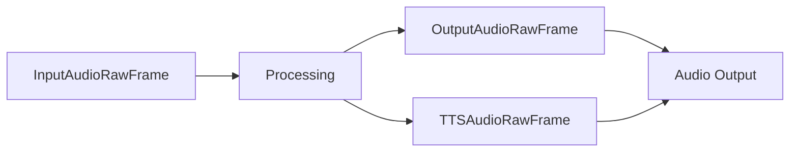

## AudioRawFrame

Base class for all audio data frames. Contains raw audio samples and associated metadata.

### Properties

<ParamField path="audio" type="bytes" required>
  Raw audio data in PCM format
</ParamField>

<ParamField path="sample_rate" type="int" required>
  Audio sample rate in Hz (e.g., 16000, 44100)
</ParamField>

<ParamField path="num_channels" type="int" required>
  Number of audio channels (typically 1 for mono, 2 for stereo)
</ParamField>

<ParamField path="num_frames" type="int">
  Number of audio frames, calculated as: len(audio) / (num_channels * 2)
</ParamField>

### Methods

```python
def __post_init__(self):
    """
    Initializes frame and calculates num_frames
    """

def __str__(self):
    """
    Returns formatted string with frame details including pts, size, frames,
    sample rate, and channels
    """
```

## InputAudioRawFrame

Audio frame specifically for input sources (e.g., microphone).

```python
@dataclass
class InputAudioRawFrame(AudioRawFrame):
    """A chunk of audio usually coming from an input transport."""
    pass
```

## OutputAudioRawFrame

Audio frame for output playback.

```python
@dataclass
class OutputAudioRawFrame(AudioRawFrame):
    """
    A chunk of audio that will be played by the output transport if the
    transport's microphone has been enabled.
    """
    pass
```

## TTSAudioRawFrame

Audio frame containing synthesized speech from TTS services.

```python
@dataclass
class TTSAudioRawFrame(OutputAudioRawFrame):
    """A chunk of output audio generated by a TTS service."""
    pass
```

## Usage Examples

### Creating Audio Frames

```python
# Input audio from microphone
input_frame = InputAudioRawFrame(
    audio=raw_audio_bytes,
    sample_rate=16000,
    num_channels=1
)

# TTS output
tts_frame = TTSAudioRawFrame(
    audio=synthesized_audio,
    sample_rate=22050,
    num_channels=1
)
```

### Common Pipeline Usage

```python
# Typical audio processing pipeline
pipeline = Pipeline([
    transport.input(),          # Produces InputAudioRawFrame
    vad_processor,             # Processes InputAudioRawFrame
    transcriber,               # Consumes InputAudioRawFrame
    llm_processor,             # Produces text for TTS
    tts_service,              # Produces TTSAudioRawFrame
    transport.output()         # Consumes OutputAudioRawFrame/TTSAudioRawFrame
])
```

## Frame Flow



## Notes

- Audio data should be in PCM format
- Frame size is typically aligned with processing requirements (e.g., 20ms chunks)
- Sample rate should match service requirements (e.g., 16kHz for most STT services)
