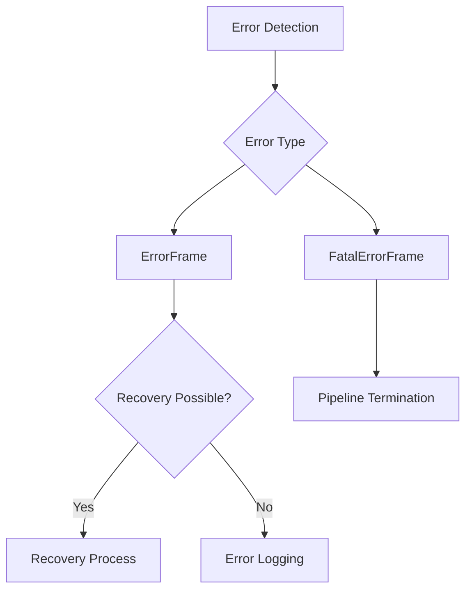

## ErrorFrame

Frame for signaling errors in the pipeline.

### Properties

<ParamField path="error" type="str" required>
  Error message or description
</ParamField>

<ParamField path="fatal" type="bool" default="false">
  Whether the error is unrecoverable
</ParamField>

### Methods

```python
def __str__(self):
    """
    Returns formatted string with error message and fatal status
    """
```

## FatalErrorFrame

Frame for unrecoverable errors that should terminate the pipeline.

```python
@dataclass
class FatalErrorFrame(ErrorFrame):
    """
    This is used notify upstream that an unrecoverable error has occurred and
    that the bot should exit.
    """
    fatal: bool = field(default=True, init=False)
```

## Usage Examples

### Error Handling

```python
# Handle non-fatal error
async def handle_service_error(error: Exception):
    await pipeline.push_frame(ErrorFrame(
        error=f"Service error: {str(error)}",
        fatal=False
    ))

# Handle fatal error
async def handle_critical_error(error: Exception):
    await pipeline.push_frame(FatalErrorFrame(
        error=f"Critical error: {str(error)}"
    ))
```

### Error Recovery

```python
async def process_frame(self, frame: Frame):
    if isinstance(frame, ErrorFrame):
        if frame.fatal:
            await self.shutdown_pipeline()
        else:
            await self.attempt_recovery()
```

### Pipeline Integration

```python
# Error-aware pipeline
pipeline = Pipeline([
    input_processor,
    error_handler,        # Processes ErrorFrames
    recovery_processor,   # Handles recovery
    output_processor
])

# Error handler implementation
class ErrorHandler(Processor):
    async def process_frame(self, frame: Frame):
        if isinstance(frame, ErrorFrame):
            if frame.fatal:
                logger.critical(f"Fatal error: {frame.error}")
                await self.push_frame(CancelFrame())
            else:
                logger.error(f"Error: {frame.error}")
                await self.handle_error(frame)
```

## Frame Flow



## Error Handling Patterns

### Graceful Degradation

```python
async def handle_service_error(self, error: Exception):
    if is_temporary_error(error):
        # Non-fatal error with retry
        await self.push_frame(ErrorFrame(
            error="Temporary service disruption",
            fatal=False
        ))
        await self.retry_operation()
    else:
        # Fatal error requiring shutdown
        await self.push_frame(FatalErrorFrame(
            error="Service permanently unavailable"
        ))
```

### Error Aggregation

```python
class ErrorAggregator(Processor):
    def __init__(self):
        self.errors = []

    async def process_frame(self, frame: Frame):
        if isinstance(frame, ErrorFrame):
            self.errors.append({
                'timestamp': time.time(),
                'message': frame.error,
                'fatal': frame.fatal
            })
            await self.update_error_metrics()
```

## Notes

- ErrorFrames are system frames and may bypass normal processing order
- Fatal errors should lead to immediate pipeline shutdown
- Error messages should be descriptive and actionable
- Error handling should be implemented at appropriate pipeline stages
- Consider logging and metrics for error tracking
- Recovery strategies should be appropriate for error type
