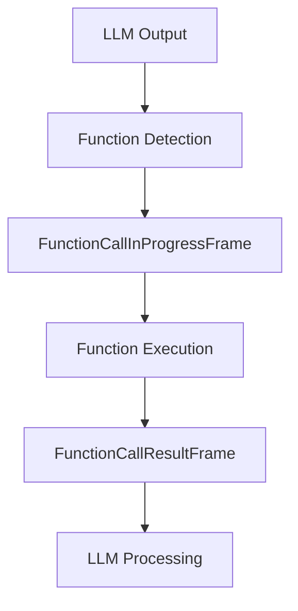

## FunctionCallResultFrame

Frame containing the result of an LLM function (tool) call.

### Properties

<ParamField path="function_name" type="str" required>
  Name of the function that was called
</ParamField>

<ParamField path="tool_call_id" type="str" required>
  Unique identifier for the tool call
</ParamField>

<ParamField path="arguments" type="str" required>
  Arguments passed to the function, typically as JSON string
</ParamField>

<ParamField path="result" type="Any" required>
  Result returned by the function
</ParamField>

<ParamField path="run_llm" type="bool" default="true">
  Whether to run the LLM with the function result
</ParamField>

## FunctionCallInProgressFrame

Frame indicating an ongoing function call.

### Properties

<ParamField path="function_name" type="str" required>
  Name of the function being called
</ParamField>

<ParamField path="tool_call_id" type="str" required>
  Unique identifier for the tool call
</ParamField>

<ParamField path="arguments" type="str" required>
  Arguments being passed to the function
</ParamField>

## Usage Examples

### Function Call Implementation

```python
# Define a function handler
async def handle_weather_lookup(location: str) -> FunctionCallResultFrame:
    try:
        weather_data = await get_weather(location)
        return FunctionCallResultFrame(
            function_name="get_weather",
            tool_call_id="call_123",
            arguments=json.dumps({"location": location}),
            result=weather_data,
            run_llm=True  # Let LLM process the result
        )
    except Exception as e:
        return FunctionCallResultFrame(
            function_name="get_weather",
            tool_call_id="call_123",
            arguments=json.dumps({"location": location}),
            result=str(e),
            run_llm=True
        )
```

### Progress Tracking

```python
# Signal function execution start
async def start_function_call(name: str, call_id: str, args: dict):
    await pipeline.push_frame(FunctionCallInProgressFrame(
        function_name=name,
        tool_call_id=call_id,
        arguments=json.dumps(args)
    ))
```

### Pipeline Integration

```python
# Function calling pipeline
pipeline = Pipeline([
    llm_processor,         # Generates function calls
    function_router,       # Routes calls to handlers
    result_processor,      # Processes function results
    response_generator    # Generates final response
])
```

## Frame Flow



## Notes

- Function calls are typically initiated by LLM output
- Tool call IDs should be unique per conversation
- Arguments should be valid JSON strings
- Results can be of any type that the LLM can process
- Progress frames help track long-running operations
