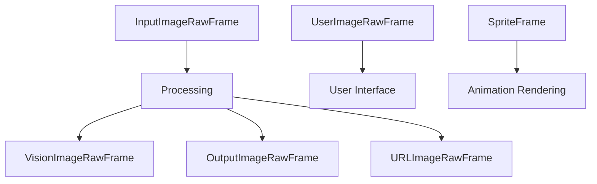

## ImageRawFrame

Base class for all image-related frames.

### Properties

<ParamField path="image" type="bytes" required>
  Raw image data
</ParamField>

<ParamField path="size" type="Tuple[int, int]" required>
  Image dimensions as (width, height)
</ParamField>

<ParamField path="format" type="str | None" optional>
  Image format identifier (e.g., "jpeg", "png")
</ParamField>

### Methods

```python
def __str__(self):
    """
    Returns formatted string with pts, size, and format information
    """
```

## InputImageRawFrame

Base class for images coming from input sources.

```python
@dataclass
class InputImageRawFrame(ImageRawFrame):
    pass
```

## OutputImageRawFrame

Base class for images intended for display or output.

```python
@dataclass
class OutputImageRawFrame(ImageRawFrame):
    pass
```

## UserImageRawFrame

Frame for images associated with specific users.

### Properties

Inherits ImageRawFrame properties, plus:

<ParamField path="user_id" type="str" required>
  Identifier of the user associated with the image
</ParamField>

## VisionImageRawFrame

Frame for images that require AI vision processing.

### Properties

Inherits ImageRawFrame properties, plus:

<ParamField path="text" type="str | None" optional>
  Text prompt or description associated with the image
</ParamField>

## URLImageRawFrame

Frame for images referenced by URL.

### Properties

Inherits OutputImageRawFrame properties, plus:

<ParamField path="url" type="str | None" optional>
  URL where the image can be accessed
</ParamField>

## SpriteFrame

Frame for animated sprite sequences.

### Properties

<ParamField path="images" type="List[ImageRawFrame]" required>
  List of image frames comprising the animation
</ParamField>

### Methods

```python
def __str__(self):
    """
    Returns formatted string with pts and number of images
    """
```

## Usage Examples

### Creating Image Frames

```python
# Basic image frame
image_frame = InputImageRawFrame(
    image=image_bytes,
    size=(640, 480),
    format="jpeg"
)

# User profile image
user_image = UserImageRawFrame(
    image=profile_image_bytes,
    size=(256, 256),
    format="png",
    user_id="user123"
)

# Vision processing request
vision_frame = VisionImageRawFrame(
    image=scene_bytes,
    size=(1024, 768),
    format="jpeg",
    text="Describe this image"
)

# URL-referenced image
url_image = URLImageRawFrame(
    image=thumbnail_bytes,
    size=(120, 120),
    format="jpeg",
    url="https://example.com/image.jpg"
)

# Animated sprite
sprite = SpriteFrame(images=[
    ImageRawFrame(image=frame1_bytes, size=(32, 32), format="png"),
    ImageRawFrame(image=frame2_bytes, size=(32, 32), format="png"),
])
```

### Common Pipeline Usage

```python
# Vision processing pipeline
pipeline = Pipeline([
    camera_input,           # Produces InputImageRawFrame
    vision_processor,       # Converts to VisionImageRawFrame
    llm_vision_service,     # Processes image and generates description
    display_output         # Handles OutputImageRawFrame
])
```

## Frame Flow



## Notes

- Image data should be in raw bytes format
- Supported formats depend on your pipeline's image processing capabilities
- Sprite frames are played at the rate specified by transport's `camera_out_framerate`
- Vision frames may be used with multimodal LLMs for image understanding
