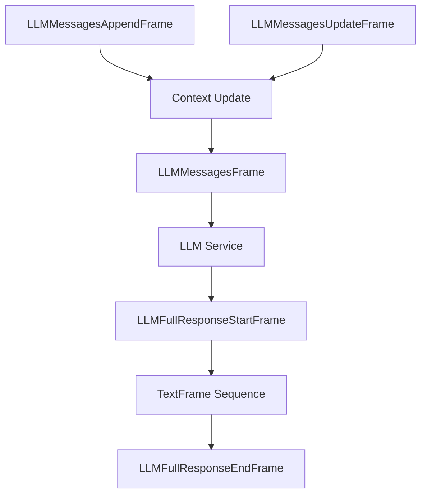

## LLMMessagesFrame

Frame containing a list of messages for LLM chat completions.

### Properties

<ParamField path="messages" type="List[dict]" required>
  List of message dictionaries representing the conversation history. Each
  message typically contains 'role' and 'content' keys.
</ParamField>

### Notes

Messages property is mutable and may be updated by ResponseAggregator processors.

## LLMMessagesAppendFrame

Frame for adding new messages to the current context.

### Properties

<ParamField path="messages" type="List[dict]" required>
  List of new messages to append to the current context
</ParamField>

## LLMMessagesUpdateFrame

Frame for replacing the current context with new messages.

### Properties

<ParamField path="messages" type="List[dict]" required>
  List of messages that will replace the current context
</ParamField>

## LLMSetToolsFrame

Frame for configuring function calling capabilities.

### Properties

<ParamField path="tools" type="List[dict]" required>
  List of tool definitions, typically in JSON Schema format
</ParamField>

## LLMEnablePromptCachingFrame

Frame for controlling prompt caching behavior.

### Properties

<ParamField path="enable" type="bool" required>
  Whether to enable or disable prompt caching
</ParamField>

## LLMFullResponseStartFrame

Control frame indicating the start of an LLM response sequence.

## LLMFullResponseEndFrame

Control frame indicating the end of an LLM response sequence.

## Usage Examples

### Basic Message Management

```python
# Initial conversation context
context = LLMMessagesFrame(messages=[
    {"role": "system", "content": "You are a helpful assistant."},
    {"role": "user", "content": "Hello!"},
])

# Append new messages
append_frame = LLMMessagesAppendFrame(messages=[
    {"role": "assistant", "content": "Hi! How can I help?"},
    {"role": "user", "content": "What's the weather?"},
])

# Update entire context
update_frame = LLMMessagesUpdateFrame(messages=[
    {"role": "system", "content": "New system prompt"},
    {"role": "user", "content": "New conversation"},
])
```

### Function Calling Setup

```python
# Configure tools/functions
tools_frame = LLMSetToolsFrame(tools=[{
    "type": "function",
    "function": {
        "name": "get_weather",
        "description": "Get current weather",
        "parameters": {
            "type": "object",
            "properties": {
                "location": {
                    "type": "string",
                    "description": "City name"
                }
            },
            "required": ["location"]
        }
    }
}])
```

### Common Pipeline Usage

```python
# Typical LLM pipeline
pipeline = Pipeline([
    context_manager,        # Manages LLMMessagesFrame
    llm_service,            # Processes messages, produces responses
    response_handler,       # Handles LLM responses
    tool_executor           # Handles function calls
])
```

## Frame Flow



## Notes

- Messages should follow the chat completion format of your LLM provider
- Tool definitions must match the schema expected by your LLM service
- Response sequences are bounded by Start/End frames
- Prompt caching can be controlled dynamically during pipeline execution
