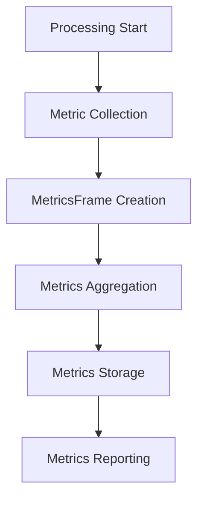

## MetricsFrame

Frame for carrying performance and operational metrics data.

### Properties

<ParamField path="data" type="List[MetricsData]" required>
  List of metrics data points
</ParamField>

### MetricsData Structure

```python
class MetricsData:
    timestamp: float       # Unix timestamp
    category: str         # Metric category
    name: str            # Metric name
    value: float         # Metric value
    unit: str           # Measurement unit
    tags: Dict[str, str] # Additional metadata
```

## Usage Examples

### Collecting Processing Metrics

```python
# Create metrics for processing time
metrics_frame = MetricsFrame(data=[
    MetricsData(
        timestamp=time.time(),
        category="processing",
        name="latency",
        value=125.5,
        unit="ms",
        tags={"processor": "stt", "model": "whisper"}
    )
])
```

### Service Performance Tracking

```python
class MetricsCollector(Processor):
    async def process_frame(self, frame: Frame):
        start_time = time.time()

        # Process frame
        result = await self.process(frame)

        # Collect metrics
        processing_time = (time.time() - start_time) * 1000
        await self.push_frame(MetricsFrame(data=[
            MetricsData(
                timestamp=time.time(),
                category="performance",
                name="processing_time",
                value=processing_time,
                unit="ms",
                tags={
                    "frame_type": frame.__class__.__name__,
                    "processor": self.__class__.__name__
                }
            )
        ]))
```

### Pipeline Integration

```python
# Metrics-enabled pipeline
pipeline = Pipeline([
    input_processor,
    metrics_collector,     # Collects processing metrics
    metrics_aggregator,    # Aggregates metrics
    metrics_reporter,      # Reports metrics
    output_processor
])
```

## Common Metrics Categories

### Performance Metrics

```python
# Latency metrics
latency_metrics = MetricsFrame(data=[
    MetricsData(
        timestamp=time.time(),
        category="latency",
        name="ttfb",  # Time to first byte
        value=75.0,
        unit="ms",
        tags={"service": "llm"}
    )
])

# Throughput metrics
throughput_metrics = MetricsFrame(data=[
    MetricsData(
        timestamp=time.time(),
        category="throughput",
        name="frames_processed",
        value=100,
        unit="frames/s",
        tags={"processor": "audio"}
    )
])
```

### Resource Usage Metrics

```python
# Resource utilization
resource_metrics = MetricsFrame(data=[
    MetricsData(
        timestamp=time.time(),
        category="resources",
        name="memory_usage",
        value=1024.5,
        unit="MB",
        tags={"component": "pipeline"}
    )
])
```

## Frame Flow



## Metrics Handling Patterns

### Metrics Aggregation

```python
class MetricsAggregator(Processor):
    def __init__(self):
        self.metrics_buffer = []
        self.aggregation_interval = 60  # seconds

    async def process_frame(self, frame: Frame):
        if isinstance(frame, MetricsFrame):
            self.metrics_buffer.extend(frame.data)

            if self.should_aggregate():
                aggregated = self.aggregate_metrics()
                await self.push_frame(MetricsFrame(
                    data=aggregated
                ))
                self.metrics_buffer.clear()
```

### Metrics Reporting

```python
class MetricsReporter(Processor):
    async def process_frame(self, frame: Frame):
        if isinstance(frame, MetricsFrame):
            for metric in frame.data:
                await self.report_metric(
                    name=metric.name,
                    value=metric.value,
                    tags=metric.tags
                )
```

## Notes

- Metrics should be collected with minimal performance impact
- Consider aggregation intervals carefully
- Use appropriate tags for filtering and analysis
- Timestamp precision is important for accurate measurements
- Buffer metrics appropriately to avoid memory issues
- Consider implementing metric sampling for high-volume data
