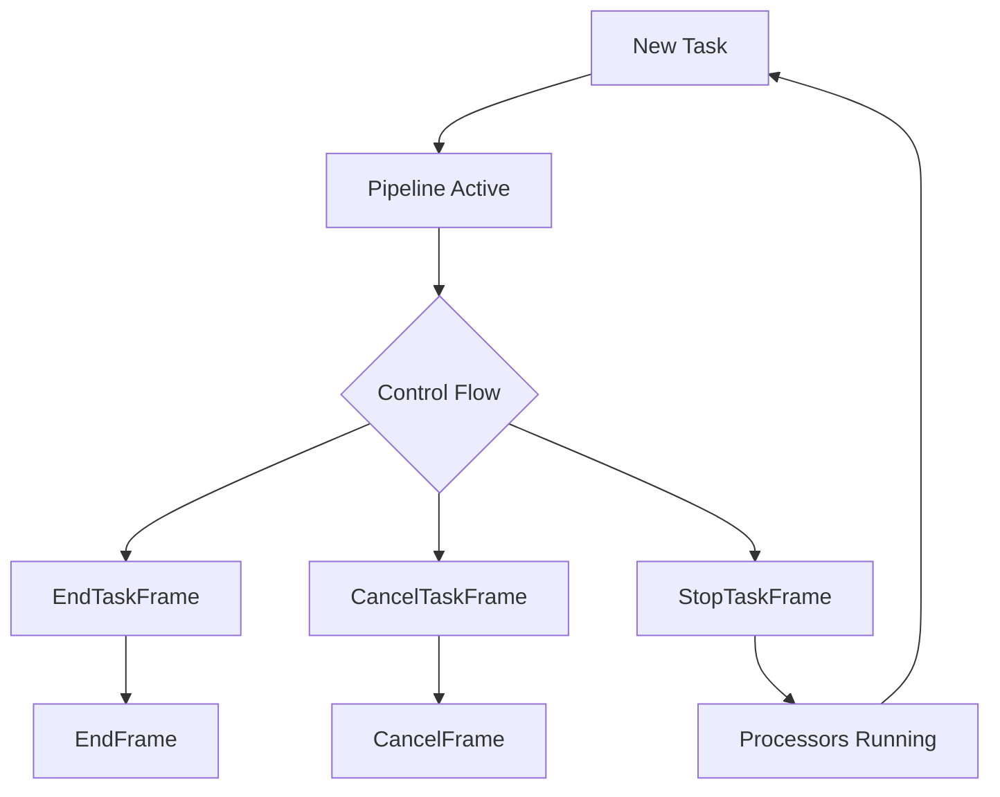

## StartFrame

Initiates pipeline processing and sets up initial conditions.

### Properties

<ParamField path="clock" type="BaseClock" required>
  Clock instance for pipeline timing
</ParamField>

<ParamField path="allow_interruptions" type="bool" default="false">
  Whether to allow user interruptions during processing
</ParamField>

<ParamField path="enable_metrics" type="bool" default="false">
  Whether to collect performance metrics
</ParamField>

<ParamField path="enable_usage_metrics" type="bool" default="false">
  Whether to collect usage metrics
</ParamField>

<ParamField path="report_only_initial_ttfb" type="bool" default="false">
  Whether to report only initial time-to-first-byte metrics
</ParamField>

## EndFrame

Signals normal pipeline termination and initiates shutdown of all pipeline components.

```python
@dataclass
class EndFrame(ControlFrame):
    """
    Indicates that a pipeline has ended and frame processors and pipelines
    should be shut down. If the transport receives this frame, it will stop
    sending frames to its output channel(s) and close all its threads.

    As a ControlFrame, it is processed in order with other frames, ensuring
    orderly shutdown of pipeline components.
    """
    pass
```

### Key Characteristics

- Propagates downstream through the pipeline
- Causes processors and pipelines to shut down in order
- Ensures orderly cleanup of pipeline resources
- Processed in sequence with other frames as a ControlFrame

## CancelFrame

Signals immediate pipeline termination.

```python
@dataclass
class CancelFrame(SystemFrame):
    """Indicates that a pipeline needs to stop right away."""
    pass
```

## EndTaskFrame

Initiates a graceful pipeline shutdown by requesting the pipeline task to begin closure.

```python
@dataclass
class EndTaskFrame(SystemFrame):
    """
    Used to notify the pipeline task that it should initiate a graceful shutdown.
    When received, the pipeline task will generate an EndFrame to propagate
    downstream, ensuring all queued frames are processed before shutdown.

    As a SystemFrame, it can be processed out of order with other frames,
    allowing immediate response to shutdown requests.
    """
    pass
```

### Key Characteristics

- Flows upstream to the pipeline task
- Triggers generation of an EndFrame for actual shutdown
- Allows out-of-order processing as a SystemFrame
- Used to initiate graceful shutdown while preserving frame processing
- Part of the two-stage shutdown process (EndTaskFrame → EndFrame)

## CancelTaskFrame

Requests immediate pipeline termination.

```python
@dataclass
class CancelTaskFrame(SystemFrame):
    """
    Used to notify the pipeline task that the pipeline should be
    stopped immediately by pushing a CancelFrame downstream.
    """
    pass
```

## StopTaskFrame

Signals that a pipeline task should be stopped while keeping processors in a running state.

```python
@dataclass
class StopTaskFrame(SystemFrame):
    """
    Indicates that a pipeline task should be stopped but that the pipeline
    processors should be kept in a running state. This is normally queued from
    the pipeline task.
    """
    pass
```

## Usage Examples

### Pipeline Initialization

```python
# Start pipeline with metrics enabled
start_frame = StartFrame(
    clock=SystemClock(),
    enable_metrics=True,
    allow_interruptions=True
)

# Push start frame to begin processing
await pipeline.push_frame(start_frame)
```

### Graceful Shutdown

```python
# End pipeline normally
async def shutdown_pipeline():
    await pipeline.push_frame(EndTaskFrame())
    # Wait for pipeline to process remaining frames
    await pipeline.wait_until_done()
```

### Emergency Stop

```python
# Cancel pipeline immediately
async def emergency_stop():
    await pipeline.push_frame(CancelTaskFrame())
```

### Pipeline State Management

```python
# Stop pipeline task while maintaining processor state
async def stop_pipeline_task():
    await pipeline.push_frame(StopTaskFrame())

# Start new pipeline task
async def start_new_task():
    await pipeline.push_frame(StartFrame(clock=pipeline.clock))
```

## Frame Flow



## Notes

- StartFrame must be the first frame in a pipeline
- EndFrame ensures all queued frames are processed before shutdown
- CancelFrame immediately stops all processing
- StopTaskFrame stops the pipeline task while keeping processors running
- Control frames are processed in order (unlike system frames)
- Metrics collection affects performance and should be enabled selectively
