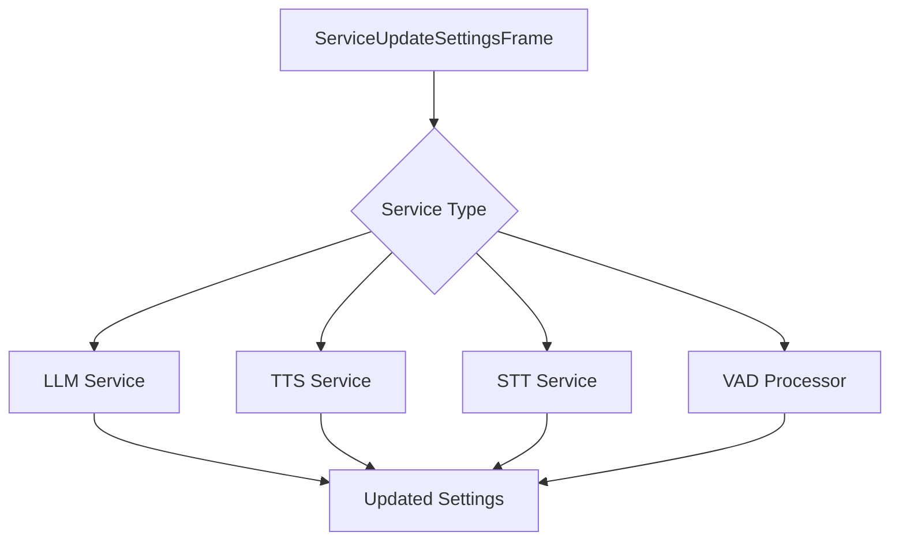

## ServiceUpdateSettingsFrame

Base class for all service configuration update frames.

### Properties

<ParamField path="settings" type="Dict[str, Any]" required>
  Dictionary of settings to update for the service
</ParamField>

## LLMUpdateSettingsFrame

Frame for updating LLM service settings.

```python
@dataclass
class LLMUpdateSettingsFrame(ServiceUpdateSettingsFrame):
    pass
```

### Example Settings

```python
# Update LLM configuration
settings = {
    "temperature": 0.7,
    "max_tokens": 100,
    "model": "gpt-4"
}
frame = LLMUpdateSettingsFrame(settings=settings)
```

## TTSUpdateSettingsFrame

Frame for updating Text-to-Speech service settings.

```python
@dataclass
class TTSUpdateSettingsFrame(ServiceUpdateSettingsFrame):
    pass
```

### Example Settings

```python
# Update TTS configuration
settings = {
    "voice_id": "voice123",
    "speed": 1.2,
    "pitch": 1.0
}
frame = TTSUpdateSettingsFrame(settings=settings)
```

## STTUpdateSettingsFrame

Frame for updating Speech-to-Text service settings.

```python
@dataclass
class STTUpdateSettingsFrame(ServiceUpdateSettingsFrame):
    pass
```

### Example Settings

```python
# Update STT configuration
settings = {
    "language": "en-US",
    "model": "whisper-1",
    "word_timestamps": True
}
frame = STTUpdateSettingsFrame(settings=settings)
```

## VADParamsUpdateFrame

Frame for updating Voice Activity Detection parameters.

### Properties

<ParamField path="params" type="VADParams" required>
  Voice Activity Detection parameters
</ParamField>

### Example Usage

```python
# Update VAD parameters
params = VADParams(
    threshold=0.5,
    min_speech_duration_ms=100,
    max_speech_duration_s=10
)
frame = VADParamsUpdateFrame(params=params)
```

## Usage Examples

### Dynamic Service Configuration

```python
# Pipeline with dynamic service updates
async def update_service_settings(pipeline):
    # Update LLM settings
    await pipeline.push_frame(LLMUpdateSettingsFrame(
        settings={"temperature": 0.9}
    ))

    # Update TTS voice
    await pipeline.push_frame(TTSUpdateSettingsFrame(
        settings={"voice_id": "new_voice"}
    ))

    # Update STT language
    await pipeline.push_frame(STTUpdateSettingsFrame(
        settings={"language": "fr-FR"}
    ))
```

## Frame Flow



## Notes

- Settings updates take effect immediately
- Invalid settings may be ignored or cause errors depending on the service
- Some settings may not be updateable while processing is active
- Service-specific validation is handled by each service implementation
