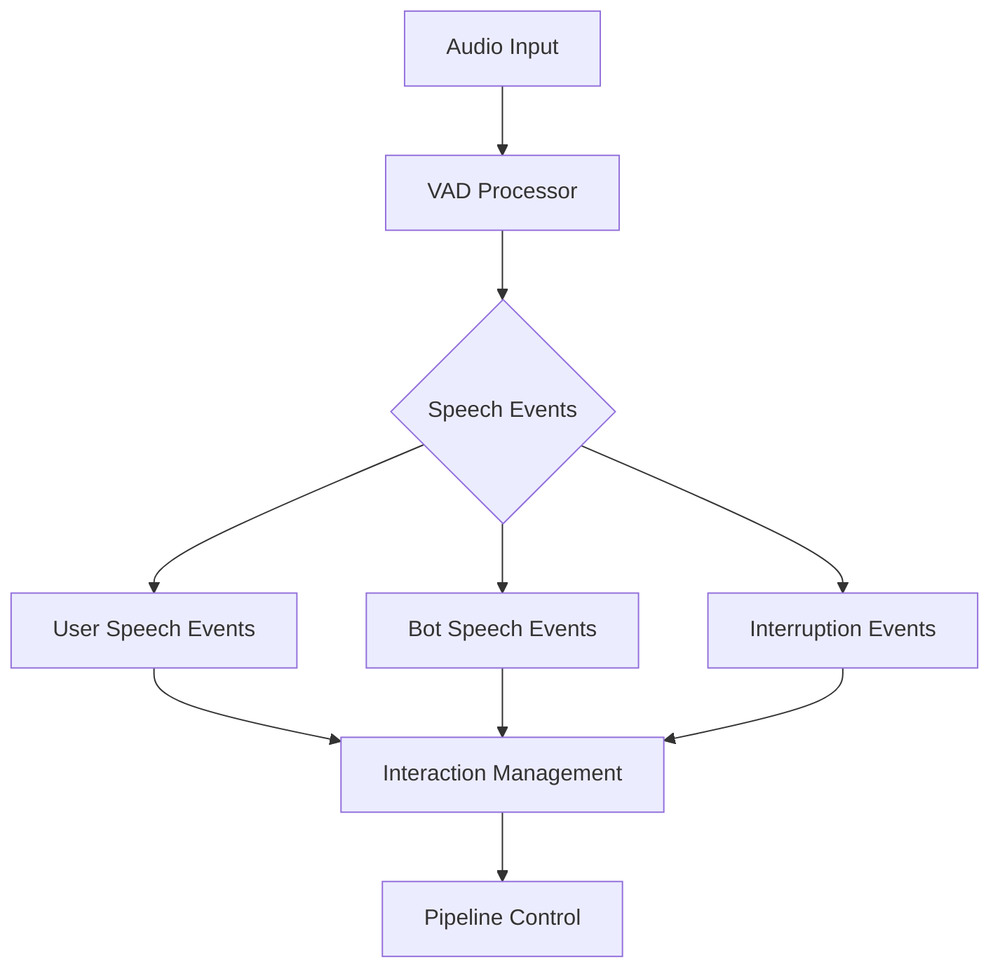

## User Speech Events

### UserStartedSpeakingFrame

Signals that a user has begun speaking.

```python
@dataclass
class UserStartedSpeakingFrame(SystemFrame):
    """
    Emitted by VAD to indicate that a user has started speaking. Used for
    interruptions or detecting speech activity before transcription is available.
    """
    pass
```

### UserStoppedSpeakingFrame

Signals that a user has finished speaking.

```python
@dataclass
class UserStoppedSpeakingFrame(SystemFrame):
    """
    Emitted by the VAD to indicate that a user stopped speaking.
    """
    pass
```

## Bot Speech Events

### BotStartedSpeakingFrame

Signals that the bot has begun speaking.

```python
@dataclass
class BotStartedSpeakingFrame(SystemFrame):
    """
    Emitted upstream by transport outputs to indicate the bot started speaking.
    """
    pass
```

### BotStoppedSpeakingFrame

Signals that the bot has finished speaking.

```python
@dataclass
class BotStoppedSpeakingFrame(SystemFrame):
    """
    Emitted upstream by transport outputs to indicate the bot stopped speaking.
    """
    pass
```

### BotSpeakingFrame

Indicates ongoing bot speech activity.

```python
@dataclass
class BotSpeakingFrame(SystemFrame):
    """
    Emitted upstream by transport outputs while the bot is still speaking.
    Used for managing user idle detection and interaction timing.
    """
    pass
```

## Interruption Events

### StartInterruptionFrame

Signals the start of a user interruption.

```python
@dataclass
class StartInterruptionFrame(SystemFrame):
    """
    Emitted by VAD to indicate that a user has started speaking during bot speech.
    Processed concurrently with other frames.
    """
    pass
```

### StopInterruptionFrame

Signals the end of a user interruption.

```python
@dataclass
class StopInterruptionFrame(SystemFrame):
    """
    Emitted by VAD to indicate that a user has stopped speaking during an interruption.
    Processed concurrently with other frames.
    """
    pass
```

### BotInterruptionFrame

Triggers bot interruption without user speech.

```python
@dataclass
class BotInterruptionFrame(SystemFrame):
    """
    Emitted when the bot should be interrupted programmatically.
    Causes similar actions to user interruption without speech events.
    """
    pass
```

## Usage Examples

### Speech Detection Pipeline

```python
# Configure pipeline with speech detection
pipeline = Pipeline([
    audio_input,          # Captures audio
    vad_processor,        # Generates speech events
    interaction_handler,  # Manages turn-taking
    bot_output            # Manages bot speech
])
```

### Interruption Handling

```python
async def handle_speech_events(frame: Frame):
    if isinstance(frame, UserStartedSpeakingFrame):
        # Stop bot speech output
        await stop_bot_speech()

    elif isinstance(frame, BotStartedSpeakingFrame):
        # Enable interruption detection
        await enable_interruption_detection()

    elif isinstance(frame, StartInterruptionFrame):
        # Handle user interruption
        await handle_interruption()
```

## Frame Flow



## Notes

- Speech events are system frames and may bypass normal processing order
- Bot speech events are used for managing turn-taking and interaction timing
- Interruption frames enable natural conversation flow by stopping current bot speech
- VAD sensitivity affects speech detection timing
- Bot interruption can be triggered programmatically
- Speech events help manage conversation state and timing
