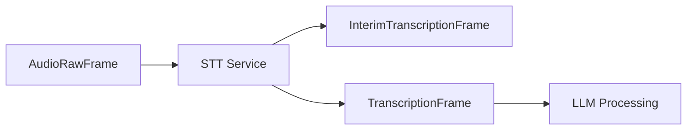

## TextFrame

Base class for all text-based frames. Used for general text content, transcriptions, and LLM interactions.

### Properties

<ParamField path="text" type="str" required>
  The text content being carried by the frame
</ParamField>

### Methods

```python
def __str__(self):
    """
    Returns formatted string with frame details including pts and text content
    """
```

## TranscriptionFrame

Frame for final transcription results from speech-to-text services.

### Properties

<ParamField path="text" type="str" required>
  The transcribed text
</ParamField>

<ParamField path="user_id" type="str" required>
  Identifier of the user who spoke
</ParamField>

<ParamField path="timestamp" type="str" required>
  ISO 8601 formatted timestamp of when the transcription was generated
</ParamField>

<ParamField path="language" type="Language | None" optional>
  Detected language of the transcription. See Language enum for supported
  values.
</ParamField>

### Methods

```python
def __str__(self):
    """
    Returns formatted string with user ID, text content, language, and timestamp
    """
```

## InterimTranscriptionFrame

Frame for preliminary transcription results during ongoing speech recognition.

### Properties

Identical to TranscriptionFrame:

<ParamField path="text" type="str" required>
  The preliminary transcribed text
</ParamField>

<ParamField path="user_id" type="str" required>
  Identifier of the user who is speaking
</ParamField>

<ParamField path="timestamp" type="str" required>
  ISO 8601 formatted timestamp
</ParamField>

<ParamField path="language" type="Language | None" optional>
  Detected language of the transcription
</ParamField>

## Usage Examples

### Creating Text Frames

```python
# Basic text frame
text_frame = TextFrame(text="Hello, world!")

# Final transcription
transcription = TranscriptionFrame(
    text="Hello, how can I help?",
    user_id="user123",
    timestamp="2024-01-01T12:00:00Z",
    language=Language.EN
)

# Interim transcription
interim = InterimTranscriptionFrame(
    text="Hello, how can",  # Partial text
    user_id="user123",
    timestamp="2024-01-01T12:00:00Z",
    language=Language.EN
)
```

### Common Pipeline Usage

```python
# Typical transcription pipeline
pipeline = Pipeline([
    stt_service,              # Produces InterimTranscriptionFrame/TranscriptionFrame
    llm_processor,            # Consumes TranscriptionFrame
    response_handler          # Processes LLM response
])
```

## Frame Flow



## Notes

- InterimTranscriptionFrames are used for real-time feedback
- TranscriptionFrames represent final, confirmed transcriptions
- Language detection is optional and may not be available from all STT services
