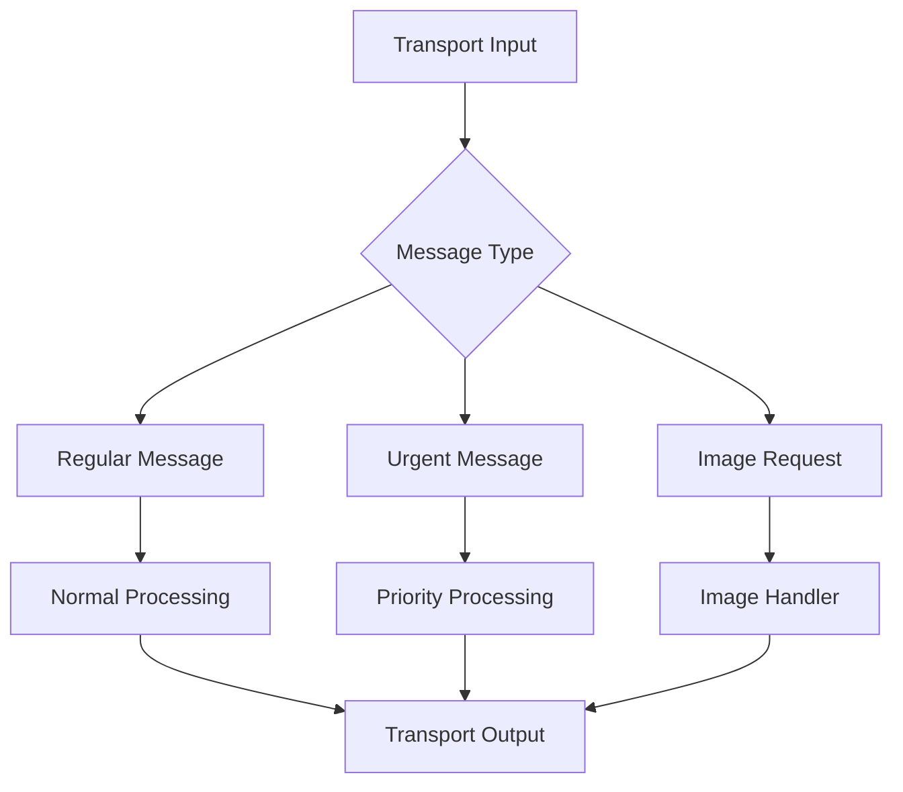

## TransportMessageFrame

Frame for general transport-level messages.

### Properties

<ParamField path="message" type="Any" required>
  The message content to be transported
</ParamField>

### Methods

```python
def __str__(self):
    """
    Returns formatted string with message content
    """
```

## TransportMessageUrgentFrame

Frame for high-priority transport messages that need immediate handling.

### Properties

<ParamField path="message" type="Any" required>
  The urgent message content to be transported
</ParamField>

### Methods

```python
def __str__(self):
    """
    Returns formatted string with urgent message content
    """
```

## UserImageRequestFrame

Frame for requesting images from specific users.

### Properties

<ParamField path="user_id" type="str" required>
  Identifier of the user to request image from
</ParamField>

<ParamField path="context" type="Any" optional>
  Additional context for the image request
</ParamField>

### Methods

```python
def __str__(self):
    """
    Returns formatted string with user ID
    """
```

## Usage Examples

### Basic Transport Messages

```python
# Send regular transport message
regular_msg = TransportMessageFrame(
    message={
        "type": "status_update",
        "status": "connected"
    }
)

# Send urgent transport message
urgent_msg = TransportMessageUrgentFrame(
    message={
        "type": "connection_error",
        "action": "reconnect"
    }
)
```

### Image Requests

```python
# Request user image
image_request = UserImageRequestFrame(
    user_id="user123",
    context={
        "purpose": "profile_update",
        "required_size": (256, 256)
    }
)
```

### Pipeline Integration

```python
# Transport-aware pipeline
pipeline = Pipeline([
    transport_input,
    message_handler,        # Processes transport messages
    image_request_handler,  # Handles image requests
    transport_output
])

# Message handler implementation
class TransportMessageHandler(Processor):
    async def process_frame(self, frame: Frame):
        if isinstance(frame, TransportMessageUrgentFrame):
            await self.handle_urgent_message(frame.message)
        elif isinstance(frame, TransportMessageFrame):
            await self.handle_regular_message(frame.message)
```

## Frame Flow



## Transport Patterns

### Message Priority Handling

```python
class PriorityMessageProcessor(Processor):
    async def process_frame(self, frame: Frame):
        if isinstance(frame, TransportMessageUrgentFrame):
            # Handle urgent message immediately
            await self.process_urgent(frame.message)
        elif isinstance(frame, TransportMessageFrame):
            # Queue regular message for processing
            await self.queue_message(frame.message)
```

### Image Request Flow

```python
class ImageRequestHandler(Processor):
    async def process_frame(self, frame: Frame):
        if isinstance(frame, UserImageRequestFrame):
            # Request image from user
            image = await self.request_user_image(
                frame.user_id,
                frame.context
            )
            # Create image frame with result
            await self.push_frame(UserImageRawFrame(
                image=image.data,
                size=image.size,
                format=image.format,
                user_id=frame.user_id
            ))
```

## Notes

- Transport messages can carry any serializable content
- Urgent messages should be used sparingly
- Image requests should handle timeouts appropriately
- Consider implementing retry logic for failed requests
- Transport frames may interact with network conditions
