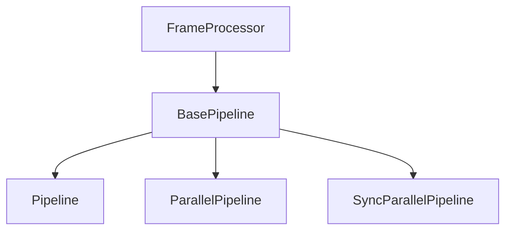

## Overview

`BasePipeline` is the abstract base class that provides core functionality for all pipeline implementations. It extends `FrameProcessor` to enable pipelines to be used as components within other pipelines.

## Class Definition

```python
class BasePipeline(FrameProcessor):
    def __init__(self):
        super().__init__()

    @abstractmethod
    def processors_with_metrics(self) -> List[FrameProcessor]:
        """
        Returns list of processors that can generate metrics.
        Must be implemented by subclasses.
        """
        pass
```

## Inheritance



## Required Methods

<ParamField path="processors_with_metrics" type="List[FrameProcessor]" required>
  Must be implemented by subclasses to return a list of processors capable of
  generating metrics. Used for metrics collection and monitoring.
</ParamField>

## Frame Processing

Inherits frame processing capabilities from `FrameProcessor`:

- Frame direction control
- Single push task rule
- System frame handling
- Error propagation

## Usage Example

```python
# Creating a custom pipeline implementation
class CustomPipeline(BasePipeline):
    def __init__(self, processors: List[FrameProcessor]):
        super().__init__()
        self._processors = processors

    def processors_with_metrics(self) -> List[FrameProcessor]:
        return [p for p in self._processors if p.can_generate_metrics()]

    async def process_frame(self, frame: Frame, direction: FrameDirection):
        await super().process_frame(frame, direction)
        # Custom frame processing logic
```

## Notes

- All pipeline implementations must inherit from BasePipeline
- Provides foundation for metrics collection
- Enables pipeline composition
- Maintains frame processing guarantees
- Supports both synchronous and asynchronous processing
