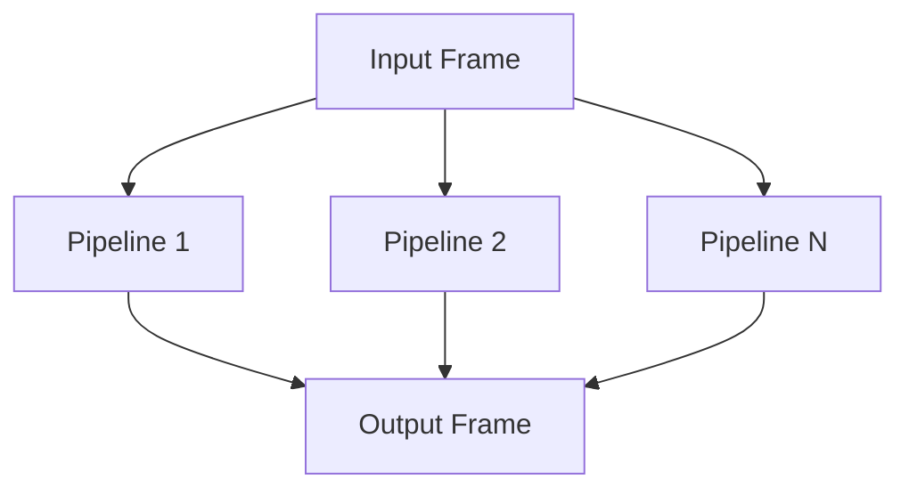

## Overview

`ParallelPipeline` enables concurrent processing by running multiple pipelines in parallel. It manages frame distribution and collection across parallel paths while maintaining frame ordering guarantees.

## Class Definition

```python
class ParallelPipeline(BasePipeline):
    def __init__(self, *args):
        super().__init__()
        if len(args) == 0:
            raise Exception("ParallelPipeline needs at least one argument")

        self._sources = []
        self._sinks = []
        self._pipelines = []

        self._up_queue = asyncio.Queue()
        self._down_queue = asyncio.Queue()
```

## Constructor Parameters

<ParamField path="*args" type="List[List[FrameProcessor]]" required>
  Variable number of processor lists, each representing a parallel processing
  path
</ParamField>

## Internal Components

### Source

```python
class Source(FrameProcessor):
    def __init__(self, upstream_queue: asyncio.Queue):
        """Handles input for each parallel path"""
```

### Sink

```python
class Sink(FrameProcessor):
    def __init__(self, downstream_queue: asyncio.Queue):
        """Handles output for each parallel path"""
```

## Queue Management

<ParamField path="_up_queue" type="asyncio.Queue">
  Queue for upstream frame collection
</ParamField>

<ParamField path="_down_queue" type="asyncio.Queue">
  Queue for downstream frame collection
</ParamField>

## Frame Flow



## Methods

### Process Frame

```python
async def process_frame(self, frame: Frame, direction: FrameDirection):
    """
    Distributes frame to all parallel paths and collects results
    """
```

### Queue Processing

```python
async def _process_up_queue(self):
    """Handles upstream frame collection"""

async def _process_down_queue(self):
    """Handles downstream frame collection"""
```

## Usage Examples

### Basic Parallel Processing

```python
# Create parallel processing paths
pipeline = ParallelPipeline(
    [audio_processor, audio_handler],
    [video_processor, video_handler],
    [text_processor, text_handler]
)
```

### With Frame Distribution

```python
# Process different frame types in parallel
pipeline = Pipeline([
    input_processor,
    ParallelPipeline(
        [audio_frames_processor],
        [video_frames_processor],
        [text_frames_processor]
    ),
    output_aggregator
])
```

## Frame Handling Rules

1. Input frames are sent to all parallel paths
2. Each path processes frames independently
3. Output frames are collected in order
4. Duplicate frames are filtered using frame IDs
5. System frames are handled specially

## Task Management

```python
# Task creation
self._up_task = loop.create_task(self._process_up_queue())
self._down_task = loop.create_task(self._process_down_queue())

# Task cleanup
if isinstance(frame, (CancelFrame, EndFrame)):
    await self._up_queue.put(None)
    await self._down_queue.put(None)
    await self._up_task
    await self._down_task
```

## Notes

- Requires at least one processing path
- Maintains frame ordering through queues
- Filters duplicate frames using frame IDs
- Handles system frames specially
- Supports nested parallel pipelines
- Provides clean task shutdown
- Thread-safe frame processing
