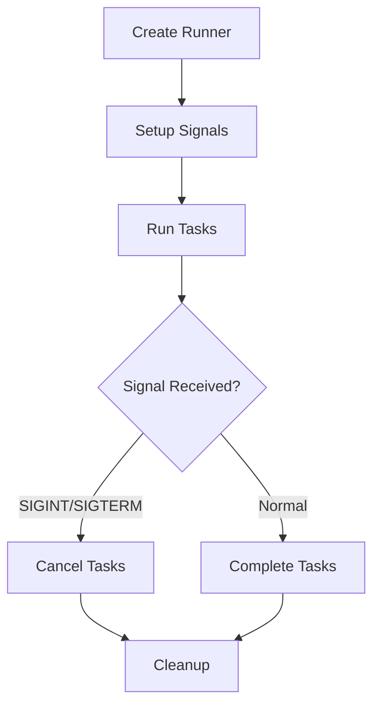
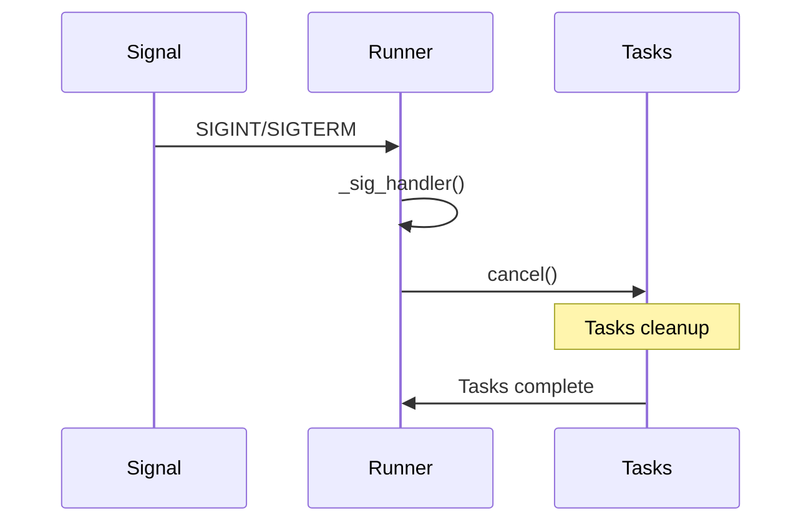

## Overview

`PipelineRunner` provides high-level orchestration for managing multiple pipeline tasks. It handles task execution, signal handling (SIGINT/SIGTERM), and coordinated shutdown of multiple pipelines.

## Class Definition

```python
class PipelineRunner:
    def __init__(
        self,
        *,
        name: str | None = None,
        handle_sigint: bool = True
    ):
        self.id: int = obj_id()
        self.name: str = name or f"{self.__class__.__name__}#{obj_count(self)}"
        self._tasks = {}
```

## Constructor Parameters

<ParamField path="name" type="str | None" optional>
  Custom name for the runner instance
</ParamField>

<ParamField path="handle_sigint" type="bool" default="true">
  Whether to handle SIGINT/SIGTERM signals
</ParamField>

## Methods

### Task Management

```python
async def run(self, task: PipelineTask):
    """
    Run a pipeline task and track it
    """

async def stop_when_done(self):
    """
    Schedule graceful shutdown of all tasks
    """

async def cancel(self):
    """
    Immediately cancel all running tasks
    """
```

## Signal Handling

```python
def _setup_sigint(self):
    """
    Configure SIGINT/SIGTERM handlers
    """
    loop = asyncio.get_running_loop()
    loop.add_signal_handler(
        signal.SIGINT,
        lambda *args: asyncio.create_task(self._sig_handler())
    )
    loop.add_signal_handler(
        signal.SIGTERM,
        lambda *args: asyncio.create_task(self._sig_handler())
    )
```

## Usage Examples

### Basic Runner

```python
# Create and use runner
runner = PipelineRunner(name="main-runner")
task = PipelineTask(my_pipeline)
await runner.run(task)
```

### Multiple Tasks

```python
# Run multiple pipeline tasks
runner = PipelineRunner()

# Create tasks
audio_task = PipelineTask(audio_pipeline)
video_task = PipelineTask(video_pipeline)

# Run tasks
await asyncio.gather(
    runner.run(audio_task),
    runner.run(video_task)
)
```

### Graceful Shutdown

```python
# Handle graceful shutdown
runner = PipelineRunner()
try:
    await runner.run(task)
    # Signal shutdown
    await runner.stop_when_done()
except Exception as e:
    # Handle errors
    logger.error(f"Pipeline error: {e}")
    await runner.cancel()
```

## Task Flow



## Signal Flow



## Task Management

### Task Tracking

```python
# Internal task management
self._tasks = {}  # name -> task mapping

# Add task
self._tasks[task.name] = task

# Remove task
del self._tasks[task.name]
```

### Task Coordination

```python
# Stop all tasks
async def stop_when_done(self):
    await asyncio.gather(*[
        t.stop_when_done()
        for t in self._tasks.values()
    ])

# Cancel all tasks
async def cancel(self):
    await asyncio.gather(*[
        t.cancel()
        for t in self._tasks.values()
    ])
```

## Error Handling

The runner provides several layers of error protection:

1. Signal Handling

   - Catches SIGINT/SIGTERM
   - Initiates clean shutdown

2. Task Management

   - Tracks task state
   - Handles task failures

3. Cleanup
   - Ensures all tasks are stopped
   - Releases resources

## Notes

- Manages multiple pipeline tasks
- Handles system signals
- Provides graceful shutdown
- Tracks task lifecycle
- Supports concurrent execution
- Thread-safe task management
- Configurable signal handling
- Maintains task isolation
