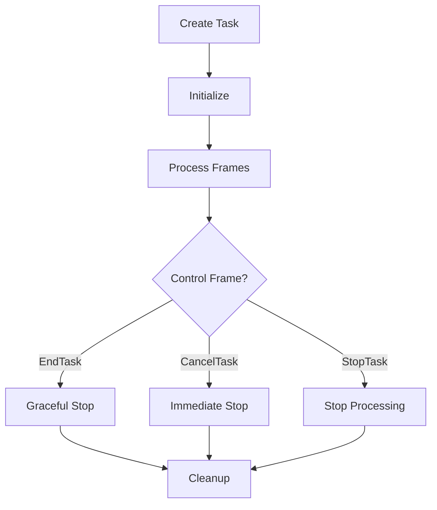

## Overview

`PipelineTask` manages the execution lifecycle of a pipeline, handling frame queuing, processing, and pipeline state management. It provides mechanisms for graceful shutdown, cancellation, and metrics collection.

## Class Definition

```python
class PipelineTask:
    def __init__(
        self,
        pipeline: BasePipeline,
        params: PipelineParams = PipelineParams(),
        clock: BaseClock = SystemClock(),
    ):
        self.id: int = obj_id()
        self.name: str = f"{self.__class__.__name__}#{obj_count(self)}"
```

## Constructor Parameters

<ParamField path="pipeline" type="BasePipeline" required>
  The pipeline to be executed
</ParamField>

<ParamField path="params" type="PipelineParams" default="PipelineParams()">
  Configuration parameters for the pipeline task
</ParamField>

<ParamField path="clock" type="BaseClock" default="SystemClock()">
  Clock for timing and synchronization
</ParamField>

## Pipeline Parameters

```python
class PipelineParams(BaseModel):
    allow_interruptions: bool = False
    enable_metrics: bool = False
    enable_usage_metrics: bool = False
    send_initial_empty_metrics: bool = True
    report_only_initial_ttfb: bool = False
```

## Task Components

### Source

```python
class Source(FrameProcessor):
    """
    Handles upstream communication and task control frames
    """
```

### Sink

```python
class Sink(FrameProcessor):
    """
    Handles downstream completion detection
    """
```

## Methods

### Task Control

```python
async def run(self):
    """Start task execution"""

async def stop_when_done(self):
    """Schedule graceful shutdown"""

async def cancel(self):
    """Immediately cancel task"""

def has_finished(self) -> bool:
    """Check if task has completed"""
```

### Frame Management

```python
async def queue_frame(self, frame: Frame):
    """Queue single frame for processing"""

async def queue_frames(self, frames: Iterable[Frame] | AsyncIterable[Frame]):
    """Queue multiple frames for processing"""
```

## Usage Examples

### Basic Task Execution

```python
# Create and run pipeline task
task = PipelineTask(
    pipeline=my_pipeline,
    params=PipelineParams(enable_metrics=True)
)
await task.run()
```

### With Frame Queuing

```python
# Queue frames for processing
task = PipelineTask(pipeline)
await task.queue_frame(StartFrame(clock=clock))
await task.queue_frames(input_frames)
await task.queue_frame(EndFrame())
await task.run()
```

### Graceful Shutdown

```python
# Handle graceful shutdown
task = PipelineTask(pipeline)
try:
    await task.run()
    await task.stop_when_done()
    while not task.has_finished():
        await asyncio.sleep(0.1)
finally:
    if not task.has_finished():
        await task.cancel()
```

## Task Flow



## Queue Processing

### Push Queue

```python
async def _process_push_queue(self):
    """
    Main processing loop:
    1. Start clock
    2. Send StartFrame
    3. Process frames
    4. Handle cleanup
    """
```

### Up Queue

```python
async def _process_up_queue(self):
    """
    Handle upstream control frames:
    - EndTaskFrame
    - CancelTaskFrame
    - StopTaskFrame
    """
```

## Metrics Support

```python
def _initial_metrics_frame(self) -> MetricsFrame:
    """
    Generate initial metrics frame with:
    - TTFB metrics
    - Processing metrics
    """
```

## Control Flow

1. Task Creation

   - Initialize queues
   - Setup source/sink
   - Link pipeline

2. Task Execution

   - Start processing tasks
   - Handle frame queuing
   - Process control frames

3. Task Termination
   - Handle cleanup
   - Stop processing
   - Clean resources

## Notes

- Manages pipeline lifecycle
- Handles graceful shutdown
- Supports metrics collection
- Processes frames in order
- Manages task state
- Provides clean cancellation
- Supports async iteration
- Thread-safe execution
