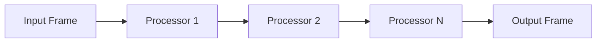

## Overview

`Pipeline` is the primary implementation of `BasePipeline` that connects frame processors in a linear sequence. It manages frame flow between processors and handles both upstream and downstream communication.

## Class Definition

```python
class Pipeline(BasePipeline):
    def __init__(self, processors: List[FrameProcessor]):
        super().__init__()
        self._source = PipelineSource(self.push_frame)
        self._sink = PipelineSink(self.push_frame)
        self._processors = [self._source] + processors + [self._sink]
        self._link_processors()
```

## Constructor Parameters

<ParamField path="processors" type="List[FrameProcessor]" required>
  List of frame processors to connect in sequence
</ParamField>

## Internal Components

### PipelineSource

Handles incoming frames and upstream communication:

```python
class PipelineSource(FrameProcessor):
    def __init__(self, upstream_push_frame: Callable[[Frame, FrameDirection], Coroutine])
```

### PipelineSink

Handles outgoing frames and downstream communication:

```python
class PipelineSink(FrameProcessor):
    def __init__(self, downstream_push_frame: Callable[[Frame, FrameDirection], Coroutine])
```

## Frame Flow



## Methods

### Process Frame

```python
async def process_frame(self, frame: Frame, direction: FrameDirection):
    """
    Process frame in specified direction through the pipeline
    """
```

### Cleanup

```python
async def cleanup(self):
    """
    Clean up all processors in the pipeline
    """
```

### Metrics Collection

```python
def processors_with_metrics(self) -> List[FrameProcessor]:
    """
    Return all processors that can generate metrics
    """
```

## Usage Examples

### Basic Pipeline

```python
# Create simple processing pipeline
pipeline = Pipeline([
    audio_processor,
    transcriber,
    llm_service,
    tts_service
])
```

### With Error Handling

```python
# Pipeline with error handling
pipeline = Pipeline([
    input_processor,
    error_handler,
    main_processor,
    cleanup_processor
])

# Process frames
try:
    await pipeline.process_frame(frame, FrameDirection.DOWNSTREAM)
finally:
    await pipeline.cleanup()
```

## Frame Processing Rules

1. Frames flow downstream by default
2. System frames can flow upstream
3. Each processor maintains frame order
4. Source and sink manage pipeline boundaries
5. Cleanup happens in sequence

## Notes

- Processors are linked in construction order
- Each processor gets parent pipeline reference
- Cleanup happens in reverse order
- Metrics are collected from all capable processors
- Source and sink handle pipeline boundaries
- Thread-safe frame processing
- Supports both sync and async processors
