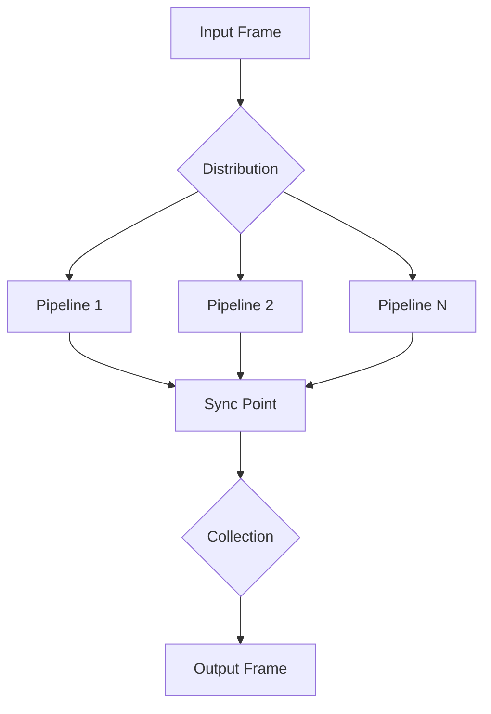

## Overview

`SyncParallelPipeline` extends parallel processing with synchronization guarantees. It ensures all parallel paths complete processing before continuing, making it ideal for operations that require coordinated outputs.

## Class Definition

```python
class SyncParallelPipeline(BasePipeline):
    def __init__(self, *args):
        super().__init__()
        if len(args) == 0:
            raise Exception("SyncParallelPipeline needs at least one argument")

        self._sinks = []
        self._sources = []
        self._pipelines = []

        self._up_queue = asyncio.Queue()
        self._down_queue = asyncio.Queue()
```

## Synchronization Mechanism

### SyncFrame

```python
@dataclass
class SyncFrame(ControlFrame):
    """Frame used to track completion of internal pipelines"""
    pass
```

## Internal Components

### Source

```python
class Source(FrameProcessor):
    def __init__(self, upstream_queue: asyncio.Queue):
        """Handles synchronized input for each parallel path"""
```

### Sink

```python
class Sink(FrameProcessor):
    def __init__(self, downstream_queue: asyncio.Queue):
        """Handles synchronized output for each parallel path"""
```

## Frame Flow



## Synchronization Process

1. Frame distribution to all paths
2. Each path processes independently
3. SyncFrames mark path completion
4. Collection waits for all paths
5. Output proceeds when synchronized

```python
async def wait_for_sync(obj, main_queue, frame, direction):
    """
    Coordinates frame processing and synchronization
    """
    processor = obj["processor"]
    queue = obj["queue"]

    await processor.process_frame(frame, direction)

    if isinstance(frame, (SystemFrame, EndFrame)):
        # Handle system frames
        handle_system_frames()
    else:
        # Normal synchronization
        await processor.process_frame(SyncFrame(), direction)
        await collect_until_sync()
```

## Usage Examples

### Basic Synchronized Processing

```python
# Create synchronized parallel paths
pipeline = SyncParallelPipeline(
    [text_processor, text_to_speech],
    [text_processor, image_generator]
)
```

### Content Generation

```python
# Synchronized content generation
pipeline = Pipeline([
    story_generator,
    SyncParallelPipeline(
        [text_to_speech_pipeline],
        [image_generation_pipeline],
        [animation_pipeline]
    ),
    content_aggregator
])
```

## Frame Processing Rules

1. All paths receive input frames
2. SyncFrames track completion
3. System frames bypass synchronization
4. Output maintains frame order
5. Duplicate frames are filtered

## Queue Management

```python
# Frame collection with sync
seen_ids = set()
while not self._up_queue.empty():
    frame = await self._up_queue.get()
    if frame.id not in seen_ids:
        await self.push_frame(frame, FrameDirection.UPSTREAM)
        seen_ids.add(frame.id)
    self._up_queue.task_done()
```

## Notes

- Requires at least one processing path
- Guarantees synchronized output
- Maintains frame ordering
- Handles system frames specially
- Supports nested synchronization
- Filters duplicate frames
- Thread-safe processing
- More overhead than ParallelPipeline
- Ideal for coordinated content generation
