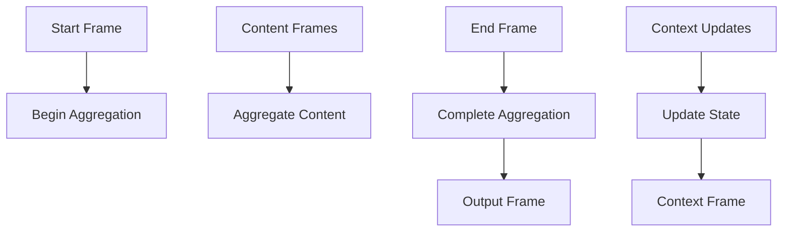

## Overview

The LLM Response Aggregators are a family of frame processors that manage conversation context and aggregate responses for Large Language Model interactions. They handle both user and assistant messages, maintaining conversation history and context.

## Base Class: LLMResponseAggregator

Base class for LLM response aggregation.

### Constructor Parameters

<ParamField path="messages" type="List[dict]" required>
  Initial list of conversation messages
</ParamField>

<ParamField path="role" type="str" required>
  Role for the messages ("user" or "assistant")
</ParamField>

<ParamField path="start_frame" type="Type[Frame]" required>
  Frame type that initiates aggregation
</ParamField>

<ParamField path="end_frame" type="Type[Frame]" required>
  Frame type that completes aggregation
</ParamField>

<ParamField path="accumulator_frame" type="Type[TextFrame]" required>
  Frame type to aggregate
</ParamField>

<ParamField path="interim_accumulator_frame" type="Type[TextFrame]" optional>
  Frame type for interim results
</ParamField>

<ParamField path="handle_interruptions" type="bool" default="false">
  Whether to handle interruption frames
</ParamField>

<ParamField path="expect_stripped_words" type="bool" default="true">
  Whether to add spaces between aggregated words
</ParamField>

## Specialized Aggregators

### LLMAssistantResponseAggregator

Aggregates assistant responses in the conversation.

```python
class LLMAssistantResponseAggregator(LLMResponseAggregator):
    def __init__(self, messages: List[dict] = []):
        super().__init__(
            messages=messages,
            role="assistant",
            start_frame=LLMFullResponseStartFrame,
            end_frame=LLMFullResponseEndFrame,
            accumulator_frame=TextFrame,
            handle_interruptions=True,
        )
```

### LLMUserResponseAggregator

Aggregates user responses in the conversation.

```python
class LLMUserResponseAggregator(LLMResponseAggregator):
    def __init__(self, messages: List[dict] = []):
        super().__init__(
            messages=messages,
            role="user",
            start_frame=UserStartedSpeakingFrame,
            end_frame=UserStoppedSpeakingFrame,
            accumulator_frame=TranscriptionFrame,
            interim_accumulator_frame=InterimTranscriptionFrame,
        )
```

### LLMFullResponseAggregator

Aggregates text frames into complete responses.

```python
aggregator = LLMFullResponseAggregator()
```

Combines multiple text frames until receiving an end frame, then emits a single combined text frame.

### Context-Aware Aggregators

#### LLMContextAggregator

Base class for context-aware aggregation.

<ParamField path="context" type="OpenAILLMContext" required>
  LLM context object for managing conversation state
</ParamField>

#### LLMAssistantContextAggregator

Context-aware assistant response aggregator.

```python
aggregator = LLMAssistantContextAggregator(
    context=context,
    expect_stripped_words=True
)
```

#### LLMUserContextAggregator

Context-aware user response aggregator.

```python
aggregator = LLMUserContextAggregator(context=context)
```

## Input Frames

The aggregators handle various frame types:

### Control Frames

- `LLMFullResponseStartFrame`
- `LLMFullResponseEndFrame`
- `UserStartedSpeakingFrame`
- `UserStoppedSpeakingFrame`
- `StartInterruptionFrame`

### Content Frames

- `TextFrame`
- `TranscriptionFrame`
- `InterimTranscriptionFrame`

### Context Management Frames

- `LLMMessagesAppendFrame`
- `LLMMessagesUpdateFrame`
- `LLMSetToolsFrame`

## Output Frames

- `LLMMessagesFrame`: Contains complete conversation messages
- `OpenAILLMContextFrame`: Contains context-aware conversation state
- `TextFrame`: Contains aggregated responses

The aggregators follow specific patterns for frame processing. Using the notation:

- S: Start Frame
- E: End Frame
- T: Transcription/Text Frame
- I: Interim Frame
- X: Output Frame

## Processing Patterns

The aggregators follow specific patterns for frame processing. Using the notation:

- S: Start Frame
- E: End Frame
- T: Transcription/Text Frame
- I: Interim Frame
- X: Output Frame

### Supported Patterns

```
S E         -> None    # Empty sequence, no output
S T E       -> X       # Simple complete sequence
S I T E     -> X       # Interim followed by final
S I E T     -> X       # End before final transcription
S I E I T   -> X       # Multiple interim results
S E T       -> X       # Delayed transcription
S E I T     -> X       # Delayed interim and final
```

### Unsupported Patterns

```
S I E T1 I T2 -> X    # Late transcriptions after interim
```

In this case, T2 will be dropped as the aggregation has completed.

### Pattern Examples

```python
# Empty sequence
await pipeline.push_frame(UserStartedSpeakingFrame())
await pipeline.push_frame(UserStoppedSpeakingFrame())
# No output

# Simple complete sequence
await pipeline.push_frame(UserStartedSpeakingFrame())
await pipeline.push_frame(TranscriptionFrame("Hello"))
await pipeline.push_frame(UserStoppedSpeakingFrame())
# Output: TextFrame("Hello")

# Interim followed by final
await pipeline.push_frame(UserStartedSpeakingFrame())
await pipeline.push_frame(InterimTranscriptionFrame("Hel"))
await pipeline.push_frame(TranscriptionFrame("Hello"))
await pipeline.push_frame(UserStoppedSpeakingFrame())
# Output: TextFrame("Hello")

# End before final transcription
await pipeline.push_frame(UserStartedSpeakingFrame())
await pipeline.push_frame(InterimTranscriptionFrame("Hel"))
await pipeline.push_frame(UserStoppedSpeakingFrame())
await pipeline.push_frame(TranscriptionFrame("Hello"))
# Output: TextFrame("Hello")
```

## Usage Examples

### Basic Response Aggregation

```python
# Setup aggregators for both sides of conversation
user_aggregator = LLMUserResponseAggregator()
assistant_aggregator = LLMAssistantResponseAggregator()

# Create pipeline
pipeline = Pipeline([
    user_aggregator,
    llm_processor,
    assistant_aggregator,
    output_handler
])
```

### Context-Aware Conversation

```python
# Initialize context
context = OpenAILLMContext(
    system_prompt="You are a helpful assistant."
)

# Setup context-aware aggregators
user_context = LLMUserContextAggregator(context)
assistant_context = LLMAssistantContextAggregator(context)

# Update conversation context
await pipeline.push_frame(LLMMessagesUpdateFrame(
    messages=[{"role": "system", "content": "New system prompt"}]
))
```

## Frame Flow



## Notes

- Maintains conversation history and roles
- Handles interruptions when configured
- Supports both streaming and complete responses
- Manages proper text spacing
- Provides context management
- Supports tool configuration for function calling
- Thread-safe for pipeline processing
