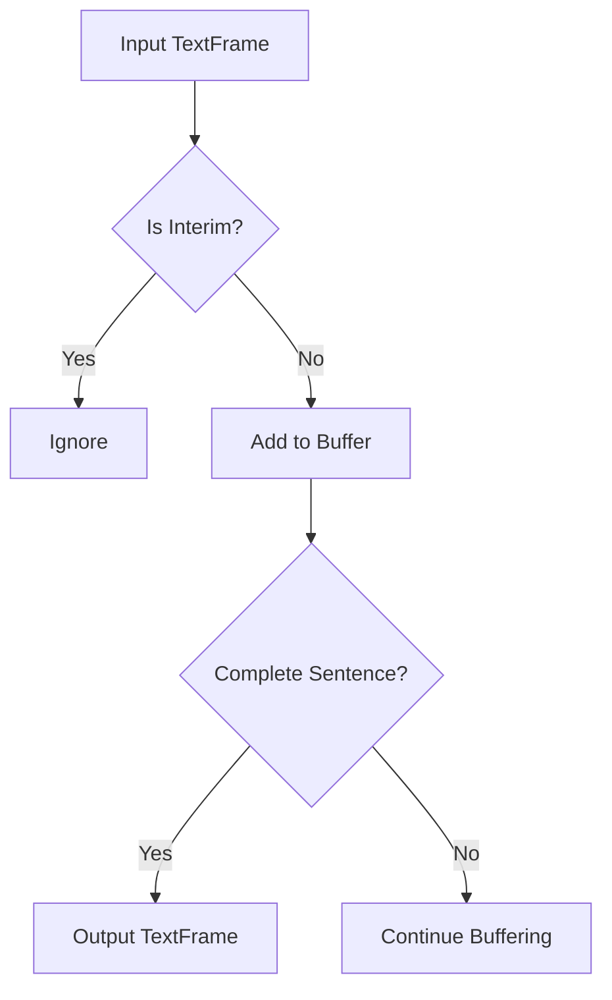

## Overview

`SentenceAggregator` is a processor that aggregates text content across multiple frames until it detects complete sentences. It helps maintain natural speech patterns by ensuring text is output in complete semantic units.

## Constructor

```python
aggregator = SentenceAggregator()
```

The processor maintains an internal buffer for text aggregation.

## Input Frames

<ParamField path="TextFrame" type="Frame">
  Contains text content to be aggregated
</ParamField>

<ParamField path="EndFrame" type="Frame">
  Signals the end of processing, forcing output of any remaining text
</ParamField>

<ParamField path="InterimTranscriptionFrame" type="Frame">
  Ignored by the processor (passed through)
</ParamField>

## Output Frames

<ParamField path="TextFrame" type="Frame">
  Contains complete sentences after aggregation
</ParamField>

## Sentence Detection

The processor uses `match_endofsentence()` to detect sentence boundaries, which typically include:

- Periods (.)
- Question marks (?)
- Exclamation points (!)
- Other sentence-ending punctuation

## Processing Pattern



## Usage Examples

### Basic Sentence Aggregation

```python
aggregator = SentenceAggregator()

# Process text fragments
await aggregator.process_frame(TextFrame("Hello"))
await aggregator.process_frame(TextFrame(" world"))
await aggregator.process_frame(TextFrame("."))
# Output: TextFrame("Hello world.")

# Multiple sentences
await aggregator.process_frame(TextFrame("First sentence. Second"))
await aggregator.process_frame(TextFrame(" sentence."))
# Outputs:
# 1. TextFrame("First sentence.")
# 2. TextFrame("Second sentence.")
```

### Handling End of Processing

```python
# Force output of incomplete sentence
await aggregator.process_frame(TextFrame("Incomplete"))
await aggregator.process_frame(EndFrame())
# Output: TextFrame("Incomplete")
```

### Pipeline Integration

```python
# Text processing pipeline
pipeline = Pipeline([
    text_input,
    SentenceAggregator(),
    sentence_processor,    # Receives complete sentences
    output_handler
])
```

## Notes

- Ignores interim transcription frames
- Maintains spacing between text fragments
- Outputs only on sentence completion or EndFrame
- Preserves original punctuation
- Thread-safe for pipeline processing
- Handles multiple sentences in single frames
- Maintains order of non-text frames

## Error Handling

The processor handles common edge cases:

- Empty text frames
- Multiple sentence endings
- Missing spaces between fragments
- Incomplete sentences at end of stream

## Best Practices

1. Ensure proper text spacing in input frames
2. Use EndFrame to flush incomplete sentences
3. Consider sentence detection requirements for your language
4. Monitor buffer size for very long sentences
