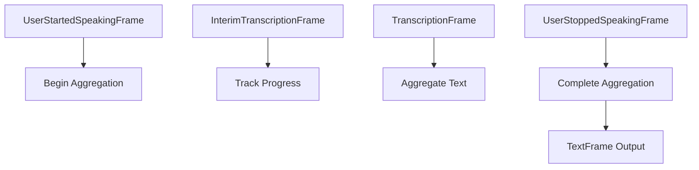

## Overview

`UserResponseAggregator` is a synchronous frame processor that combines multiple transcription frames between speech start and end events into a single complete response. It handles both interim and final transcriptions to build complete user utterances.

## Class Definition

```python
class UserResponseAggregator(ResponseAggregator):
    def __init__(self):
        super().__init__(
            start_frame=UserStartedSpeakingFrame,
            end_frame=UserStoppedSpeakingFrame,
            accumulator_frame=TranscriptionFrame,
            interim_accumulator_frame=InterimTranscriptionFrame,
        )
```

## Input Frames

The processor handles several frame types:

<ParamField path="UserStartedSpeakingFrame" type="SystemFrame">
  Signals the start of user speech and begins aggregation
</ParamField>

<ParamField path="TranscriptionFrame" type="TextFrame">
  Contains final transcription segments to be aggregated
</ParamField>

<ParamField path="InterimTranscriptionFrame" type="TextFrame">
  Contains preliminary transcription segments (tracked but not aggregated)
</ParamField>

<ParamField path="UserStoppedSpeakingFrame" type="SystemFrame">
  Signals the end of user speech and triggers final aggregation
</ParamField>

## Output Frames

<ParamField path="TextFrame" type="Frame">
  Contains the complete aggregated user response
</ParamField>

## Behavior

### Aggregation Rules

The processor follows these patterns:

```
S: Start, E: End, T: Transcription, I: Interim, X: Text output

S E     -> None     # Empty speech
S T E   -> X        # Single transcription
S I T E -> X        # Interim followed by final
S I E T -> X        # Delayed final after end
S I E I T -> X      # Multiple interim results
S E T   -> X        # Delayed transcription
S E I T -> X        # Delayed interim and final
```

### Processing Flow

1. `UserStartedSpeakingFrame` initiates aggregation
2. `InterimTranscriptionFrames` are tracked but not aggregated
3. `TranscriptionFrames` are aggregated with space separation
4. `UserStoppedSpeakingFrame` triggers output if aggregation is complete
5. Final `TextFrame` contains the complete utterance

## Usage Example

```python
# Create pipeline with response aggregation
pipeline = Pipeline([
    audio_input,
    vad_processor,          # Generates speech start/stop frames
    stt_service,           # Generates transcription frames
    UserResponseAggregator(),
    response_handler       # Receives complete utterances
])

# Example frame sequence
await pipeline.push_frame(UserStartedSpeakingFrame())
await pipeline.push_frame(InterimTranscriptionFrame("Hello", "user1", timestamp))
await pipeline.push_frame(TranscriptionFrame("Hello", "user1", timestamp))
await pipeline.push_frame(InterimTranscriptionFrame("Hello how", "user1", timestamp))
await pipeline.push_frame(TranscriptionFrame("how", "user1", timestamp))
await pipeline.push_frame(UserStoppedSpeakingFrame())
# Output: TextFrame("Hello how")
```

## Frame Flow



## Notes

- Maintains proper text spacing between segments
- Handles delayed transcriptions after speech end
- Tracks interim results for state management
- Passes through unhandled frame types
- Thread-safe for pipeline processing
- Cleans up state on reset or cancellation
