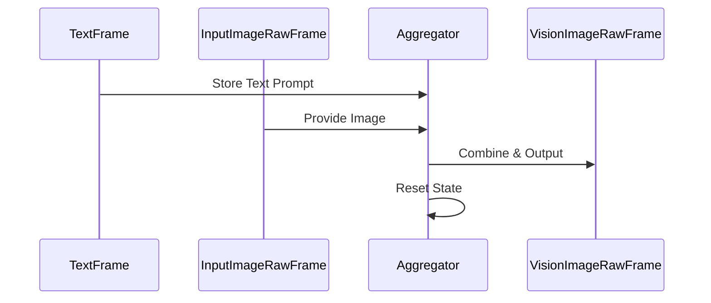
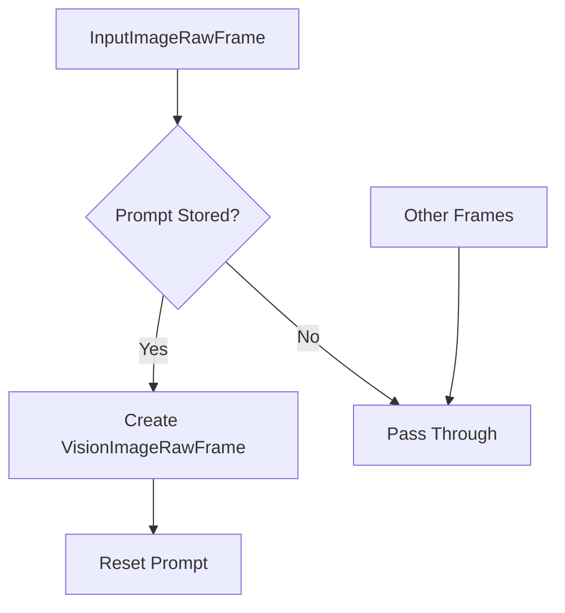

## Overview

`VisionImageFrameAggregator` is a processor that pairs text prompts with images to create vision processing requests. It waits for consecutive text and image frames, combining them into a single vision frame for processing by multimodal models.

## Constructor

```python
aggregator = VisionImageFrameAggregator()
```

The processor maintains internal state to track the most recent text prompt.

## Input Frames

### Text Prompt

<ParamField path="TextFrame" type="Frame">
  Contains the text prompt or question about the image
</ParamField>

### Image Data

<ParamField path="InputImageRawFrame" type="Frame">
  Contains the image to be analyzed, including: - Raw image data - Image
  dimensions - Format information
</ParamField>

## Output Frames

<ParamField path="VisionImageRawFrame" type="Frame">
  Combined frame containing: - Text prompt - Image data - Image dimensions -
  Format information
</ParamField>

## Processing Pattern

The aggregator follows a specific sequence:

1. Receives `TextFrame` → stores prompt
2. Receives `InputImageRawFrame` → combines with stored prompt
3. Outputs `VisionImageRawFrame`
4. Resets stored prompt



## Usage Examples

### Basic Usage

```python
# Create aggregator
aggregator = VisionImageFrameAggregator()

# Process frames
await aggregator.process_frame(TextFrame("What do you see?"))
await aggregator.process_frame(InputImageRawFrame(
    image=image_bytes,
    size=(640, 480),
    format="jpeg"
))
# Output: VisionImageRawFrame with combined data
```

### Pipeline Integration

```python
# Vision processing pipeline
pipeline = Pipeline([
    text_input,          # Generates text prompts
    image_input,         # Provides images
    VisionImageFrameAggregator(),
    vision_model,        # Processes combined frames
    response_handler
])
```

## Frame Flow



## Example Sequence

```python
# Text prompt
await pipeline.push_frame(TextFrame(
    "Describe the objects in this image"
))

# Image data
await pipeline.push_frame(InputImageRawFrame(
    image=image_data,
    size=(1024, 768),
    format="png"
))

# Results in VisionImageRawFrame output
# Containing both prompt and image data
```

## Notes

- Text prompts must precede their corresponding images
- Only the most recent text prompt is stored
- Unmatched text prompts are replaced by newer ones
- Non-matching frames are passed through unchanged
- State is automatically reset after output
- Thread-safe for pipeline processing
