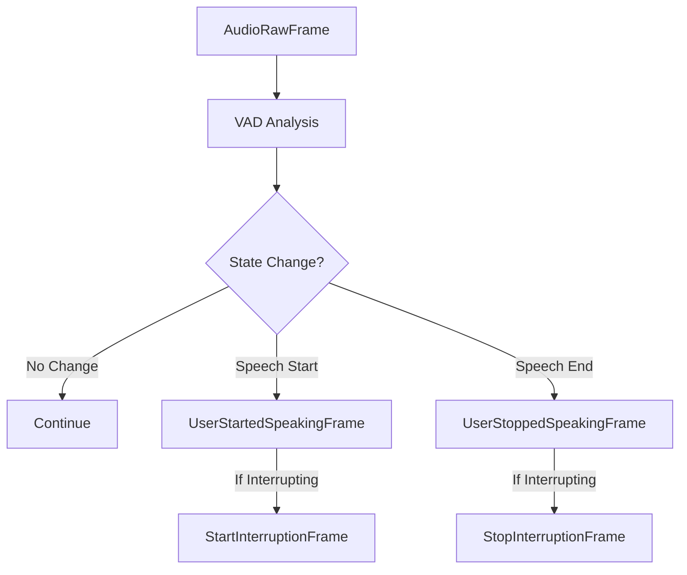

## Overview

`SileroVAD` is a frame processor that performs Voice Activity Detection (VAD) using the Silero VAD model. It analyzes audio frames to detect when users start and stop speaking, and can handle interruptions in conversations.

## Constructor Parameters

<ParamField path="sample_rate" type="int" default="16000">
  Audio sample rate in Hz
</ParamField>

<ParamField path="vad_params" type="VADParams" default="VADParams()">
  Voice Activity Detection parameters
</ParamField>

<ParamField path="audio_passthrough" type="bool" default="false">
  Whether to pass audio frames downstream
</ParamField>

### VADParams Configuration

```python
class VADParams:
    threshold: float              # Speech detection threshold
    min_speech_duration_ms: int   # Minimum speech duration
    max_speech_duration_s: int    # Maximum speech duration
    min_silence_duration_ms: int  # Minimum silence duration
```

## Input Frames

<ParamField path="AudioRawFrame" type="Frame" required>
  Raw audio data for VAD analysis. Should match configured sample rate.
</ParamField>

## Output Frames

### Speech Detection Frames

<ParamField path="UserStartedSpeakingFrame" type="SystemFrame">
  Emitted when speech is detected
</ParamField>

<ParamField path="UserStoppedSpeakingFrame" type="SystemFrame">
  Emitted when speech ends
</ParamField>

### Interruption Frames

<ParamField path="StartInterruptionFrame" type="SystemFrame">
  Emitted out-of-band when speech interrupts ongoing processing
</ParamField>

<ParamField path="StopInterruptionFrame" type="SystemFrame">
  Emitted when interrupting speech ends
</ParamField>

## State Management

### VAD States

```python
class VADState(Enum):
    QUIET     # No speech detected
    STARTING  # Potential speech beginning
    SPEAKING  # Active speech
    STOPPING  # Potential speech ending
```

The processor tracks state transitions to generate appropriate frames:

- QUIET → SPEAKING: Generates UserStartedSpeakingFrame
- SPEAKING → QUIET: Generates UserStoppedSpeakingFrame

## Usage Example

```python
# Basic VAD setup
vad = SileroVAD(
    sample_rate=16000,
    vad_params=VADParams(
        threshold=0.5,
        min_speech_duration_ms=250,
        min_silence_duration_ms=100
    ),
    audio_passthrough=True
)

# Pipeline integration
pipeline = Pipeline([
    audio_input,
    vad,                 # Detects speech
    transcriber,         # Receives audio if passthrough=True
    response_handler     # Handles speech events
])
```

## Frame Flow



## Interruption Handling

The processor provides special handling for interruptions:

1. When speech is detected:

   ```python
   # Normal speech event
   await self.push_frame(UserStartedSpeakingFrame())

   # Out-of-band interruption notification
   await self.push_frame(StartInterruptionFrame())
   ```

2. When speech ends:

   ```python
   # Normal speech event
   await self.push_frame(UserStoppedSpeakingFrame())

   # Out-of-band interruption end
   await self.push_frame(StopInterruptionFrame())
   ```

## Notes

- Requires audio input at the configured sample rate
- Interruption frames are sent out-of-band for immediate handling
- State transitions filter out STARTING and STOPPING states
- Audio passthrough can be enabled for downstream processing
- Uses Silero VAD model for accurate speech detection
- Thread-safe for pipeline processing
