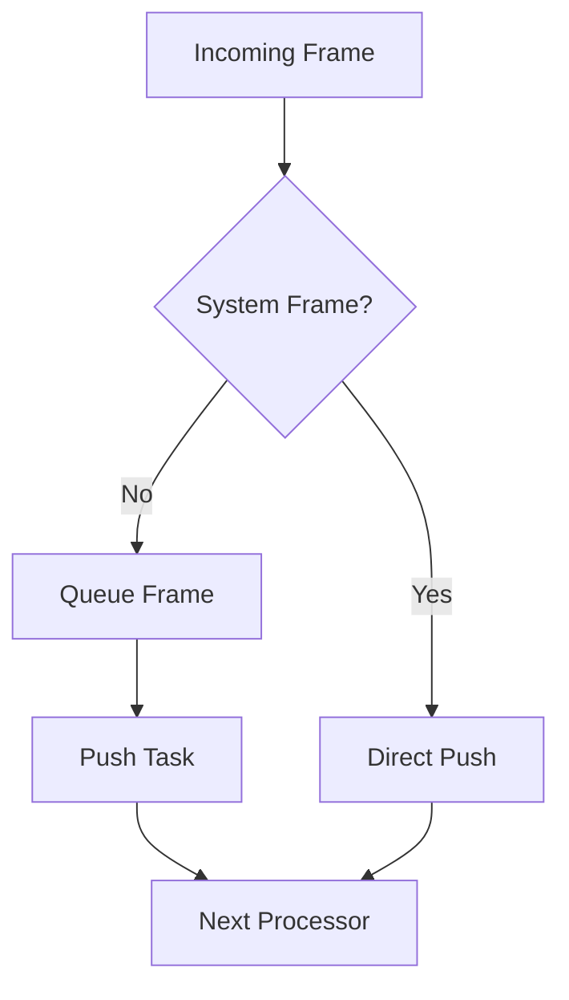

## Overview

`FrameProcessor` is the foundation class for all processors in Pipecat. It provides essential functionality for frame handling, pipeline linking, metrics collection, and event management.

## Constructor Parameters

<ParamField path="name" type="str | None" optional>
  Custom name for the processor. Defaults to "ClassName#N"
</ParamField>

<ParamField path="metrics" type="FrameProcessorMetrics | None" optional>
  Custom metrics collector for the processor
</ParamField>

<ParamField path="loop" type="asyncio.AbstractEventLoop | None" optional>
  Custom event loop for the processor
</ParamField>

## Core Properties

### Identification

```python
self.id: int                     # Unique processor ID
self.name: str                   # Processor name
```

### Pipeline Links

```python
self._parent: FrameProcessor     # Parent processor
self._prev: FrameProcessor      # Previous processor in pipeline
self._next: FrameProcessor      # Next processor in pipeline
```

### Processing Control

```python
self._allow_interruptions: bool  # Whether interruptions are allowed
self._enable_metrics: bool       # Whether metrics collection is enabled
self._clock: BaseClock          # Pipeline clock
```

## Frame Processing

### Main Processing Method

```python
async def process_frame(self, frame: Frame, direction: FrameDirection):
    """
    Process incoming frames and handle system events.

    Args:
        frame: The frame to process
        direction: DOWNSTREAM or UPSTREAM
    """
```

### Frame Direction

```python
class FrameDirection(Enum):
    DOWNSTREAM = 1  # Normal flow direction
    UPSTREAM = 2    # Reverse flow direction
```

## Frame Pushing

### Push Methods

```python
async def push_frame(
    self,
    frame: Frame,
    direction: FrameDirection = FrameDirection.DOWNSTREAM
):
    """Push frame to next/previous processor"""

async def push_error(self, error: ErrorFrame):
    """Push error frame upstream"""
```

### Single Push Task Rule

The processor maintains a single task for pushing frames to ensure ordering:

```python
self.__push_frame_task: asyncio.Task  # Single frame pushing task
self.__push_queue: asyncio.Queue      # Frame queue
```

## Metrics Support

### Metrics Methods

```python
async def start_processing_metrics(self)
async def stop_processing_metrics(self)
async def start_ttfb_metrics(self)
async def stop_ttfb_metrics(self)
async def start_llm_usage_metrics(self, tokens: LLMTokenUsage)
async def start_tts_usage_metrics(self, text: str)
```

## Event Handling

### Event Registration

```python
@event_handler(event_name: str)
def handle_event(self, *args, **kwargs):
    """Decorator for event handlers"""

def add_event_handler(self, event_name: str, handler)
def _register_event_handler(self, event_name: str)
```

## Interruption Handling

```python
async def _start_interruption(self):
    """Handle start of interruption"""
    # Cancels current push task
    # Creates new queue and task

async def _stop_interruption(self):
    """Handle end of interruption"""
```

## Resource Management

```python
async def cleanup(self):
    """Clean up processor resources"""
    pass
```

## Usage Example

```python
class CustomProcessor(FrameProcessor):
    def __init__(self, **kwargs):
        super().__init__(**kwargs)

    async def process_frame(self, frame: Frame, direction: FrameDirection):
        # Handle system frames
        await super().process_frame(frame, direction)

        if isinstance(frame, SpecificFrame):
            # Process frame
            result = await self.process(frame)
            # Push result downstream
            await self.push_frame(result)
        else:
            # Pass through other frames
            await self.push_frame(frame, direction)
```

## Frame Flow



## Notes

- Maintains single push task for frame ordering
- Handles system frames separately from data frames
- Supports bidirectional frame flow
- Provides metrics collection infrastructure
- Manages processor lifecycle
- Handles interruptions gracefully
- Thread-safe frame processing
