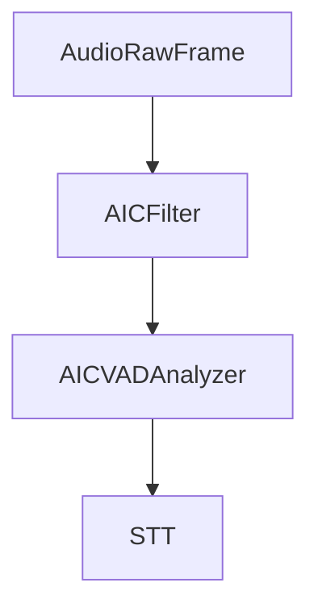

## Overview

`AICFilter` is an audio processor that enhances user speech by reducing background noise and improving speech clarity. It inherits from `BaseAudioFilter` and processes audio frames in real-time using ai-coustics' speech enhancement technology.

To use AIC, you need a license key. Get started at [ai-coustics.com](https://docs.ai-coustics.com/tutorials/pipecat-quickstart).

<Note>
  This documentation covers **aic-sdk v3.x**. If you're using aic-sdk v2.x or
  v1.x, please see the [Migration Guide](#migration-guides) section below for
  upgrading instructions.
</Note>

## Installation

The AIC filter requires additional dependencies:

```bash
uv add "pipecat-ai[aic]"
```

## Constructor Parameters

<ParamField path="license_key" type="str" required>
  ai-coustics license key for authentication. Get your key at
  [developers.ai-coustics.io](https://developers.ai-coustics.io).
</ParamField>

<ParamField path="model_id" type="str | None" default="None">
  Model identifier to download from CDN. Required if `model_path` is not provided.
  See [artifacts.ai-coustics.io](https://artifacts.ai-coustics.io/) for available models.
  See the [documentation](https://docs.ai-coustics.com/guides/models) for more detailed information about the models.

Examples: `"quail-vf-2.0-l-16khz"`, `"quail-vf-l-16khz"`, `"quail-s-16khz"`, `"quail-l-8khz"`

</ParamField>

<ParamField path="model_path" type="str | None" default="None">
  Path to a local `.aicmodel` file. If provided, `model_id` is ignored and no
  download occurs. Useful for offline deployments or custom models.
</ParamField>

<ParamField path="model_download_dir" type="Path | None" default="None">
  Directory for downloading and caching models. Defaults to a cache directory in
  the user's home folder.
</ParamField>

<ParamField path="enhancement_level" type="float | None" default="None">
  Overall enhancement strength from `0.0` (no enhancement) to `1.0` (maximum
  enhancement). If `None`, the model's default behavior is used. This parameter
  allows you to control the intensity of the speech enhancement applied by the
  model.
</ParamField>

## Input Frames

<ParamField path="FilterEnableFrame" type="Frame">
  Specific control frame to toggle filtering on/off

```python
from pipecat.frames.frames import FilterEnableFrame

# Disable speech enhancement
await worker.queue_frame(FilterEnableFrame(False))

# Re-enable speech enhancement
await worker.queue_frame(FilterEnableFrame(True))
```

</ParamField>

## Usage Examples

### Basic Usage with Quail VAD 2.0

The recommended approach is to use `AICFilter` for enhancement and `AICQuailVADAnalyzer` for voice activity detection:

```python
from pipecat.audio.filters.aic_filter import AICFilter
from pipecat.audio.vad.aic_quail_vad import AICQuailVADAnalyzer
from pipecat.processors.aggregators.llm_response_universal import (
    LLMContextAggregatorPair,
    LLMUserAggregatorParams,
)
from pipecat.transports.daily.transport import DailyTransport, DailyParams

# Create the AIC filter for enhancement
aic_filter = AICFilter(
    license_key=os.environ["AIC_SDK_LICENSE"],
    model_id="quail-vf-2.0-l-16khz",
)

# Create standalone Quail VAD 2.0 analyzer
aic_vad = AICQuailVADAnalyzer(
    license_key=os.environ["AIC_SDK_LICENSE"],
)

transport = DailyTransport(
    room_url,
    token,
    "Bot",
    DailyParams(
        audio_in_enabled=True,
        audio_out_enabled=True,
        audio_in_filter=aic_filter,
    ),
)

user_aggregator, assistant_aggregator = LLMContextAggregatorPair(
    context,
    user_params=LLMUserAggregatorParams(
        vad_analyzer=aic_vad,
    ),
)
```

### Using a Local Model

For offline deployments or when you want to manage model files yourself:

```python
from pipecat.audio.filters.aic_filter import AICFilter

aic_filter = AICFilter(
    license_key=os.environ["AIC_SDK_LICENSE"],
    model_path="/path/to/your/model.aicmodel",
)
```

### Custom Cache Directory

Specify a custom directory for model downloads:

```python
from pipecat.audio.filters.aic_filter import AICFilter

aic_filter = AICFilter(
    license_key=os.environ["AIC_SDK_LICENSE"],
    model_id="quail-s-16khz",
    model_download_dir="/opt/aic-models",
)
```

### With Enhancement Level Control

Control the enhancement strength applied by the model:

```python
from pipecat.audio.filters.aic_filter import AICFilter

# Set enhancement level to 70% strength
aic_filter = AICFilter(
    license_key=os.environ["AIC_SDK_LICENSE"],
    model_id="quail-vf-l-16khz",
    enhancement_level=0.7,
)

# Use default model behavior (no enhancement_level specified)
aic_filter_default = AICFilter(
    license_key=os.environ["AIC_SDK_LICENSE"],
    model_id="quail-vf-l-16khz",
)
```

### With Other Transports

The AIC filter works with any Pipecat transport:

```python
from pipecat.audio.filters.aic_filter import AICFilter
from pipecat.audio.vad.aic_quail_vad import AICQuailVADAnalyzer
from pipecat.processors.aggregators.llm_response_universal import (
    LLMContextAggregatorPair,
    LLMUserAggregatorParams,
)
from pipecat.transports.websocket.fastapi import FastAPIWebsocketTransport, FastAPIWebsocketParams

aic_filter = AICFilter(
    license_key=os.environ["AIC_SDK_LICENSE"],
    model_id="quail-vf-2.0-l-16khz",
)

aic_vad = AICQuailVADAnalyzer(
    license_key=os.environ["AIC_SDK_LICENSE"],
)

transport = FastAPIWebsocketTransport(
    params=FastAPIWebsocketParams(
        audio_in_enabled=True,
        audio_out_enabled=True,
        audio_in_filter=aic_filter,
    ),
)

user_aggregator, assistant_aggregator = LLMContextAggregatorPair(
    context,
    user_params=LLMUserAggregatorParams(
        vad_analyzer=aic_vad,
    ),
)
```

<Info>
  See the [AIC filter
  example](https://github.com/pipecat-ai/pipecat/blob/main/examples/voice/voice-aicoustics.py)
  for a complete working example.
</Info>

## Models

For detailed information about the available models, take a look at the [Models documentation](https://docs.ai-coustics.com/guides/models).

## Audio Flow



The AIC filter enhances audio before it reaches the VAD and STT stages, improving transcription accuracy in noisy environments.

## Migration Guides

### Migrating from v2 to v3

<Note>
  For the complete aic-sdk migration guide including all API changes, see the
  official [Python 2.5 to 3.0 Migration
  Guide](https://docs.ai-coustics.com/guides/migrations/python-2-5-to-3-0).
</Note>

#### Migration Steps

1. Update Pipecat to the latest version (aic-sdk v3.1.0+ is included automatically).
2. **Remove deprecated VAD methods**: The `create_vad_analyzer()` and `get_vad_context()` methods have been removed. Use [`AICQuailVADAnalyzer`](/api-reference/server/services/vad/aic-quail-vad-analyzer) for voice activity detection.
3. Update model selection if needed: The old default `quail-vad-2.0-xxs-16khz` no longer works with aic-sdk 3.0. See [artifacts.ai-coustics.io](https://artifacts.ai-coustics.io/) for current models.

#### Breaking Changes

| v2 Method/Feature       | v3 Replacement                                                                                                   |
| ----------------------- | ---------------------------------------------------------------------------------------------------------------- |
| `create_vad_analyzer()` | Use `AICQuailVADAnalyzer` (removed in v3)                                                                        |
| `get_vad_context()`     | Use `AICQuailVADAnalyzer` for VAD (removed in v3)                                                                |
| Old VAD models          | `quail-vad-2.0-xxs-16khz` no longer works; use `vad-2.1-xxs-16khz` or other models from artifacts.ai-coustics.io |

### Migrating from v1 to v2

<Note>
  For the complete aic-sdk migration guide including all API changes, see the
  official [Python 1.3 to 2.0 Migration
  Guide](https://docs.ai-coustics.com/guides/migrations/python-1-3-to-2-0#quick-migration-checklist).
</Note>

#### Migration Steps

1. Update Pipecat to the latest version (aic-sdk v2.3.0+ is included automatically).
2. **Update environment variable**: Change `AIC_LICENSE_KEY` to `AIC_SDK_LICENSE` in your `.env` file.
3. Remove deprecated constructor parameters (`model_type`, `voice_gain`, `noise_gate_enable`).
4. Add `model_id` parameter with an appropriate model (e.g., `"quail-vf-2.0-l-16khz"`).
5. **For VAD**: Replace `aic_filter.create_vad_analyzer()` with `AICQuailVADAnalyzer` for improved accuracy and independence from the enhancement filter.
6. Update any runtime VAD adjustments to use the new VAD context API.

#### Breaking Changes

| v1 Parameter        | v2 Replacement                                                                          |
| ------------------- | --------------------------------------------------------------------------------------- |
| `model_type`        | `model_id` (string-based model selection)                                               |
| `enhancement_level` | Now optional (0.0-1.0 range, applies at initialization and when toggling filter on/off) |
| `voice_gain`        | Removed                                                                                 |
| `noise_gate_enable` | Removed                                                                                 |

## Notes

- Requires ai-coustics license key (get one at [developers.ai-coustics.io](https://developers.ai-coustics.io))
- **Environment variable**: Use `AIC_SDK_LICENSE` (not `AIC_LICENSE_KEY`) for authentication
- **aic-sdk 3.x required**: Version 3.1.0+ is included in `pipecat-ai[aic]`
- Models are automatically downloaded and cached on first use
- Supports real-time audio processing with low latency
- Handles PCM_16 audio format (int16 samples)
- Thread-safe for pipeline processing
- Can be dynamically enabled/disabled via `FilterEnableFrame`
- **For VAD**: Use [`AICQuailVADAnalyzer`](/api-reference/server/services/vad/aic-quail-vad-analyzer) for voice activity detection
- The filter closes its ai-coustics session when the pipeline stops
- For available models, visit [artifacts.ai-coustics.io](https://artifacts.ai-coustics.io/)
