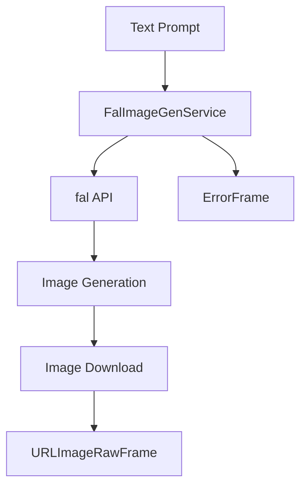

## Overview

`FalImageGenService` provides high-speed image generation capabilities using fal's optimized Stable Diffusion XL models. It supports various image sizes, formats, and generation parameters with a focus on fast inference.

## Installation

To use `FalImageGenService`, install the required dependencies:

```bash
pip install pipecat-ai[fal]
```

You'll also need to set up your Fal API key as an environment variable: `FAL_KEY`

<Tip>You can obtain a fal API key by signing up at [fal](https://fal.ai/).</Tip>

## Configuration

### Constructor Parameters

<ParamField path="params" type="InputParams" required>
  Generation parameters configuration
</ParamField>

<ParamField path="aiohttp_session" type="aiohttp.ClientSession" required>
  HTTP session for image downloading
</ParamField>

<ParamField path="model" type="str" default="fal-ai/fast-sdxl">
  Model identifier
</ParamField>

<ParamField path="key" type="str" optional>
  Fal API key (alternative to environment variable)
</ParamField>

### Input Parameters

```python
class InputParams(BaseModel):
    seed: Optional[int] = None              # Random seed for reproducibility
    num_inference_steps: int = 8            # Number of denoising steps
    num_images: int = 1                     # Number of images to generate
    image_size: Union[str, Dict[str, int]] = "square_hd"  # Image dimensions
    expand_prompt: bool = False             # Enhance prompt automatically
    enable_safety_checker: bool = True      # Filter unsafe content
    format: str = "png"                     # Output image format
```

#### Supported Image Sizes

Possible enum values: `square_hd`, `square`, `portrait_4_3`, `portrait_16_9`, `landscape_4_3`, `landscape_16_9`

Note: For custom image sizes, you can pass the width and height as an object:

```json
{
  "image_size": {
    "width": 1280,
    "height": 720
  }
}
```

See the [fal docs](https://fal.ai/models/fal-ai/fast-lightning-sdxl/api) for more information.

## Output Frames

### URLImageRawFrame

<ParamField path="url" type="string">
  Generated image URL
</ParamField>

<ParamField path="image" type="bytes">
  Raw image data
</ParamField>

<ParamField path="size" type="tuple">
  Image dimensions (width, height)
</ParamField>

<ParamField path="format" type="string">
  Image format (e.g., 'PNG')
</ParamField>

### ErrorFrame

<ParamField path="error" type="string">
  Error information if generation fails
</ParamField>

## Usage Example

```python
import aiohttp
from pipecat.services.fal import FalImageGenService

# Configure service
async with aiohttp.ClientSession() as session:
    service = FalImageGenService(
        model="fal-ai/fast-sdxl",
        aiohttp_session=session,
        params=FalImageGenService.InputParams(
            num_inference_steps=8,
            image_size="portrait_hd",
            expand_prompt=True
        )
    )

    # Use in pipeline
    pipeline = Pipeline([
        prompt_input,       # Produces text prompts
        service,           # Generates images
        image_handler     # Handles generated images
    ])
```

## Frame Flow



## Metrics Support

The service collects processing metrics:

- Generation time
- Download time
- API response time
- Total processing duration

## Notes

- Fast inference times with optimized models
- Supports various image sizes and formats
- Automatic prompt enhancement option
- Built-in safety filtering
- Asynchronous operation
- Efficient HTTP session management
- Comprehensive error handling
