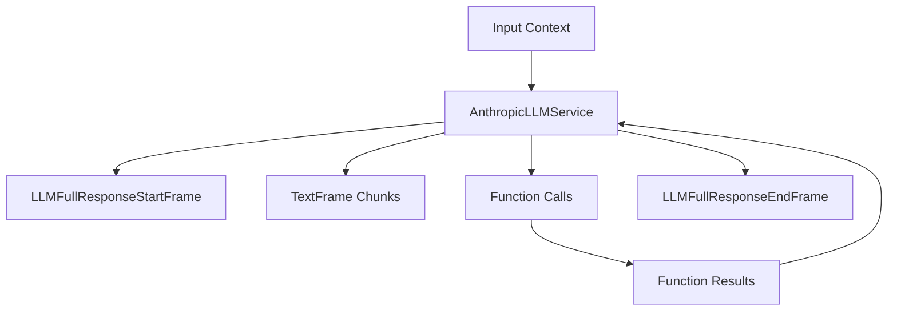

## Overview

`AnthropicLLMService` provides integration with Anthropic's Claude models, supporting streaming responses, function calling, and prompt caching. It includes specialized context handling for Anthropic's message format.

## Installation

To use `AnthropicLLMService`, install the required dependencies:

```bash
pip install pipecat-ai[anthropic]
```

You'll also need to set up your Anthropic API key as an environment variable: `ANTHROPIC_API_KEY`

## Configuration

### Constructor Parameters

<ParamField path="api_key" type="str" required>
  Anthropic API key
</ParamField>

<ParamField path="model" type="str" default="claude-3-5-sonnet-20240620">
  Model identifier
</ParamField>

<ParamField path="params" type="InputParams" optional>
  Model configuration parameters
</ParamField>

### Input Parameters

```python
class InputParams(BaseModel):
    enable_prompt_caching_beta: Optional[bool] = False
    max_tokens: Optional[int] = 4096          # >= 1
    temperature: Optional[float] = NOT_GIVEN  # [0.0, 1.0]
    top_k: Optional[int] = NOT_GIVEN          # >= 0
    top_p: Optional[float] = NOT_GIVEN        # [0.0, 1.0]
    extra: Optional[Dict[str, Any]] = {}
```

## Input Frames

<ParamField path="OpenAILLMContextFrame" type="Frame">
  Contains conversation context
</ParamField>

<ParamField path="LLMMessagesFrame" type="Frame">
  Contains conversation messages
</ParamField>

<ParamField path="VisionImageRawFrame" type="Frame">
  Contains image for vision processing
</ParamField>

<ParamField path="LLMUpdateSettingsFrame" type="Frame">
  Updates model settings
</ParamField>

<ParamField path="LLMEnablePromptCachingFrame" type="Frame">
  Controls prompt caching behavior
</ParamField>

## Output Frames

<ParamField path="TextFrame" type="Frame">
  Contains generated text
</ParamField>

<ParamField path="FunctionCallInProgressFrame" type="Frame">
  Indicates ongoing function call
</ParamField>

<ParamField path="FunctionCallResultFrame" type="Frame">
  Contains function call results
</ParamField>

## Context Management

### AnthropicLLMContext

Specialized context manager that handles Anthropic's message format:

```python
context = AnthropicLLMContext(
    messages=[],
    tools=[],
    system="You are a helpful assistant"
)
```

### Context Aggregators

```python
# Create context aggregators
aggregators = AnthropicLLMService.create_context_aggregator(
    context,
    assistant_expect_stripped_words=True
)

# Access aggregators
user_aggregator = aggregators.user()
assistant_aggregator = aggregators.assistant()
```

## Usage Examples

### Basic Usage

```python
# Configure service
llm_service = AnthropicLLMService(
    api_key="your-api-key",
    model="claude-3-5-sonnet-20240620",
    params=AnthropicLLMService.InputParams(
        temperature=0.7,
        max_tokens=1000
    )
)

# Create pipeline
pipeline = Pipeline([
    context_manager,
    llm_service,
    response_handler
])
```

### With Function Calling

```python
# Configure function calling
context = AnthropicLLMContext(
    system="You are a helpful assistant",
    tools=[{
        "type": "function",
        "function": {
            "name": "get_weather",
            "description": "Get weather information",
            "parameters": {
                "type": "object",
                "properties": {
                    "location": {"type": "string"}
                }
            }
        }
    }]
)

# Use in pipeline
pipeline = Pipeline([
    context_aggregator,
    llm_service,
    function_handler
])
```

## Frame Flow



## Metrics Support

The service collects various metrics:

- Token usage (prompt and completion)
- Cache metrics (creation and read tokens)
- Processing time
- Time to first byte (TTFB)

## Features

### Prompt Caching

```python
# Enable prompt caching
await pipeline.push_frame(
    LLMEnablePromptCachingFrame(enable=True)
)
```

### Message Format Conversion

Automatically handles conversion between:

- OpenAI message format
- Anthropic message format
- Function calling format

### Token Estimation

Provides token usage tracking and estimation:

```python
def _estimate_tokens(self, text: str) -> int:
    """Estimates token count for partial responses"""
```

## Notes

- Supports streaming responses
- Handles function calling
- Provides prompt caching
- Manages conversation context
- Supports vision inputs
- Includes metrics collection
- Thread-safe processing
- Handles interruptions
