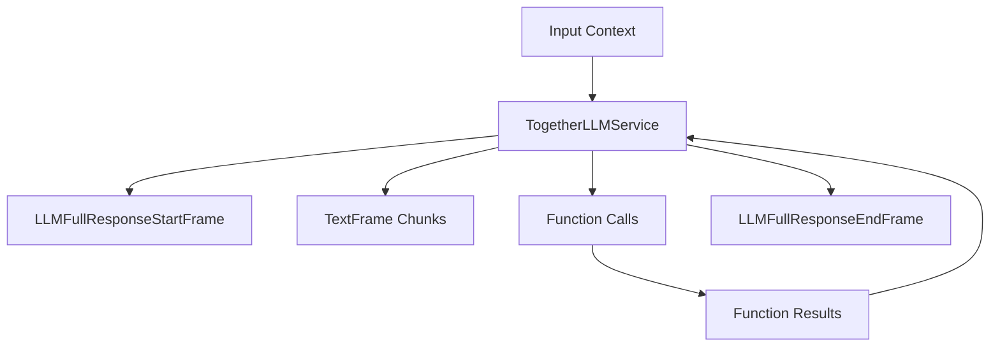

## Overview

`AzureLLMService` extends the BaseOpenAILLMService to provide Azure-specific OpenAI model integration. It maintains compatibility with OpenAI's interface while using Azure's endpoints.

## Installation

To use `AzureLLMService`, install the required dependencies:

```bash
pip install pipecat-ai[azure]
```

You'll also need to set up the following environment variables:

- `AZURE_API_KEY`
- `AZURE_REGION`

## Configuration

### Constructor Parameters

<ParamField path="api_key" type="str" required>
  Azure OpenAI API key
</ParamField>

<ParamField path="endpoint" type="str" required>
  Azure OpenAI endpoint URL
</ParamField>

<ParamField path="model" type="str" required>
  Model deployment name
</ParamField>

<ParamField path="api_version" type="str" default="2023-12-01-preview">
  Azure OpenAI API version
</ParamField>

### Input Parameters

Inherits all input parameters from OpenAILLMService:

```python
class InputParams(BaseModel):
    frequency_penalty: Optional[float]   # [-2.0, 2.0]
    presence_penalty: Optional[float]    # [-2.0, 2.0]
    seed: Optional[int]                  # >= 0
    temperature: Optional[float]         # [0.0, 2.0]
    top_p: Optional[float]               # [0.0, 1.0]
    max_tokens: Optional[int]            # >= 1
    max_completion_tokens: Optional[int] # >= 1
    extra: Optional[Dict[str, Any]]
```

### Input Frames

<ParamField path="OpenAILLMContextFrame" type="Frame">
  Contains OpenAI-specific conversation context
</ParamField>

<ParamField path="LLMMessagesFrame" type="Frame">
  Contains conversation messages
</ParamField>

<ParamField path="VisionImageRawFrame" type="Frame">
  Contains image for vision model processing
</ParamField>

<ParamField path="LLMUpdateSettingsFrame" type="Frame">
  Updates model settings
</ParamField>

### Output Frames

<ParamField path="TextFrame" type="Frame">
  Contains generated text chunks
</ParamField>

<ParamField path="FunctionCallInProgressFrame" type="Frame">
  Indicates start of function call
</ParamField>

<ParamField path="FunctionCallResultFrame" type="Frame">
  Contains function call results
</ParamField>

## Usage Example

```python
# Configure service
llm_service = AzureLLMService(
    api_key="your-api-key",
    endpoint="https://your-resource.openai.azure.com/",
    model="gpt-4",
    api_version="2023-12-01-preview"
)

# Use in pipeline
pipeline = Pipeline([
    context_manager,
    llm_service,
    response_handler
])
```

## Function Calling

Supports OpenAI-compatible function calling:

```python
# Define tools
tools = [{
    "type": "function",
    "function": {
        "name": "get_weather",
        "description": "Get weather information",
        "parameters": {
            "type": "object",
            "properties": {
                "location": {"type": "string"}
            }
        }
    }
}]

# Configure context with tools
context = OpenAILLMContext(
    messages=[],
    tools=tools
)

# Register function handler
@service.function("get_weather")
async def handle_weather(location: str):
    return {"temperature": 72, "condition": "sunny"}
```

## Frame Flow



## Metrics Support

The service collects the same metrics as OpenAILLMService:

- Token usage (prompt and completion)
- Processing duration
- Time to First Byte (TTFB)
- Function call metrics

## Notes

- OpenAI-compatible interface
- Supports streaming responses
- Handles function calling
- Manages conversation context
- Includes token usage tracking
- Thread-safe processing
- Automatic error handling
- Inherits OpenAI service features
