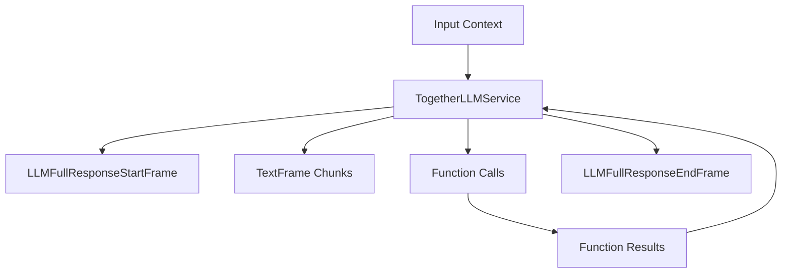

## Overview

`AzureLLMService` extends the BaseOpenAILLMService to provide Azure-specific OpenAI model integration. It maintains compatibility with OpenAI's interface while using Azure's endpoints.

## Installation

To use `AzureLLMService`, install the required dependencies:

```bash
pip install pipecat-ai[azure]
```

You'll also need to set up the following environment variables:

- `AZURE_API_KEY`
- `AZURE_REGION`

## Configuration

### Constructor Parameters

<ParamField path="api_key" type="str" required>
  Azure OpenAI API key
</ParamField>

<ParamField path="endpoint" type="str" required>
  Azure OpenAI endpoint URL
</ParamField>

<ParamField path="model" type="str" required>
  Model deployment name
</ParamField>

<ParamField path="api_version" type="str" default="2023-12-01-preview">
  Azure OpenAI API version
</ParamField>

### Input Parameters

Inherits all input parameters from OpenAILLMService:

<ParamField path="extra" type="Optional[Dict[str, Any]]">
  Additional parameters to pass to the model
</ParamField>

<ParamField path="frequency_penalty" type="Optional[float]">
  Reduces likelihood of repeating tokens based on their frequency. Range: [-2.0,
  2.0]
</ParamField>

<ParamField path="max_completion_tokens" type="Optional[int]">
  Maximum number of tokens in the completion. Must be greater than or equal to 1
</ParamField>

<ParamField path="max_tokens" type="Optional[int]">
  Maximum number of tokens to generate. Must be greater than or equal to 1
</ParamField>

<ParamField path="presence_penalty" type="Optional[float]">
  Reduces likelihood of repeating any tokens that have appeared. Range: [-2.0,
  2.0]
</ParamField>

<ParamField path="seed" type="Optional[int]">
  Random seed for deterministic generation. Must be greater than or equal to 0
</ParamField>

<ParamField path="temperature" type="Optional[float]">
  Controls randomness in the output. Range: [0.0, 2.0]
</ParamField>

<ParamField path="top_p" type="Optional[float]">
  Controls diversity via nucleus sampling. Range: [0.0, 1.0]
</ParamField>

## Input Frames

<ParamField path="OpenAILLMContextFrame" type="Frame">
  Contains OpenAI-specific conversation context
</ParamField>

<ParamField path="LLMMessagesFrame" type="Frame">
  Contains conversation messages
</ParamField>

<ParamField path="VisionImageRawFrame" type="Frame">
  Contains image for vision model processing
</ParamField>

<ParamField path="LLMUpdateSettingsFrame" type="Frame">
  Updates model settings
</ParamField>

## Output Frames

<ParamField path="TextFrame" type="Frame">
  Contains generated text chunks
</ParamField>

<ParamField path="FunctionCallInProgressFrame" type="Frame">
  Indicates start of function call
</ParamField>

<ParamField path="FunctionCallResultFrame" type="Frame">
  Contains function call results
</ParamField>

## Context Management

The Azure service uses specialized context management to handle conversations and message formatting. It relies on the OpenAI base class for context management, which includes managing the conversation history, system prompts, tool calls, and converting between OpenAI and Azure message formats.

### OpenAILLMContext

The base context manager for OpenAI conversations:

```python
context = OpenAILLMContext(
    messages=[],  # Conversation history
    tools=[],     # Available function calling tools
    system="You are a helpful assistant"  # System prompt
)
```

### Context Aggregators

Context aggregators handle message format conversion and management. The service provides a method to create paired aggregators:

<ResponseField name="create_context_aggregator" type="static method">
Creates user and assistant aggregators for handling message formatting.

```python
@staticmethod
def create_context_aggregator(
    context: OpenAILLMContext,
    *,
    assistant_expect_stripped_words: bool = True
) -> OpenAIContextAggregatorPair
```

### Parameters

<ParamField path="context" type="OpenAILLMContext" required>
  The context object containing conversation history and settings
</ParamField>

<ParamField path="assistant_expect_stripped_words" type="bool" default="True">
  Controls text preprocessing for assistant responses
</ParamField>

</ResponseField>

### Usage Example

```python

# 1. Create the context
context = OpenAILLMContext(
    messages=[],
    system="You are a helpful assistant"
)

# 2. Create aggregators for message handling
aggregators = OpenAILLMService.create_context_aggregator(context)

# 3. Access individual aggregators
user_aggregator = aggregators.user()      # Handles user message formatting
assistant_aggregator = aggregators.assistant()  # Handles assistant responses

# 4. Use in a pipeline
pipeline = Pipeline([
    user_aggregator,
    llm_service,
    assistant_aggregator
])
```

The context management system ensures proper message formatting and history tracking throughout the conversation.

## Methods

See the [LLM base class methods](/api-reference/services/base-service-classes#methods-2) for additional functionality.

## Usage Example

```python
# Configure service
llm_service = AzureLLMService(
    api_key="your-api-key",
    endpoint="https://your-resource.openai.azure.com/",
    model="gpt-4",
    api_version="2023-12-01-preview"
)

# Use in pipeline
pipeline = Pipeline([
    context_manager,
    llm_service,
    response_handler
])
```

## Function Calling

Supports OpenAI-compatible function calling:

```python
# Define tools
tools = [{
    "type": "function",
    "function": {
        "name": "get_weather",
        "description": "Get weather information",
        "parameters": {
            "type": "object",
            "properties": {
                "location": {"type": "string"}
            }
        }
    }
}]

# Configure context with tools
context = OpenAILLMContext(
    messages=[],
    tools=tools
)

# Register function handler
@service.function("get_weather")
async def handle_weather(location: str):
    return {"temperature": 72, "condition": "sunny"}
```

## Frame Flow



## Metrics Support

The service collects the same metrics as OpenAILLMService:

- Token usage (prompt and completion)
- Processing duration
- Time to First Byte (TTFB)
- Function call metrics

## Notes

- OpenAI-compatible interface
- Supports streaming responses
- Handles function calling
- Manages conversation context
- Includes token usage tracking
- Thread-safe processing
- Automatic error handling
- Inherits OpenAI service features
