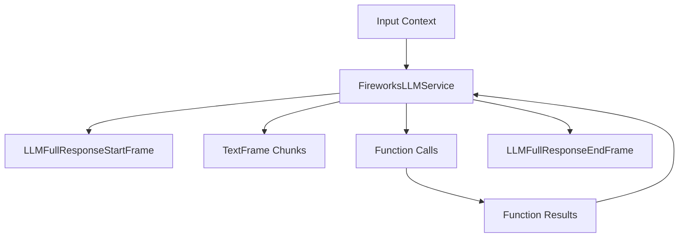

## Overview

`FireworksLLMService` provides access to Fireworks AI's language models through an OpenAI-compatible interface. It inherits from `BaseOpenAILLMService` and supports streaming responses, function calling, and context management.

## Installation

To use `FireworksLLMService`, install the required dependencies:

```bash
pip install pipecat-ai[fireworks]
```

You'll also need to set up your Fireworks API key as an environment variable: `FIREWORKS_API_KEY`

## Configuration

### Constructor Parameters

<ParamField path="api_key" type="str" required>
  Your Fireworks AI API key
</ParamField>

<ParamField
  path="model"
  type="str"
  default="accounts/fireworks/models/firefunction-v1">
  Model identifier
</ParamField>

<ParamField
  path="base_url"
  type="str"
  default="https://api.fireworks.ai/inference/v1">
  Fireworks AI API endpoint
</ParamField>

### Input Parameters

Inherits all input parameters from BaseOpenAILLMService:

<ParamField path="extra" type="Optional[Dict[str, Any]]">
  Additional parameters to pass to the model
</ParamField>

<ParamField path="frequency_penalty" type="Optional[float]">
  Reduces likelihood of repeating tokens based on their frequency. Range: [-2.0,
  2.0]
</ParamField>

<ParamField path="max_completion_tokens" type="Optional[int]">
  Maximum number of tokens in the completion. Must be greater than or equal to 1
</ParamField>

<ParamField path="max_tokens" type="Optional[int]">
  Maximum number of tokens to generate. Must be greater than or equal to 1
</ParamField>

<ParamField path="presence_penalty" type="Optional[float]">
  Reduces likelihood of repeating any tokens that have appeared. Range: [-2.0,
  2.0]
</ParamField>

<ParamField path="seed" type="Optional[int]">
  Random seed for deterministic generation. Must be greater than or equal to 0
</ParamField>

<ParamField path="temperature" type="Optional[float]">
  Controls randomness in the output. Range: [0.0, 2.0]
</ParamField>

<ParamField path="top_p" type="Optional[float]">
  Controls diversity via nucleus sampling. Range: [0.0, 1.0]
</ParamField>

## Input Frames

<ParamField path="OpenAILLMContextFrame" type="Frame">
  Contains OpenAI-specific conversation context
</ParamField>

<ParamField path="LLMMessagesFrame" type="Frame">
  Contains conversation messages
</ParamField>

<ParamField path="VisionImageRawFrame" type="Frame">
  Contains image for vision model processing
</ParamField>

<ParamField path="LLMUpdateSettingsFrame" type="Frame">
  Updates model settings
</ParamField>

## Output Frames

<ParamField path="TextFrame" type="Frame">
  Contains generated text chunks
</ParamField>

<ParamField path="FunctionCallInProgressFrame" type="Frame">
  Indicates start of function call
</ParamField>

<ParamField path="FunctionCallResultFrame" type="Frame">
  Contains function call results
</ParamField>

## Context Management

The Fireworks service uses specialized context management to handle conversations and message formatting. It relies on the OpenAI base class for context management, which includes managing the conversation history, system prompts, tool calls, and converting between OpenAI and Fireworks message formats.

### OpenAILLMContext

The base context manager for OpenAI conversations:

```python
context = OpenAILLMContext(
    messages=[],  # Conversation history
    tools=[],     # Available function calling tools
    system="You are a helpful assistant"  # System prompt
)
```

### Context Aggregators

Context aggregators handle message format conversion and management. The service provides a method to create paired aggregators:

<ResponseField name="create_context_aggregator" type="static method">
Creates user and assistant aggregators for handling message formatting.

```python
@staticmethod
def create_context_aggregator(
    context: OpenAILLMContext,
    *,
    assistant_expect_stripped_words: bool = True
) -> OpenAIContextAggregatorPair
```

### Parameters

<ParamField path="context" type="OpenAILLMContext" required>
  The context object containing conversation history and settings
</ParamField>

<ParamField path="assistant_expect_stripped_words" type="bool" default="True">
  Controls text preprocessing for assistant responses
</ParamField>

</ResponseField>

### Usage Example

```python

# 1. Create the context
context = OpenAILLMContext(
    messages=[],
    system="You are a helpful assistant"
)

# 2. Create aggregators for message handling
aggregators = OpenAILLMService.create_context_aggregator(context)

# 3. Access individual aggregators
user_aggregator = aggregators.user()      # Handles user message formatting
assistant_aggregator = aggregators.assistant()  # Handles assistant responses

# 4. Use in a pipeline
pipeline = Pipeline([
    user_aggregator,
    llm_service,
    assistant_aggregator
])
```

The context management system ensures proper message formatting and history tracking throughout the conversation.

## Methods

See the [LLM base class methods](/api-reference/services/base-service-classes#methods-2) for additional functionality.

## Usage Example

```python
from pipecat.services.fireworks import FireworksLLMService
from pipecat.processors.aggregators.openai_llm_context import OpenAILLMContext

# Configure service
service = FireworksLLMService(
    api_key="your-fireworks-api-key",
    model="accounts/fireworks/models/firefunction-v1",
    params=FireworksLLMService.InputParams(
        temperature=0.7,
        max_tokens=1000
    )
)

# Create context
context = OpenAILLMContext(
    messages=[
        {"role": "system", "content": "You are a helpful assistant"},
        {"role": "user", "content": "What is machine learning?"}
    ]
)

# Use in pipeline
pipeline = Pipeline([
    context_manager,  # Manages conversation context
    service,          # Processes LLM requests
    text_handler      # Handles responses
])
```

## Function Calling

Supports OpenAI-compatible function calling with the `firefunction-v1` model:

```python
# Define tools
tools = [{
    "type": "function",
    "function": {
        "name": "get_weather",
        "description": "Get weather information",
        "parameters": {
            "type": "object",
            "properties": {
                "location": {"type": "string"}
            }
        }
    }
}]

# Configure context with tools
context = OpenAILLMContext(
    messages=[],
    tools=tools
)

# Register function handler
@service.function("get_weather")
async def handle_weather(location: str):
    return {"temperature": 72, "condition": "sunny"}
```

## Available Models

Fireworks AI provides access to various models, including:

| Model Name                                  | Description                    |
| ------------------------------------------- | ------------------------------ |
| `accounts/fireworks/models/firefunction-v1` | Optimized for function calling |
| `accounts/fireworks/models/llama-v2-7b`     | Llama 2 7B base model          |
| `accounts/fireworks/models/llama-v2-13b`    | Llama 2 13B base model         |
| `accounts/fireworks/models/llama-v2-70b`    | Llama 2 70B base model         |
| `accounts/fireworks/models/mixtral-8x7b`    | Mixtral 8x7B model             |

## Frame Flow

Inherits the BaseOpenAI LLM Service frame flow:



## Metrics Support

The service collects standard LLM metrics:

- Token usage (prompt and completion)
- Processing duration
- Time to First Byte (TTFB)
- Function call metrics

## Notes

- OpenAI-compatible interface
- Supports streaming responses
- Handles function calling
- Manages conversation context
- Includes token usage tracking
- Thread-safe processing
- Automatic error handling
