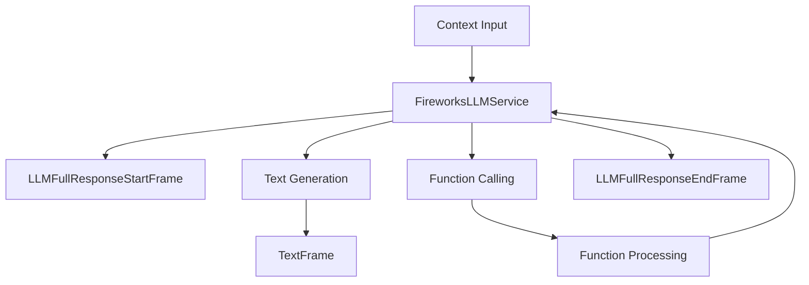

## Overview

`FireworksLLMService` provides access to Fireworks AI's language models through an OpenAI-compatible interface. It inherits from `BaseOpenAILLMService` and supports streaming responses, function calling, and context management.

## Installation

To use `FireworksLLMService`, install the required dependencies:

```bash
pip install pipecat-ai[fireworks]
```

You'll also need to set up your Fireworks API key as an environment variable: `FIREWORKS_API_KEY`

## Configuration

### Constructor Parameters

<ParamField path="api_key" type="str" required>
  Your Fireworks AI API key
</ParamField>

<ParamField
  path="model"
  type="str"
  default="accounts/fireworks/models/firefunction-v1">
  Model identifier
</ParamField>

<ParamField
  path="base_url"
  type="str"
  default="https://api.fireworks.ai/inference/v1">
  Fireworks AI API endpoint
</ParamField>

### Input Parameters

Inherits all input parameters from BaseOpenAILLMService:

```python
class InputParams(BaseModel):
    frequency_penalty: Optional[float]   # [-2.0, 2.0]
    presence_penalty: Optional[float]    # [-2.0, 2.0]
    seed: Optional[int]                  # >= 0
    temperature: Optional[float]         # [0.0, 2.0]
    top_p: Optional[float]               # [0.0, 1.0]
    max_tokens: Optional[int]            # >= 1
    max_completion_tokens: Optional[int] # >= 1
    extra: Optional[Dict[str, Any]]
```

## Usage Example

```python
from pipecat.services.fireworks import FireworksLLMService
from pipecat.processors.aggregators.openai_llm_context import OpenAILLMContext

# Configure service
service = FireworksLLMService(
    api_key="your-fireworks-api-key",
    model="accounts/fireworks/models/firefunction-v1",
    params=FireworksLLMService.InputParams(
        temperature=0.7,
        max_tokens=1000
    )
)

# Create context
context = OpenAILLMContext(
    messages=[
        {"role": "system", "content": "You are a helpful assistant"},
        {"role": "user", "content": "What is machine learning?"}
    ]
)

# Use in pipeline
pipeline = Pipeline([
    context_manager,  # Manages conversation context
    service,          # Processes LLM requests
    text_handler      # Handles responses
])
```

## Function Calling

Supports OpenAI-compatible function calling with the `firefunction-v1` model:

```python
# Define tools
tools = [{
    "type": "function",
    "function": {
        "name": "get_weather",
        "description": "Get weather information",
        "parameters": {
            "type": "object",
            "properties": {
                "location": {"type": "string"}
            }
        }
    }
}]

# Configure context with tools
context = OpenAILLMContext(
    messages=[],
    tools=tools
)

# Register function handler
@service.function("get_weather")
async def handle_weather(location: str):
    return {"temperature": 72, "condition": "sunny"}
```

## Available Models

Fireworks AI provides access to various models, including:

| Model Name                                  | Description                    |
| ------------------------------------------- | ------------------------------ |
| `accounts/fireworks/models/firefunction-v1` | Optimized for function calling |
| `accounts/fireworks/models/llama-v2-7b`     | Llama 2 7B base model          |
| `accounts/fireworks/models/llama-v2-13b`    | Llama 2 13B base model         |
| `accounts/fireworks/models/llama-v2-70b`    | Llama 2 70B base model         |
| `accounts/fireworks/models/mixtral-8x7b`    | Mixtral 8x7B model             |

## Frame Flow

Inherits the BaseOpenAI LLM Service frame flow:



## Metrics Support

The service collects standard LLM metrics:

- Token usage (prompt and completion)
- Processing duration
- Time to First Byte (TTFB)
- Function call metrics

## Notes

- OpenAI-compatible interface
- Supports streaming responses
- Handles function calling
- Manages conversation context
- Includes token usage tracking
- Thread-safe processing
- Automatic error handling
