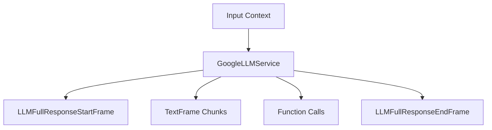

## Overview

`GoogleLLMService` provides integration with Google's Gemini models, supporting streaming responses, function calling, and multimodal inputs. It includes specialized context handling for Google's message format while maintaining compatibility with OpenAI-style contexts.

## Installation

To use `GoogleLLMService`, install the required dependencies:

```bash
pip install pipecat-ai[google]
```

You'll also need to set up your Google API key as an environment variable: `GOOGLE_API_KEY`

## Configuration

### Constructor Parameters

<ParamField path="api_key" type="str" required>
  Google API key
</ParamField>

<ParamField path="model" type="str" default="gemini-1.5-flash-latest">
  Model identifier
</ParamField>

<ParamField path="params" type="InputParams" optional>
  Model configuration parameters
</ParamField>

### Input Parameters

```python
class InputParams(BaseModel):
    max_tokens: Optional[int] = 4096  # >= 1
    temperature: Optional[float] = None  # [0.0, 2.0]
    top_k: Optional[int] = None  # >= 0
    top_p: Optional[float] = None  # [0.0, 1.0]
    extra: Optional[Dict[str, Any]] = {}
```

## Input/Output Frames

### Input Frames

<ParamField path="OpenAILLMContextFrame" type="Frame">
  Contains conversation context
</ParamField>

<ParamField path="LLMMessagesFrame" type="Frame">
  Contains conversation messages
</ParamField>

<ParamField path="VisionImageRawFrame" type="Frame">
  Contains image for vision processing
</ParamField>

<ParamField path="LLMUpdateSettingsFrame" type="Frame">
  Updates model settings
</ParamField>

### Output Frames

<ParamField path="TextFrame" type="Frame">
  Contains generated text
</ParamField>

<ParamField path="LLMFullResponseStartFrame" type="Frame">
  Signals start of response
</ParamField>

<ParamField path="LLMFullResponseEndFrame" type="Frame">
  Signals end of response
</ParamField>

## Context Management

### GoogleLLMContext

Specialized context manager that handles Google's message format while maintaining OpenAI compatibility:

```python
context = GoogleLLMContext(
    messages=[],
    tools=[],
)
```

### Context Aggregators

```python
# Create context aggregators
aggregators = GoogleLLMService.create_context_aggregator(
    context,
    assistant_expect_stripped_words=True
)
```

## Usage Examples

### Basic Usage

```python
# Configure service
llm_service = GoogleLLMService(
    api_key="your-api-key",
    model="gemini-1.5-flash-latest",
    params=GoogleLLMService.InputParams(
        temperature=0.7,
        max_tokens=1000
    )
)

# Create pipeline
pipeline = Pipeline([
    context_manager,
    llm_service,
    response_handler
])
```

### With Function Calling

```python
# Configure function calling
context = GoogleLLMContext()
context.add_tool({
    "function_declarations": [{
        "name": "get_weather",
        "description": "Get weather information",
        "parameters": {
            "type": "object",
            "properties": {
                "location": {"type": "string"}
            }
        }
    }]
})
```

## Frame Flow



## Metrics Support

The service collects various metrics:

- Token usage (prompt and completion)
- Processing time
- Time to first byte (TTFB)

## Notes

- Supports streaming responses
- Handles function calling
- Provides OpenAI compatibility
- Manages conversation context
- Supports vision inputs
- Includes metrics collection
- Thread-safe processing
