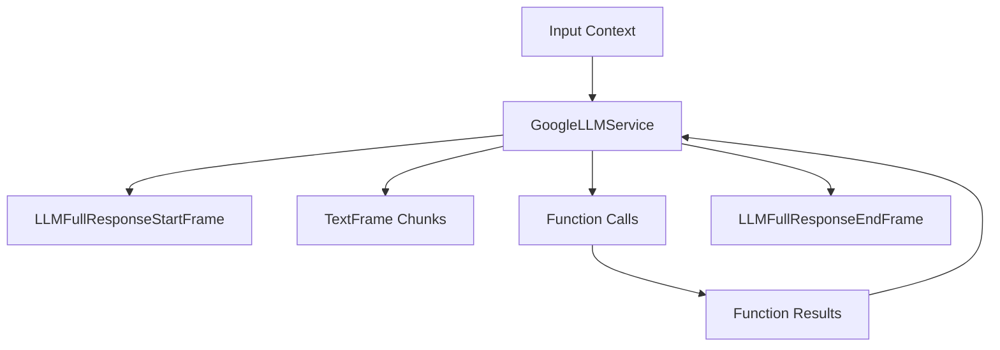

## Overview

`GoogleLLMService` provides integration with Google's Gemini models, supporting streaming responses, function calling, and multimodal inputs. It includes specialized context handling for Google's message format while maintaining compatibility with OpenAI-style contexts.

## Installation

To use `GoogleLLMService`, install the required dependencies:

```bash
pip install pipecat-ai[google]
```

You'll also need to set up your Google API key as an environment variable: `GOOGLE_API_KEY`

## Configuration

### Constructor Parameters

<ParamField path="api_key" type="str" required>
  Google API key
</ParamField>

<ParamField path="model" type="str" default="gemini-1.5-flash-latest">
  Model identifier
</ParamField>

<ParamField path="params" type="InputParams" optional>
  Model configuration parameters
</ParamField>

### Input Parameters

<ParamField path="extra" type="Optional[Dict[str, Any]]" default="{}">
  Additional parameters to pass to the model
</ParamField>

<ParamField path="max_tokens" type="Optional[int]" default="4096">
  Maximum number of tokens to generate. Must be greater than or equal to 1
</ParamField>

<ParamField path="temperature" type="Optional[float]" default="None">
  Controls randomness in the output. Range: [0.0, 2.0]
</ParamField>

<ParamField path="top_k" type="Optional[int]" default="None">
  Controls diversity via nucleus sampling. Must be greater than or equal to 0
</ParamField>

<ParamField path="top_p" type="Optional[float]" default="None">
  Controls diversity via nucleus sampling. Range: [0.0, 1.0]
</ParamField>

## Input Frames

<ParamField path="OpenAILLMContextFrame" type="Frame">
  Contains conversation context
</ParamField>

<ParamField path="LLMMessagesFrame" type="Frame">
  Contains conversation messages
</ParamField>

<ParamField path="VisionImageRawFrame" type="Frame">
  Contains image for vision processing
</ParamField>

<ParamField path="LLMUpdateSettingsFrame" type="Frame">
  Updates model settings
</ParamField>

## Output Frames

<ParamField path="TextFrame" type="Frame">
  Contains generated text
</ParamField>

<ParamField path="LLMFullResponseStartFrame" type="Frame">
  Signals start of response
</ParamField>

<ParamField path="LLMFullResponseEndFrame" type="Frame">
  Signals end of response
</ParamField>

## Context Management

The Google service uses specialized context management to handle conversations and message formatting. This includes managing the conversation history, system prompts, function calls, and converting between OpenAI and Google message formats.

### GoogleLLMContext

The base context manager for Google conversations:

```python
context = GoogleLLMContext(
    messages=[],  # Conversation history
    tools=[],     # Available function calling tools
    system="You are a helpful assistant"  # System prompt
)
```

### Context Aggregators

Context aggregators handle message format conversion and management. The service provides a method to create paired aggregators:

<ResponseField name="create_context_aggregator" type="static method">
Creates user and assistant aggregators for handling message formatting.

```python
@staticmethod
def create_context_aggregator(
    context: OpenAILLMContext,
    *,
    assistant_expect_stripped_words: bool = True
) -> GoogleContextAggregatorPair
```

### Parameters

<ParamField path="context" type="OpenAILLMContext" required>
  The context object containing conversation history and settings
</ParamField>

<ParamField path="assistant_expect_stripped_words" type="bool" default="True">
  Controls text preprocessing for assistant responses
</ParamField>

</ResponseField>

### Usage Example

```python

# 1. Create the context
context = GoogleLLMContext(
    messages=[],
    system="You are a helpful assistant"
)

# 2. Create aggregators for message handling
aggregators = GoogleLLMService.create_context_aggregator(context)

# 3. Access individual aggregators
user_aggregator = aggregators.user()      # Handles user message formatting
assistant_aggregator = aggregators.assistant()  # Handles assistant responses

# 4. Use in a pipeline
pipeline = Pipeline([
    user_aggregator,
    llm_service,
    assistant_aggregator
])
```

The context management system ensures proper message formatting and history tracking throughout the conversation while handling the conversion between OpenAI and Google message formats automatically.

## Methods

See the [LLM base class methods](/api-reference/services/base-service-classes#methods-2) for additional functionality.

## Usage Examples

### Basic Usage

```python
# Configure service
llm_service = GoogleLLMService(
    api_key="your-api-key",
    model="gemini-1.5-flash-latest",
    params=GoogleLLMService.InputParams(
        temperature=0.7,
        max_tokens=1000
    )
)

# Create pipeline
pipeline = Pipeline([
    context_manager,
    llm_service,
    response_handler
])
```

### With Function Calling

```python
# Configure function calling
context = GoogleLLMContext()
context.add_tool({
    "function_declarations": [{
        "name": "get_weather",
        "description": "Get weather information",
        "parameters": {
            "type": "object",
            "properties": {
                "location": {"type": "string"}
            }
        }
    }]
})
```

## Frame Flow



## Metrics Support

The service collects various metrics:

- Token usage (prompt and completion)
- Processing time
- Time to first byte (TTFB)

## Notes

- Supports streaming responses
- Handles function calling
- Provides OpenAI compatibility
- Manages conversation context
- Supports vision inputs
- Includes metrics collection
- Thread-safe processing
