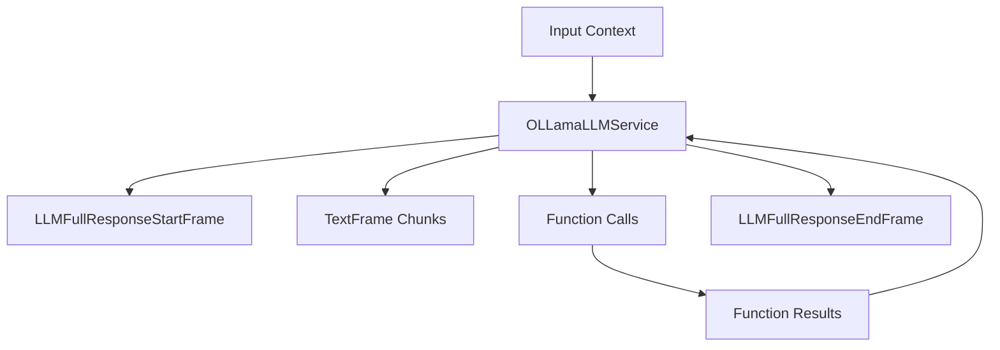

## Overview

`OLLamaLLMService` provides access to locally-run Ollama models through an OpenAI-compatible interface. It inherits from `BaseOpenAILLMService` and allows you to run various open-source models locally while maintaining compatibility with OpenAI's API format.

## Installation

To use `OLLamaLLMService`, you need:

1. Install Ollama on your system ([Ollama installation guide](https://ollama.ai/download))
2. Install Pipecat dependencies:

```bash
pip install pipecat-ai[ollama]
```

## Configuration

### Constructor Parameters

<ParamField path="model" type="str" default="llama2">
  Ollama model identifier
</ParamField>

<ParamField path="base_url" type="str" default="http://localhost:11434/v1">
  Local Ollama API endpoint
</ParamField>

### Input Parameters

Inherits all input parameters from BaseOpenAILLMService:

```python
class InputParams(BaseModel):
    frequency_penalty: Optional[float]   # [-2.0, 2.0]
    presence_penalty: Optional[float]    # [-2.0, 2.0]
    seed: Optional[int]                  # >= 0
    temperature: Optional[float]         # [0.0, 2.0]
    top_p: Optional[float]               # [0.0, 1.0]
    max_tokens: Optional[int]            # >= 1
    max_completion_tokens: Optional[int] # >= 1
    extra: Optional[Dict[str, Any]]
```

### Input Frames

<ParamField path="OpenAILLMContextFrame" type="Frame">
  Contains OpenAI-specific conversation context
</ParamField>

<ParamField path="LLMMessagesFrame" type="Frame">
  Contains conversation messages
</ParamField>

<ParamField path="VisionImageRawFrame" type="Frame">
  Contains image for vision model processing
</ParamField>

<ParamField path="LLMUpdateSettingsFrame" type="Frame">
  Updates model settings
</ParamField>

### Output Frames

<ParamField path="TextFrame" type="Frame">
  Contains generated text chunks
</ParamField>

<ParamField path="FunctionCallInProgressFrame" type="Frame">
  Indicates start of function call
</ParamField>

<ParamField path="FunctionCallResultFrame" type="Frame">
  Contains function call results
</ParamField>

## Usage Example

```python
from pipecat.services.ollama import OLLamaLLMService
from pipecat.processors.aggregators.openai_llm_context import OpenAILLMContext

# Configure service
service = OLLamaLLMService(
    model="llama2",
    params=OLLamaLLMService.InputParams(
        temperature=0.7,
        max_tokens=1000
    )
)

# Create context
context = OpenAILLMContext(
    messages=[
        {"role": "system", "content": "You are a helpful assistant"},
        {"role": "user", "content": "Explain quantum computing"}
    ]
)

# Use in pipeline
pipeline = Pipeline([
    context_manager,  # Manages conversation context
    service,          # Processes LLM requests
    text_handler      # Handles responses
])
```

## Available Models

Ollama supports various open-source models. Here are some popular options:

| Model Name    | Description                        |
| ------------- | ---------------------------------- |
| `llama2`      | Meta's Llama 2 base model          |
| `codellama`   | Specialized for code generation    |
| `mistral`     | Mistral AI's base model            |
| `mixtral`     | Mistral's mixture of experts model |
| `neural-chat` | Intel's neural chat model          |
| `phi`         | Microsoft's phi model series       |
| `vicuna`      | Berkeley's vicuna model            |

See [Ollama's documentation](https://ollama.com/library) for a full list of available models.

To use a specific model:

```python
service = OLLamaLLMService(model="mistral")
```

## Frame Flow

Inherits the BaseOpenAI LLM Service frame flow:



## Metrics Support

The service collects standard metrics:

- Token usage (prompt and completion)
- Processing duration
- Time to First Byte (TTFB)
- Function call metrics

## Key Features

1. **Local Execution**

   - No internet connection required after model download
   - Complete data privacy
   - Lower latency for many use cases

2. **Model Management**

   - Easy model switching
   - Local model customization
   - Version control through Ollama

3. **Resource Control**
   - CPU/GPU utilization management
   - Memory usage control
   - Concurrent request handling

## Common Use Cases

1. **Development and Testing**

   - Rapid prototyping
   - Offline development
   - Cost-effective testing

2. **Privacy-Sensitive Applications**

   - Healthcare applications
   - Financial services
   - Personal data processing

3. **Edge Computing**
   - IoT applications
   - Embedded systems
   - Low-latency requirements

## Notes

- Runs models locally through Ollama
- OpenAI-compatible interface
- Supports streaming responses
- Handles function calling
- Manages conversation context
- Includes token usage tracking
- Thread-safe processing
