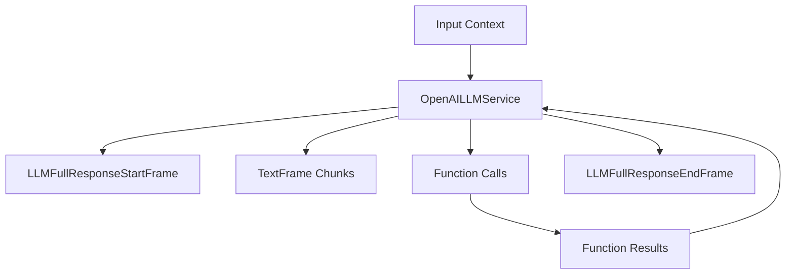

## Overview

OpenAI LLM services provide chat completion capabilities using OpenAI's API. The implementation includes two main classes:

- `BaseOpenAILLMService`: Base class providing core OpenAI chat completion functionality
- `OpenAILLMService`: Implementation with context aggregation support

## Installation

To use OpenAI services, install the required dependencies:

```bash
pip install pipecat-ai[openai]
```

You'll also need to set up your OpenAI API key as an environment variable: `OPENAI_API_KEY`

## BaseOpenAILLMService

### Constructor Parameters

<ParamField path="model" type="str" required>
  OpenAI model identifier (e.g., "gpt-4", "gpt-3.5-turbo")
</ParamField>

<ParamField path="api_key" type="str" optional>
  OpenAI API key (defaults to environment variable)
</ParamField>

<ParamField path="base_url" type="str" optional>
  Custom API endpoint URL
</ParamField>

<ParamField path="params" type="InputParams" optional>
  Model configuration parameters
</ParamField>

### Input Parameters

```python
class InputParams(BaseModel):
    frequency_penalty: Optional[float]   # [-2.0, 2.0]
    presence_penalty: Optional[float]    # [-2.0, 2.0]
    seed: Optional[int]                  # >= 0
    temperature: Optional[float]         # [0.0, 2.0]
    top_p: Optional[float]               # [0.0, 1.0]
    max_tokens: Optional[int]            # >= 1
    max_completion_tokens: Optional[int] # >= 1
    extra: Optional[Dict[str, Any]]      # Additional parameters
```

### Input Frames

<ParamField path="OpenAILLMContextFrame" type="Frame">
  Contains OpenAI-specific conversation context
</ParamField>

<ParamField path="LLMMessagesFrame" type="Frame">
  Contains conversation messages
</ParamField>

<ParamField path="VisionImageRawFrame" type="Frame">
  Contains image for vision model processing
</ParamField>

<ParamField path="LLMUpdateSettingsFrame" type="Frame">
  Updates model settings
</ParamField>

### Output Frames

<ParamField path="TextFrame" type="Frame">
  Contains generated text chunks
</ParamField>

<ParamField path="FunctionCallInProgressFrame" type="Frame">
  Indicates start of function call
</ParamField>

<ParamField path="FunctionCallResultFrame" type="Frame">
  Contains function call results
</ParamField>

## OpenAILLMService

Extended implementation with context aggregation support.

### Constructor Parameters

<ParamField path="model" type="str" default="gpt-4">
  OpenAI model identifier
</ParamField>

<ParamField path="params" type="BaseOpenAILLMService.InputParams">
  Model configuration parameters
</ParamField>

## Usage Examples

### Basic Usage

```python
from pipecat.services.openai import OpenAILLMService

# Configure service
llm_service = OpenAILLMService(
    model="gpt-4",
    params=OpenAILLMService.InputParams(
        temperature=0.7,
        max_tokens=1000
    )
)

# Create pipeline
pipeline = Pipeline([
    context_manager,
    llm_service,
    response_handler
])
```

### With Function Calling

```python
# Configure function calling
context = OpenAILLMContext(
    system_prompt="You are a helpful assistant.",
    tools=[{
        "type": "function",
        "function": {
            "name": "get_weather",
            "description": "Get weather information",
            "parameters": {
                "type": "object",
                "properties": {
                    "location": {"type": "string"}
                }
            }
        }
    }]
)

# Create context aggregators
aggregators = OpenAILLMService.create_context_aggregator(context)
```

## Frame Flow



## Notes

- Supports streaming responses
- Handles function calling
- Provides metrics collection
- Supports vision models
- Manages conversation context
- Thread-safe processing
