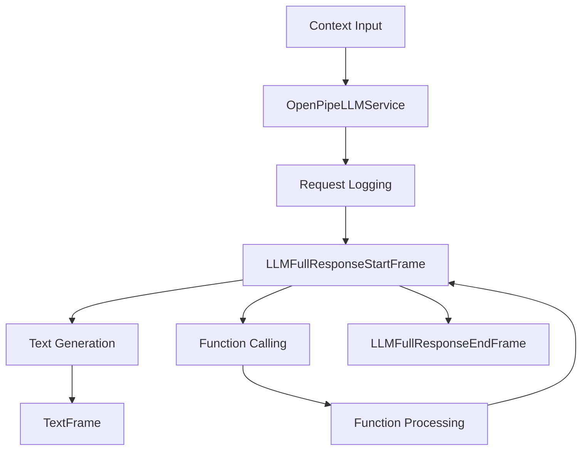

## Overview

`OpenPipeLLMService` extends the BaseOpenAILLMService to provide integration with OpenPipe, enabling request logging, model fine-tuning, and performance monitoring. It maintains compatibility with OpenAI's API while adding OpenPipe's logging and optimization capabilities.

## Installation

To use `OpenPipeLLMService`, install the required dependencies:

```bash
pip install pipecat-ai[openpipe]
```

You'll need to set up the following environment variables:

- `OPENPIPE_API_KEY` - Your OpenPipe API key
- `OPENAI_API_KEY` - Your OpenAI API key

## Configuration

### Constructor Parameters

<ParamField path="model" type="str" default="gpt-4o">
  Model identifier
</ParamField>

<ParamField path="api_key" type="str | None" optional>
  OpenAI API key
</ParamField>

<ParamField path="base_url" type="str | None" optional>
  OpenAI API endpoint
</ParamField>

<ParamField path="openpipe_api_key" type="str | None" optional>
  OpenPipe API key
</ParamField>

<ParamField
  path="openpipe_base_url"
  type="str"
  default="https://app.openpipe.ai/api/v1">
  OpenPipe API endpoint
</ParamField>

<ParamField path="tags" type="Dict[str, str] | None" optional>
  Custom tags for request logging
</ParamField>

### Input Parameters

Inherits all input parameters from BaseOpenAILLMService:

```python
class InputParams(BaseModel):
    frequency_penalty: Optional[float]  # [-2.0, 2.0]
    presence_penalty: Optional[float]   # [-2.0, 2.0]
    seed: Optional[int]                # >= 0
    temperature: Optional[float]       # [0.0, 2.0]
    top_p: Optional[float]            # [0.0, 1.0]
    max_tokens: Optional[int]         # >= 1
    max_completion_tokens: Optional[int] # >= 1
    extra: Optional[Dict[str, Any]]
```

## Usage Example

```python
from pipecat.services.openpipe import OpenPipeLLMService
from pipecat.processors.aggregators.openai_llm_context import OpenAILLMContext

# Configure service with tags
service = OpenPipeLLMService(
    model="gpt-4",
    openpipe_api_key="your-openpipe-key",
    tags={
        "environment": "production",
        "feature": "customer-support"
    },
    params=OpenPipeLLMService.InputParams(
        temperature=0.7,
        max_tokens=1000
    )
)

# Create context
context = OpenAILLMContext(
    messages=[
        {"role": "system", "content": "You are a helpful assistant"},
        {"role": "user", "content": "How do I optimize my API usage?"}
    ]
)

# Use in pipeline
pipeline = Pipeline([
    context_manager,    # Manages conversation context
    service,           # Processes LLM requests with logging
    text_handler      # Handles responses
])
```

## Request Logging

OpenPipe automatically logs requests with configurable tags:

```python
# Configure detailed logging
service = OpenPipeLLMService(
    tags={
        "environment": "production",
        "feature": "chat",
        "version": "v1.0",
        "user_type": "premium"
    }
)
```

## Frame Flow

Inherits the BaseOpenAI LLM Service frame flow with added logging:



## Metrics Support

The service collects standard metrics plus OpenPipe-specific data:

- Token usage (prompt and completion)
- Processing duration
- Time to First Byte (TTFB)
- Request logs and metadata
- Performance metrics
- Cost tracking

## Common Use Cases

1. **Performance Monitoring**

   - Request latency tracking
   - Token usage monitoring
   - Cost analysis

2. **Model Optimization**

   - Data collection for fine-tuning
   - Response quality monitoring
   - Usage pattern analysis

3. **Development and Testing**
   - Request logging for debugging
   - A/B testing
   - Quality assurance

## Notes

- Maintains OpenAI API compatibility
- Automatic request logging
- Support for custom tags
- Fine-tuning data collection
- Performance monitoring
- Cost tracking capabilities
- Thread-safe processing
