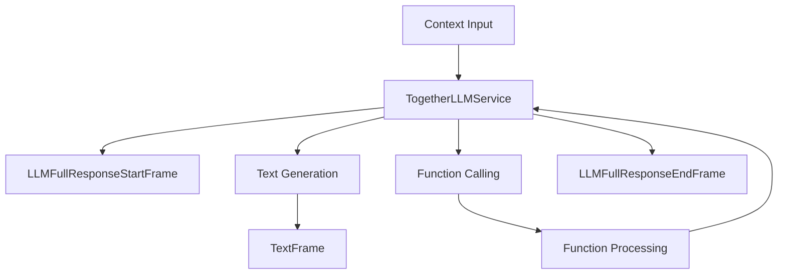

## Overview

`TogetherLLMService` provides access to Together AI's language models, including Meta's Llama 3.1 and 3.2 models, through an OpenAI-compatible interface. It inherits from `OpenAILLMService` and maintains compatibility with OpenAI's function calling format.

## Installation

To use `TogetherLLMService`, install the required dependencies:

```bash
pip install pipecat-ai[together]
```

You'll also need to set up your Together API key as an environment variable: `TOGETHER_API_KEY`

## Configuration

### Constructor Parameters

<ParamField path="api_key" type="str" required>
  Your Together AI API key
</ParamField>

<ParamField path="base_url" type="str" default="https://api.together.xyz/v1">
  Together AI API endpoint
</ParamField>

<ParamField
  path="model"
  type="str"
  default="meta-llama/Meta-Llama-3.1-8B-Instruct-Turbo">
  Model identifier
</ParamField>

### Input Parameters

Inherits all input parameters from OpenAILLMService:

```python
class InputParams(BaseModel):
    frequency_penalty: Optional[float]  # [-2.0, 2.0]
    presence_penalty: Optional[float]   # [-2.0, 2.0]
    seed: Optional[int]                # >= 0
    temperature: Optional[float]       # [0.0, 2.0]
    top_p: Optional[float]            # [0.0, 1.0]
    max_tokens: Optional[int]         # >= 1
    max_completion_tokens: Optional[int] # >= 1
    extra: Optional[Dict[str, Any]]
```

## Usage Example

```python
from pipecat.services.together import TogetherLLMService
from pipecat.processors.aggregators.openai_llm_context import OpenAILLMContext

# Configure service
service = TogetherLLMService(
    api_key="your-together-api-key",
    model="meta-llama/Meta-Llama-3.1-8B-Instruct-Turbo",
    params=TogetherLLMService.InputParams(
        temperature=0.7,
        max_tokens=1000
    )
)

# Create context
context = OpenAILLMContext(
    messages=[
        {"role": "system", "content": "You are a helpful assistant"},
        {"role": "user", "content": "Tell me about quantum computing"}
    ]
)

# Use in pipeline
pipeline = Pipeline([
    context_manager,    # Manages conversation context
    service,           # Processes LLM requests
    text_handler      # Handles responses
])
```

## Function Calling

Supports OpenAI-compatible function calling:

```python
# Define tools
tools = [{
    "type": "function",
    "function": {
        "name": "get_weather",
        "description": "Get weather information",
        "parameters": {
            "type": "object",
            "properties": {
                "location": {"type": "string"}
            }
        }
    }
}]

# Configure context with tools
context = OpenAILLMContext(
    messages=[],
    tools=tools
)

# Register function handler
@service.function("get_weather")
async def handle_weather(location: str):
    return {"temperature": 72, "condition": "sunny"}
```

## Available Models

Together AI provides access to various models, including:

| Model Name                                       | Description                                     |
| ------------------------------------------------ | ----------------------------------------------- |
| `meta-llama/Meta-Llama-3.1-8B-Instruct-Turbo`    | Llama 3.1 8B instruct model optimized for speed |
| `meta-llama/Meta-Llama-3.1-34B-Instruct`         | Llama 3.1 34B instruct model                    |
| `meta-llama/Meta-Llama-3.1-70B-Instruct`         | Llama 3.1 70B instruct model                    |
| `meta-llama/Meta-Llama-3.1-405B-Instruct`        | Llama 3.1 405B instruct model                   |
| `meta-llama/Llama-3.2-3B-Instruct-Turbo`         | Llama 3.2 3B instruct model optimized for speed |
| `meta-llama/Llama-3.2-11B-Vision-Instruct-Turbo` | Llama 3.2 11B vision & instruct model           |
| `meta-llama/Llama-3.2-90B-Vision-Instruct-Turbo` | Llama 3.2 90B vision & instruct model           |

## Frame Flow

Inherits the OpenAI LLM Service frame flow:



## Metrics Support

The service collects the same metrics as OpenAILLMService:

- Token usage (prompt and completion)
- Processing duration
- Time to First Byte (TTFB)
- Function call metrics

## Notes

- OpenAI-compatible interface
- Supports streaming responses
- Handles function calling
- Manages conversation context
- Includes token usage tracking
- Thread-safe processing
- Automatic error handling
- Inherits OpenAI service features
