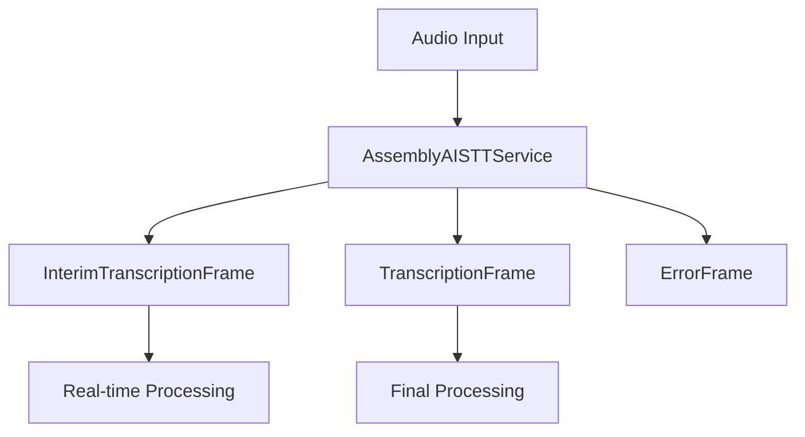

## Overview

`AssemblyAISTTService` provides real-time speech-to-text capabilities using AssemblyAI's WebSocket API. It supports streaming transcription with both interim and final results.

## Installation

To use `AssemblyAISTTService`, install the required dependencies:

```bash
pip install pipecat-ai[assemblyai]
```

You'll also need to set up your AssemblyAI API key as an environment variable: `ASSEMBLYAI_API_KEY`

## Configuration

### Constructor Parameters

<ParamField path="api_key" type="str" required>
  Your AssemblyAI API key
</ParamField>

<ParamField path="sample_rate" type="int" default="16000">
  Audio sample rate in Hz
</ParamField>

<ParamField path="encoding" type="AudioEncoding" default="pcm_s16le">
  Audio encoding format
</ParamField>

<ParamField path="language" type="Language" default="Language.EN">
  Transcription language (currently only English supported for real-time)
</ParamField>

## Input

The service processes raw audio data with the following requirements:

- PCM audio format
- 16-bit depth
- 16kHz sample rate (default)
- Single channel (mono)

## Output Frames

### TranscriptionFrame

Generated for final transcriptions, containing:

<ParamField path="text" type="string">
  Transcribed text
</ParamField>

<ParamField path="user_id" type="string">
  User identifier
</ParamField>

<ParamField path="timestamp" type="string">
  ISO 8601 formatted timestamp
</ParamField>

<ParamField path="language" type="Language">
  Transcription language
</ParamField>

### InterimTranscriptionFrame

Generated during ongoing speech, containing the same fields as TranscriptionFrame but with preliminary results.

### ErrorFrame

Generated when transcription errors occur, containing error details.

## Dynamic Configuration

### Language Setting

```python
await service.set_language(Language.FR)
```

## Language Support

Assembly STT supports the following languages and regional variants:

| Language Code | Description | Service Codes |
| ------------- | ----------- | ------------- |
| `Language.EN` | English     | `en`          |

## Usage Example

```python
from pipecat.services.assemblyai import AssemblyAISTTService
from pipecat.transcriptions.language import Language

# Configure service
stt_service = AssemblyAISTTService(
    api_key="your-api-key",
    sample_rate=16000,
    language=Language.EN
)

# Use in pipeline
pipeline = Pipeline([
    transport.input(),     # Produces audio frames
    stt_service,          # Processes audio → produces transcription frames
    text_handler         # Consumes transcription frames
])
```

## Frame Flow



## Metrics Support

The service collects processing metrics:

- Time to First Byte (TTFB)
- Processing duration
- Connection status

## Notes

- Currently supports English-only real-time transcription
- Handles WebSocket connection management
- Provides both interim and final transcriptions
- Thread-safe processing with proper event loop handling
- Automatic error handling and reporting
- Manages connection lifecycle
