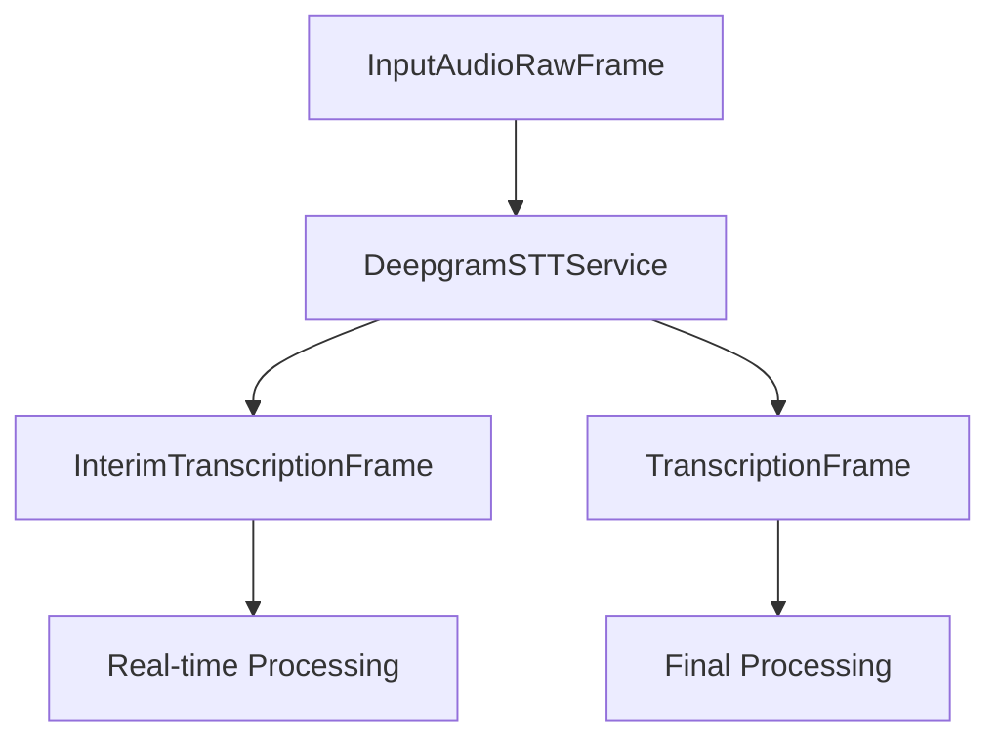

## Overview

`DeepgramSTTService` provides real-time speech-to-text capabilities using Deepgram's WebSocket API. It supports interim results, language detection, and voice activity detection (VAD).

## Installation

To use `DeepgramSTTService`, install the required dependencies:

```bash
pip install pipecat-ai[deepgram]
```

You'll also need to set up your Deepgram API key as an environment variable: `DEEPGRAM_API_KEY`

## Configuration

### Constructor Parameters

<ParamField path="api_key" type="str" required>
  Your Deepgram API key
</ParamField>

<ParamField path="url" type="str" default="">
  Custom Deepgram API endpoint URL
</ParamField>

<ParamField path="live_options" type="LiveOptions" optional>
  Custom transcription options
</ParamField>

### Default Options

```python
LiveOptions(
    encoding="linear16",
    language=Language.EN,
    model="nova-2-general",
    sample_rate=16000,
    channels=1,
    interim_results=True,
    smart_format=True,
    punctuate=True,
    profanity_filter=True,
    vad_events=False
)
```

## Input

The service processes `InputAudioRawFrame` instances containing:

- Raw PCM audio data
- 16-bit depth
- 16kHz sample rate
- Single channel (mono)

## Output Frames

### TranscriptionFrame

Generated for final transcriptions, containing:

<ParamField path="text" type="string">
  Transcribed text
</ParamField>

<ParamField path="user_id" type="string">
  User identifier
</ParamField>

<ParamField path="timestamp" type="string">
  ISO 8601 formatted timestamp
</ParamField>

<ParamField path="language" type="Language">
  Detected language (if available)
</ParamField>

### InterimTranscriptionFrame

Generated during ongoing speech, containing same fields as TranscriptionFrame but with preliminary results.

## Dynamic Configuration

### Language Setting

```python
await service.set_language(Language.FR)
```

### Model Selection

```python
await service.set_model("nova-2-general")
```

## Usage Example

```python
from pipecat.services.deepgram import DeepgramSTTService
from deepgram import LiveOptions

# Configure service
stt_service = DeepgramSTTService(
    api_key="your-api-key",
    live_options=LiveOptions(
        model="nova-2-general",
        language="en-US",
        smart_format=True,
        vad_events=True
    )
)

# Use in pipeline
pipeline = Pipeline([
    transport.input(),     # Produces InputAudioRawFrame
    stt_service,          # Processes audio → produces transcription frames
    text_handler         # Consumes transcription frames
])
```

## Language Support

Deepgram STT supports the following languages and regional variants:

| Language Code    | Description                      | Service Codes            |
| ---------------- | -------------------------------- | ------------------------ |
| `Language.BG`    | Bulgarian                        | `bg`                     |
| `Language.CA`    | Catalan                          | `ca`                     |
| `Language.ZH`    | Chinese (Mandarin, Simplified)   | `zh`, `zh-CN`, `zh-Hans` |
| `Language.ZH_TW` | Chinese (Mandarin, Traditional)  | `zh-TW`, `zh-Hant`       |
| `Language.ZH_HK` | Chinese (Cantonese, Traditional) | `zh-HK`                  |
| `Language.CS`    | Czech                            | `cs`                     |
| `Language.DA`    | Danish                           | `da`, `da-DK`            |
| `Language.NL`    | Dutch                            | `nl`                     |
| `Language.NL_BE` | Dutch (Flemish)                  | `nl-BE`                  |
| `Language.EN`    | English                          | `en`                     |
| `Language.EN_US` | English (US)                     | `en-US`                  |
| `Language.EN_AU` | English (Australia)              | `en-AU`                  |
| `Language.EN_GB` | English (UK)                     | `en-GB`                  |
| `Language.EN_NZ` | English (New Zealand)            | `en-NZ`                  |
| `Language.EN_IN` | English (India)                  | `en-IN`                  |
| `Language.ET`    | Estonian                         | `et`                     |
| `Language.FI`    | Finnish                          | `fi`                     |
| `Language.FR`    | French                           | `fr`                     |
| `Language.FR_CA` | French (Canada)                  | `fr-CA`                  |
| `Language.DE`    | German                           | `de`                     |
| `Language.DE_CH` | German (Switzerland)             | `de-CH`                  |
| `Language.EL`    | Greek                            | `el`                     |
| `Language.HI`    | Hindi                            | `hi`                     |
| `Language.HU`    | Hungarian                        | `hu`                     |
| `Language.ID`    | Indonesian                       | `id`                     |
| `Language.IT`    | Italian                          | `it`                     |
| `Language.JA`    | Japanese                         | `ja`                     |
| `Language.KO`    | Korean                           | `ko`, `ko-KR`            |
| `Language.LV`    | Latvian                          | `lv`                     |
| `Language.LT`    | Lithuanian                       | `lt`                     |
| `Language.MS`    | Malay                            | `ms`                     |
| `Language.NO`    | Norwegian                        | `no`                     |
| `Language.PL`    | Polish                           | `pl`                     |
| `Language.PT`    | Portuguese                       | `pt`                     |
| `Language.PT_BR` | Portuguese (Brazil)              | `pt-BR`                  |
| `Language.PT_PT` | Portuguese (Portugal)            | `pt-PT`                  |
| `Language.RO`    | Romanian                         | `ro`                     |
| `Language.RU`    | Russian                          | `ru`                     |
| `Language.SK`    | Slovak                           | `sk`                     |
| `Language.ES`    | Spanish                          | `es`, `es-419`           |
| `Language.SV`    | Swedish                          | `sv`, `sv-SE`            |
| `Language.TH`    | Thai                             | `th`, `th-TH`            |
| `Language.TR`    | Turkish                          | `tr`                     |
| `Language.UK`    | Ukrainian                        | `uk`                     |
| `Language.VI`    | Vietnamese                       | `vi`                     |

### Special Features

- Supports multilingual transcription (Spanish + English) using `multi`
- Provides multiple regional variants for major languages
- Supports traditional and simplified Chinese scripts

### Usage Example

```python
# Configure service with specific language
stt_service = DeepgramSTTService(
    api_key="your-api-key",
    live_options=LiveOptions(
        language="en-US",  # Specific regional variant
        model="nova-2-general"
    )
)
```

Note: Language support may vary by model. Check Deepgram's documentation for model-specific language availability.

## Frame Flow



## Metrics Support

The service supports metrics collection when VAD is enabled:

- Time to First Byte (TTFB)
- Processing duration
- Speech detection events

## Notes

- Requires valid Deepgram API key
- Supports real-time transcription
- Handles WebSocket connection management
- Provides language detection
- Supports model switching
- Includes VAD capabilities
- Manages connection lifecycle
