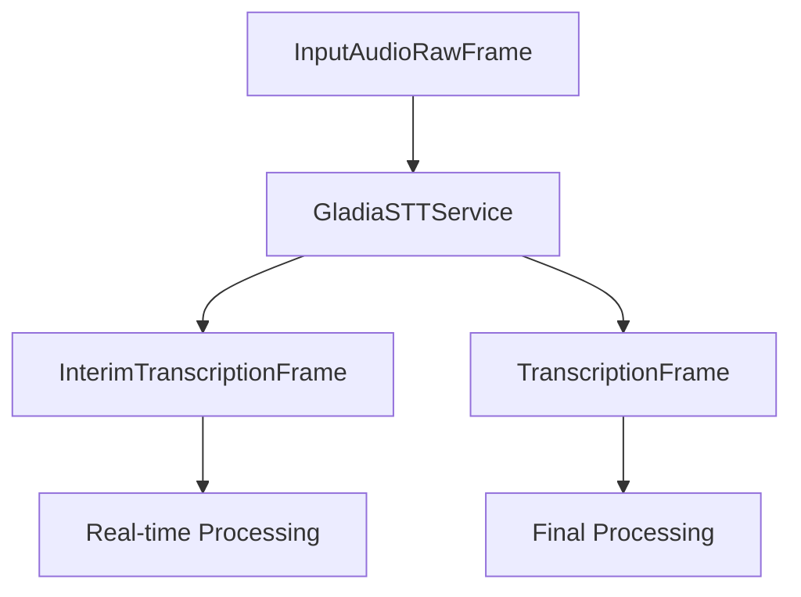

## Overview

`GladiaSTTService` is a speech-to-text (STT) service that integrates with Gladia's API to provide real-time transcription capabilities. It processes audio input and produces transcription frames in real-time.

## Installation

To use GladiaSTTService, you need to install the Gladia dependencies:

```bash
pip install pipecat-ai[gladia]
```

You'll also need to set up your Gladia API key as an environment variable: `GLADIA_API_KEY`

## Input

### Configuration Parameters

<ParamField path="api_key" type="string" required>
  Your Gladia API key for authentication
</ParamField>

<ParamField path="url" type="string" default="https://api.gladia.io/v2/live">
  Gladia API endpoint URL
</ParamField>

<ParamField path="confidence" type="float" default="0.5">
  Minimum confidence threshold for transcriptions. Values range from 0 to 1.
</ParamField>

### Input Frames

The service processes `InputAudioRawFrame` instances containing:

- Raw PCM audio data
- 16-bit depth
- Sample rate matching configuration (default 16kHz)
- Single channel (mono)

See [Audio Frames](/api-reference/frames/audio) for detailed frame structure.

## Output

The service produces two types of frames during transcription:

### InterimTranscriptionFrame

Generated during ongoing speech when confidence threshold is met. Contains:

<ParamField path="text" type="string">
  Preliminary transcribed text
</ParamField>

<ParamField path="user_id" type="string">
  ID of the speaking user
</ParamField>

<ParamField path="timestamp" type="string">
  ISO 8601 formatted timestamp
</ParamField>

<ParamField path="language" type="Language">
  Detected language (if enabled)
</ParamField>

### TranscriptionFrame

Generated for final transcriptions when confidence threshold is met. Contains identical fields to InterimTranscriptionFrame but represents confirmed text.

See [Text Frames](/api-reference/frames/text) for detailed frame structures.

## Configuration

### InputParams

<ParamField path="sample_rate" type="integer" default="16000">
  Audio sample rate in Hz
</ParamField>

<ParamField path="language" type="Language" default="Language.EN">
  Primary language for transcription
</ParamField>

<ParamField path="endpointing" type="float" default="0.2">
  Silence duration (in seconds) to mark end of speech
</ParamField>

<ParamField
  path="maximum_duration_without_endpointing"
  type="integer"
  default="10">
  Maximum duration in seconds without detecting speech end
</ParamField>

<ParamField path="audio_enhancer" type="boolean" optional>
  Enable audio enhancement preprocessing
</ParamField>

<ParamField path="words_accurate_timestamps" type="boolean" optional>
  Enable accurate word timestamps in transcription
</ParamField>

## Example Usage

```python
from pipecat.services.gladia import GladiaSTTService
from pipecat.transcriptions.language import Language

# Configure the service
stt_service = GladiaSTTService(
    api_key="your-api-key",
    confidence=0.7,
    params=GladiaSTTService.InputParams(
        language=Language.EN,
        audio_enhancer=True,
        sample_rate=16000
    )
)

# Use in a pipeline
pipeline = Pipeline([
    transport.input(),     # Produces InputAudioRawFrame
    stt_service,          # Processes audio → produces transcription frames
    llm_processor,        # Consumes TranscriptionFrame
])
```

## Frame Flow



## Service Control

The service accepts `STTUpdateSettingsFrame` for dynamic configuration updates. See [Service Control Frames](/api-reference/frames/service-control) for details.

## Notes

- Audio input must be in PCM format
- Transcription frames are only generated when confidence threshold is met
- Language detection is optional
- Service automatically handles websocket connections and cleanup
- Real-time processing occurs in parallel for natural conversation flow
