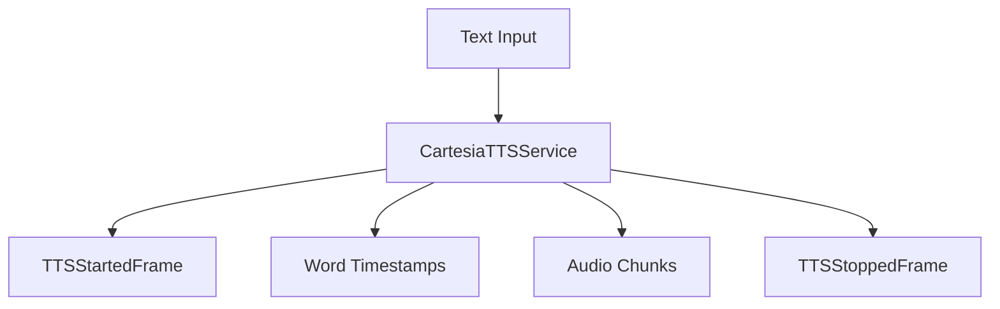
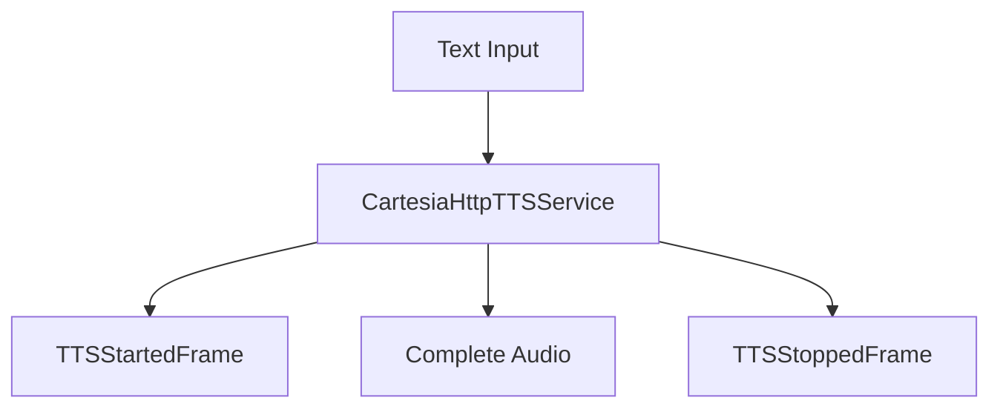

## Overview

Cartesia provides two TTS service implementations:

- `CartesiaTTSService`: WebSocket-based service with word-level timestamps and streaming
- `CartesiaHttpTTSService`: HTTP-based service for simpler, non-streaming synthesis

## Installation

To use Cartesia services, install the required dependencies:

```bash
pip install pipecat-ai[cartesia]
```

You'll also need to set up your Cartesia API key as an environment variable: `CARTESIA_API_KEY`.

<Tip>
  You can obtain a Cartesia API key by signing up at
  [Cartesia](https://play.cartesia.ai/sign-up).
</Tip>

## CartesiaTTSService

WebSocket-based implementation supporting real-time streaming and word timestamps.

### Constructor Parameters

<ParamField path="api_key" type="str" required>
  Cartesia API key
</ParamField>

<ParamField path="voice_id" type="str" required>
  Voice identifier
</ParamField>

<ParamField path="cartesia_version" type="str" default="2024-06-10">
  API version
</ParamField>

<ParamField path="url" type="str" default="wss://api.cartesia.ai/tts/websocket">
  WebSocket endpoint URL
</ParamField>

<ParamField path="model" type="str" default="sonic-english">
  Model identifier
</ParamField>

<ParamField path="sample_rate" type="int" default="24000">
  Output audio sample rate in Hz
</ParamField>

<ParamField path="encoding" type="str" default="pcm_s16le">
  Audio encoding format
</ParamField>

<ParamField path="container" type="str" default="raw">
  Audio container format
</ParamField>

### Input Parameters

```python
class InputParams(BaseModel):
    language: Optional[Language] = Language.EN
    speed: Optional[Union[str, float]] = ""
    emotion: Optional[List[str]] = []
```

## CartesiaHttpTTSService

HTTP-based implementation for simpler synthesis requirements.

### Constructor Parameters

<ParamField path="api_key" type="str" required>
  Cartesia API key
</ParamField>

<ParamField path="voice_id" type="str" required>
  Voice identifier
</ParamField>

<ParamField path="model" type="str" default="sonic-english">
  Model identifier
</ParamField>

<ParamField path="base_url" type="str" default="https://api.cartesia.ai">
  API base URL
</ParamField>

<ParamField path="sample_rate" type="int" default="24000">
  Output audio sample rate in Hz
</ParamField>

<ParamField path="encoding" type="str" default="pcm_s16le">
  Audio encoding format
</ParamField>

<ParamField path="container" type="str" default="raw">
  Audio container format
</ParamField>

## Output Frames

### Control Frames

<ParamField path="TTSStartedFrame" type="Frame">
  Signals start of synthesis
</ParamField>

<ParamField path="TTSStoppedFrame" type="Frame">
  Signals completion of synthesis
</ParamField>

### Audio Frames

<ParamField path="TTSAudioRawFrame" type="Frame">
  Contains generated audio data
</ParamField>

### Error Frames

<ParamField path="ErrorFrame" type="Frame">
  Contains error information
</ParamField>

## Language Support

Supports multiple languages through the `Language` enum:

| Language Code | Description        | Service Code |
| ------------- | ------------------ | ------------ |
| `Language.DE` | German             | `de`         |
| `Language.EN` | English            | `en`         |
| `Language.ES` | Spanish            | `es`         |
| `Language.FR` | French             | `fr`         |
| `Language.JA` | Japanese           | `ja`         |
| `Language.PT` | Portuguese         | `pt`         |
| `Language.ZH` | Chinese (Mandarin) | `zh`         |

## Usage Examples

### WebSocket Service

```python
# Configure WebSocket service
ws_service = CartesiaTTSService(
    api_key="your-api-key",
    voice_id="voice-id",
    model="sonic-english",
    params=CartesiaTTSService.InputParams(
        language=Language.EN,
        speed=1.2,
        emotion=["happy"]
    )
)

# Use in pipeline
pipeline = Pipeline([
    text_input,
    ws_service,
    audio_output
])
```

### HTTP Service

```python
# Configure HTTP service
http_service = CartesiaHttpTTSService(
    api_key="your-api-key",
    voice_id="voice-id",
    model="sonic-english",
    params=CartesiaHttpTTSService.InputParams(
        language=Language.EN,
        speed=1.0
    )
)
```

## Frame Flow

### WebSocket Service



### HTTP Service



## Notes

### WebSocket Service

- Supports word-level timestamps
- Real-time streaming
- Sentence aggregation for better quality
- Automatic reconnection
- Interruption handling
- Context management

### HTTP Service

- Simpler implementation
- Complete audio delivery
- No streaming support
- Lower latency for short texts
- Easier integration

## Common Features

- Metrics collection
- Language detection
- Voice control
- Error handling
- Thread-safe processing
