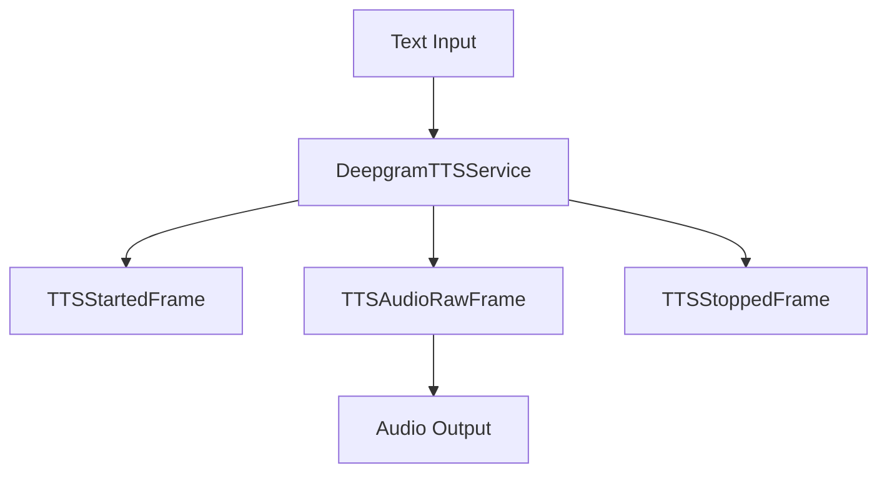

## Overview

`DeepgramTTSService` converts text to speech using Deepgram's Aura API. It supports various voices and audio configurations.

## Installation

To use `DeepgramTTSService`, install the required dependencies:

```bash
pip install pipecat-ai[deepgram]
```

You'll also need to set up your Deepgram API key as an environment variable: `DEEPGRAM_API_KEY`

## Configuration

### Constructor Parameters

<ParamField path="api_key" type="str" required>
  Your Deepgram API key
</ParamField>

<ParamField path="voice" type="str" default="aura-helios-en">
  Voice identifier to use for synthesis
</ParamField>

<ParamField path="sample_rate" type="int" default="24000">
  Output audio sample rate in Hz
</ParamField>

<ParamField path="encoding" type="str" default="linear16">
  Audio encoding format
</ParamField>

## Input

The service accepts text input through its TTS pipeline.

## Output Frames

### TTSStartedFrame

Signals the start of audio generation.

### TTSAudioRawFrame

Contains generated audio data:

<ParamField path="audio" type="bytes">
  Raw audio data chunk
</ParamField>

<ParamField path="sample_rate" type="int">
  Audio sample rate (24kHz default)
</ParamField>

<ParamField path="num_channels" type="int">
  Number of audio channels (1 for mono)
</ParamField>

### TTSStoppedFrame

Signals the completion of audio generation.

## Language Support

Deepgram TTS supports the following languages and regional variants:

| Language Code | Description | Service Codes |
| ------------- | ----------- | ------------- |
| `Language.EN` | English     | `en`          |

## Usage Example

```python
from pipecat.services.deepgram import DeepgramTTSService

# Configure service
tts_service = DeepgramTTSService(
    api_key="your-api-key",
    voice="aura-helios-en",
    sample_rate=24000
)

# Use in pipeline
pipeline = Pipeline([
    text_input,          # Produces text for synthesis
    tts_service,         # Converts text to speech
    audio_output        # Handles audio playback
])
```

## Frame Flow



## Metrics Support

The service supports metrics collection:

- Time to First Byte (TTFB)
- TTS usage metrics
- Processing duration

## Audio Processing

- Streams audio in 8KB chunks
- Supports 16-bit PCM format
- Generates mono audio output
- Handles memory buffering

## Error Handling

```python
try:
    # Generate speech
    async for frame in service.run_tts(text):
        if isinstance(frame, ErrorFrame):
            handle_error(frame.error)
except Exception as e:
    logger.error(f"TTS error: {e}")
```

## Notes

- Requires valid Deepgram API key
- Streams audio in chunks
- Supports various voices
- Provides metrics collection
- Handles memory efficiently
- Thread-safe processing
