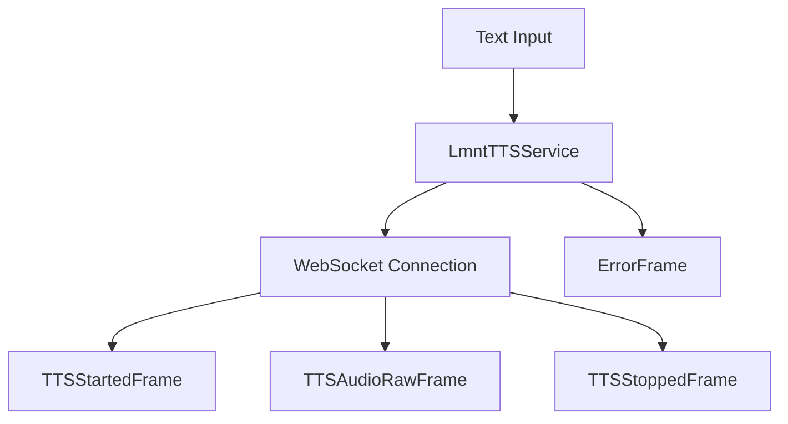

## Overview

`LmntTTSService` provides text-to-speech capabilities using LMNT's WebSocket-based streaming API. It supports real-time audio generation with multiple voices and languages.

## Installation

To use `LmntTTSService`, install the required dependencies:

```bash
pip install pipecat-ai[lmnt]
```

You'll also need to set up your LMNT API key as an environment variable: `LMNT_API_KEY`

## Configuration

### Constructor Parameters

<ParamField path="api_key" type="str" required>
  Your LMNT API key
</ParamField>

<ParamField path="voice_id" type="str" required>
  LMNT voice identifier
</ParamField>

<ParamField path="sample_rate" type="int" default="24000">
  Output audio sample rate in Hz
</ParamField>

<ParamField path="language" type="Language" default="Language.EN">
  Synthesis language
</ParamField>

## Output Frames

### Control Frames

<ParamField path="TTSStartedFrame" type="Frame">
  Signals start of speech synthesis
</ParamField>

<ParamField path="TTSStoppedFrame" type="Frame">
  Signals completion of speech synthesis
</ParamField>

### Audio Frames

<ParamField path="TTSAudioRawFrame" type="Frame">
  Contains generated audio data with: - PCM audio format (16-bit) - Specified
  sample rate - Single channel (mono)
</ParamField>

### Error Frames

<ParamField path="ErrorFrame" type="Frame">
  Contains LMNT API error information
</ParamField>

## Language Support

Supports multiple languages and regional variants:

| Language Code    | Description           | Service Code |
| ---------------- | --------------------- | ------------ |
| `Language.DE`    | German                | `de`         |
| `Language.EN`    | English (US)          | `en`         |
| `Language.EN_AU` | English (Australia)   | `en`         |
| `Language.EN_GB` | English (UK)          | `en`         |
| `Language.EN_IN` | English (India)       | `en`         |
| `Language.EN_NZ` | English (New Zealand) | `en`         |
| `Language.ES`    | Spanish               | `es`         |
| `Language.FR`    | French                | `fr`         |
| `Language.FR_CA` | French (Canada)       | `fr`         |
| `Language.KO`    | Korean                | `ko`         |
| `Language.PT`    | Portuguese            | `pt`         |
| `Language.PT_BR` | Portuguese (Brazil)   | `pt`         |
| `Language.ZH`    | Chinese (Simplified)  | `zh`         |
| `Language.ZH_TW` | Chinese (Traditional) | `zh`         |

## Usage Example

```python
from pipecat.services.lmnt import LmntTTSService
from pipecat.transcriptions.language import Language

# Configure service
tts_service = LmntTTSService(
    api_key="your-lmnt-api-key",
    voice_id="your-voice-id",
    sample_rate=24000,
    language=Language.EN
)

# Use in pipeline
pipeline = Pipeline([
    text_input,         # Produces text
    tts_service,        # Converts text to speech
    audio_output        # Plays audio
])
```

## Frame Flow



## Metrics Support

The service collects processing metrics:

- Time to First Byte (TTFB)
- Processing duration
- Character usage
- WebSocket connection status

## Features

### Real-time Streaming

- WebSocket-based streaming synthesis
- Low-latency audio delivery
- Automatic connection management

### Interruption Handling

```python
# Service handles interruptions gracefully
await service.push_frame(StartInterruptionFrame())
```

### Connection Management

- Automatic WebSocket connection handling
- Reconnection on errors
- Clean connection termination

## Notes

- Supports streaming synthesis
- Handles WebSocket lifecycle
- Provides real-time audio chunks
- Manages connection state
- Supports interruptions
- Thread-safe processing
- Automatic error handling
- Includes metrics collection
