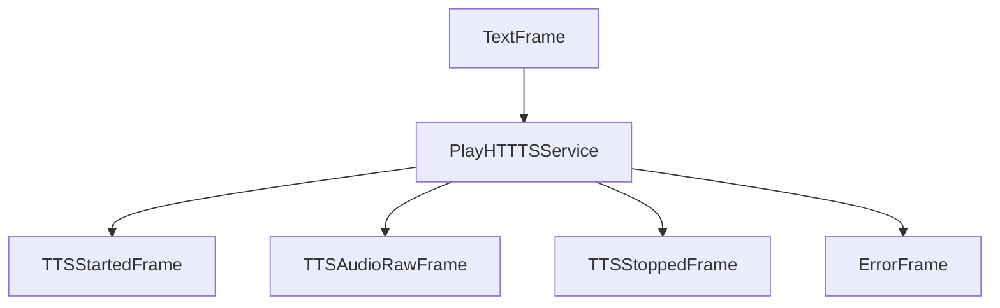
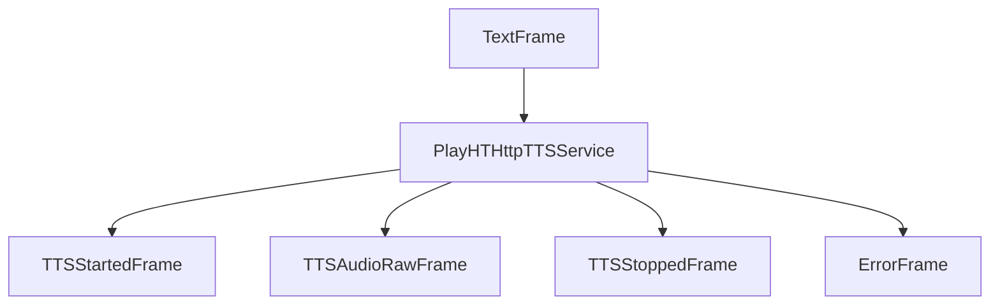

## Overview

PlayHT provides two TTS service implementations:

- `PlayHTTTSService`: WebSocket-based service with real-time streaming
- `PlayHTHttpTTSService`: HTTP-based service for simpler, non-streaming synthesis

## Installation

To use PlayHT services, install the required dependencies:

```bash
pip install pipecat-ai[playht]
```

You'll also need to set up your PlayHT credentials as environment variables:

- `PLAY_HT_USER_ID`
- `PLAY_HT_API_KEY`

## PlayHTTTSService

WebSocket-based implementation supporting real-time streaming synthesis.

### Constructor Parameters

<ParamField path="api_key" type="str" required>
  PlayHT API key
</ParamField>

<ParamField path="user_id" type="str" required>
  PlayHT user ID
</ParamField>

<ParamField path="voice_url" type="str" required>
  Voice identifier URL
</ParamField>

<ParamField path="voice_engine" type="str" default="PlayHT3.0-mini">
  TTS engine identifier. See the [PlayHT
  docs](https://docs.play.ht/reference/models) for available engines.
</ParamField>

<ParamField path="sample_rate" type="int" default="24000">
  Output audio sample rate in Hz
</ParamField>

<ParamField path="output_format" type="str" default="wav">
  Audio output format
</ParamField>

### Input Parameters

```python
class InputParams(BaseModel):
    language: Optional[Language] = Language.EN
    speed: Optional[float] = 1.0
    seed: Optional[int] = None
```

## PlayHTHttpTTSService

HTTP-based implementation for simpler synthesis requirements.

### Constructor Parameters

<ParamField path="api_key" type="str" required>
  PlayHT API key
</ParamField>

<ParamField path="user_id" type="str" required>
  PlayHT user ID
</ParamField>

<ParamField path="voice_url" type="str" required>
  Voice identifier URL
</ParamField>

<ParamField path="voice_engine" type="str" default="PlayHT3.0-mini">
  TTS engine identifier. See the [PlayHT
  docs](https://docs.play.ht/reference/models) for available engines.
</ParamField>

<ParamField path="sample_rate" type="int" default="24000">
  Output audio sample rate in Hz
</ParamField>

### Input Parameters

```python
class InputParams(BaseModel):
    language: Optional[Language] = Language.EN
    speed: Optional[float] = 1.0
    seed: Optional[int] = None
```

## Output Frames

### Control Frames

<ParamField path="TTSStartedFrame" type="Frame">
  Signals start of synthesis
</ParamField>

<ParamField path="TTSStoppedFrame" type="Frame">
  Signals completion of synthesis
</ParamField>

### Audio Frames

<ParamField path="TTSAudioRawFrame" type="Frame">
  Contains generated audio data with: - WAV format - Specified sample rate -
  Single channel (mono)
</ParamField>

### Error Frames

<ParamField path="ErrorFrame" type="Frame">
  Contains PlayHT error information
</ParamField>

## Language Support

Supports multiple languages when using the `PlayHT3.0-mini` engine:

| Language Code | Description | Service Code |
| ------------- | ----------- | ------------ |
| `Language.BG` | Bulgarian   | `BULGARIAN`  |
| `Language.CA` | Catalan     | `CATALAN`    |
| `Language.CS` | Czech       | `CZECH`      |
| `Language.DA` | Danish      | `DANISH`     |
| `Language.DE` | German      | `GERMAN`     |
| `Language.EN` | English     | `ENGLISH`    |
| `Language.ES` | Spanish     | `SPANISH`    |
| `Language.FR` | French      | `FRENCH`     |
| `Language.EL` | Greek       | `GREEK`      |
| `Language.HI` | Hindi       | `HINDI`      |
| `Language.HU` | Hungarian   | `HUNGARIAN`  |
| `Language.ID` | Indonesian  | `INDONESIAN` |
| `Language.IT` | Italian     | `ITALIAN`    |
| `Language.JA` | Japanese    | `JAPANESE`   |
| `Language.KO` | Korean      | `KOREAN`     |
| `Language.MS` | Malay       | `MALAY`      |
| `Language.NL` | Dutch       | `DUTCH`      |
| `Language.PL` | Polish      | `POLISH`     |
| `Language.PT` | Portuguese  | `PORTUGUESE` |
| `Language.RU` | Russian     | `RUSSIAN`    |
| `Language.SV` | Swedish     | `SWEDISH`    |
| `Language.TH` | Thai        | `THAI`       |
| `Language.TR` | Turkish     | `TURKISH`    |
| `Language.UK` | Ukrainian   | `UKRAINIAN`  |

## Usage Examples

### WebSocket Service

```python
# Configure WebSocket service
ws_service = PlayHTTTSService(
    api_key="your-api-key",
    user_id="your-user-id",
    voice_url="voice-url",
    voice_engine="PlayHT3.0-mini",
    params=PlayHTTTSService.InputParams(
        language=Language.EN,
        speed=1.2
    )
)

# Use in pipeline
pipeline = Pipeline([
    text_input,
    ws_service,
    audio_output
])
```

### HTTP Service

```python
# Configure HTTP service
http_service = PlayHTHttpTTSService(
    api_key="your-api-key",
    user_id="your-user-id",
    voice_url="voice-url",
    voice_engine="PlayHT3.0-mini",
    params=PlayHTHttpTTSService.InputParams(
        language=Language.EN,
        speed=1.0
    )
)
```

## Frame Flow

### WebSocket Service



### HTTP Service



## Metrics Support

Both services collect processing metrics:

- Time to First Byte (TTFB)
- Processing duration
- Character usage
- API calls

## Notes

### WebSocket Service

- Real-time streaming support
- Automatic reconnection
- Interruption handling
- WAV header management
- Thread-safe processing

### HTTP Service

- Simpler implementation
- Complete audio delivery
- WAV header parsing
- Chunked audio delivery
- Lower latency for short texts

## Common Features

- Multiple voice engines
- Speed control
- Language support
- Seed-based consistency
- Error handling
- Metrics collection
