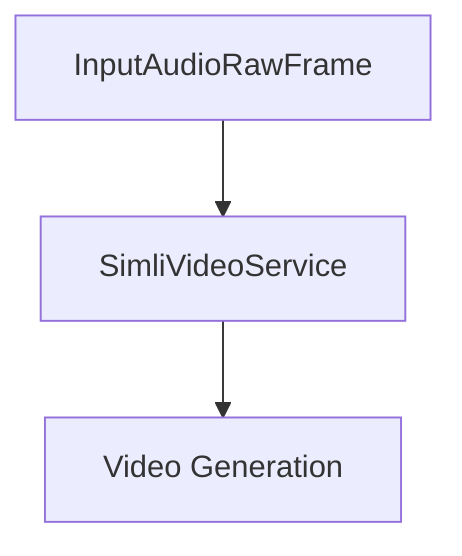

## Overview

`SimliVideoService` enables the creation of AI avatar video responses by sending audio to Simli's WebRTC API. It handles real-time audio streaming and video generation through Simli's platform.

## Installation

To use `SimliVideoService`, install the required dependencies:

```bash
pip install pipecat-ai[simli]
```

You'll need to set up the following environment variables:

- `SIMLI_API_KEY` - Your Simli API key
- `SIMLI_FACE_ID` - Your Simli Face ID

<Tip>
  You can obtain a Simli API key by signing up at
  [Simli](https://www.simli.com/).
</Tip>

## Configuration

```python
SimliVideoService(SimliConfig(SIMLI_API_KEY, SIMLI_FACE_ID), useTurnServer=False, latencyInterval=60)
```

### Constructor Parameters for `SimliConfig`

<ParamField path="apiKey" type="str" required>
  {" "}
  Your Simli API key. This key is required for authenticating API requests.{" "}
</ParamField> <ParamField path="faceId" type="str" required>
  {" "}
  The face identifier for Simli. This is used to associate API interactions with
  a specific face or persona.{" "}
</ParamField> <ParamField path="syncAudio" type="bool" default="True">
  {" "}
  Indicates whether to synchronize audio streams. Defaults to `True`. Set to `False`
  to disable audio synchronization.{" "}
</ParamField> <ParamField path="handleSilence" type="bool" default="True">
  {" "}
  Determines if silence in audio streams should be handled automatically. Defaults
  to `True`.{" "}
</ParamField> <ParamField path="maxSessionLength" type="int" default="600">
  {" "}
  The maximum length of a session in seconds. Defaults to `600` (10 minutes).{" "}
</ParamField> <ParamField path="maxIdleTime" type="int" default="30">
  {" "}
  The maximum idle time (in seconds) allowed during a session before it is automatically
  terminated. Defaults to `30` seconds.{" "}
</ParamField>

### Constructor Parameters for `SimliVideoService`

<ParamField path="simliConfig" type="SimliConfig" required>
  {" "}
  The configuration object for Simli. This must be an instance of `SimliConfig` and
  contains essential settings such as API key, face ID, and other session-related
  configurations.{" "}
</ParamField> <ParamField path="useTurnServer" type="bool" default="False">
  {" "}
  Determines whether a TURN server should be used for establishing connections. Defaults
  to `False`. Set to `True` if your network requires TURN for WebRTC connections.{" "}
</ParamField> <ParamField path="latencyInterval" type="int" default="60">
  {" "}
  The interval in seconds for measuring and reporting latency. Defaults to `60` seconds.{" "}
</ParamField>

## Input Frames

### Audio Input

<ParamField path="TTSAudioRawFrame" type="Frame">
  Raw audio data for avatar speech
</ParamField>

### Control Frames

<ParamField path="TTSStartedFrame" type="Frame">
  Signals start of speech synthesis
</ParamField>

<ParamField path="TTSStoppedFrame" type="Frame">
  Signals end of speech synthesis
</ParamField>

<ParamField path="StartInterruptionFrame" type="Frame">
  Signals conversation interruption
</ParamField>

<ParamField path="EndFrame" type="Frame">
  Signals end of conversation
</ParamField>

<ParamField path="CancelFrame" type="Frame">
  Signals conversation cancellation
</ParamField>

## Usage Example

```python
from pipecat.services.simli import SimliVideoService
import aiohttp

async def main():
    async with aiohttp.ClientSession() as session:
        # Configure service
        simli = SimliVideoService(
            SimliConfig(os.getenv("SIMLI_API_KEY"), os.getenv("SIMLI_FACE_ID"))
        )

        # Start connection
        await Simli.startConnection()

        # Use in pipeline
        pipeline = Pipeline([
            audio_input,      # Audio source
            tts_service,      # Text-to-speech
            simli,            # Simli video generation
            video_output      # Video playback
        ])
```

## API Methods

### initialize

```python
async def startConnection(self) -> void:
```

Starts a webRTC connection to the Simli servers

## Frame Flow



## Metrics Support

The service collects processing metrics:

- Processing duration
- Time to First Byte (TTFB)
- API response times
- Audio processing metrics

## Common Use Cases

1. **AI Video Avatars**

   - Virtual assistants
   - Customer service
   - Educational content

2. **Interactive Presentations**

   - Product demonstrations
   - Training materials
   - Marketing content

3. **Real-time Communication**
   - Video conferencing
   - Virtual meetings
   - Interactive broadcasts

## Notes

- Handles real-time audio streaming
- Supports conversation interruptions
- Manages conversation lifecycle
- Automatic audio resampling
- Thread-safe processing
- WebRTC integration through [Daily](/api-reference/services/transport/daily)
- Includes comprehensive error handling
