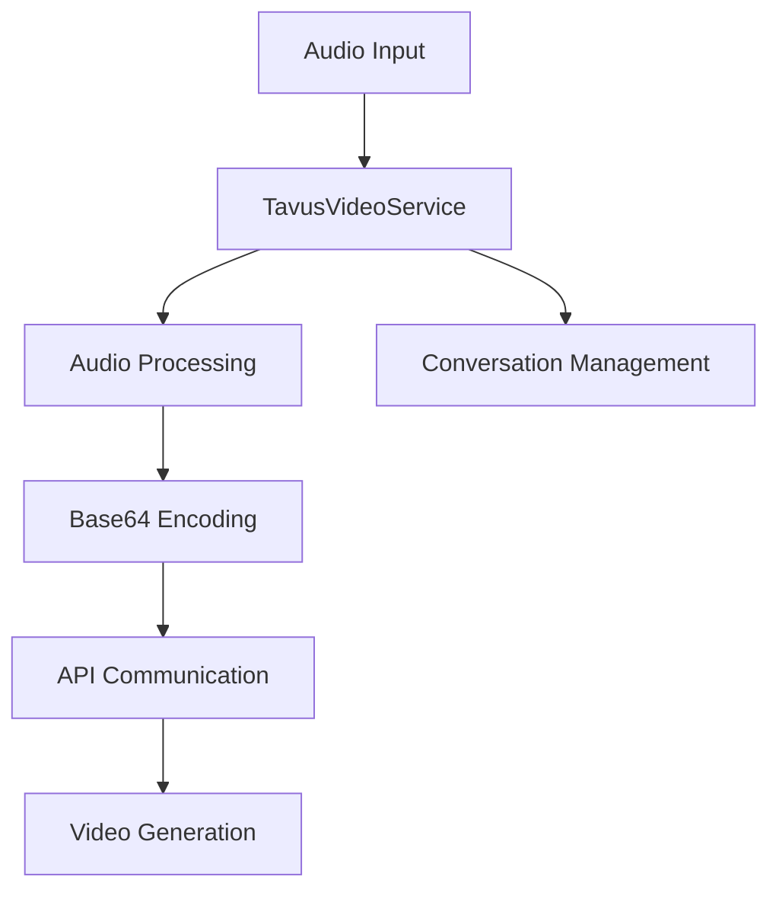

## Overview

`TavusVideoService` enables the creation of AI avatar video responses by sending audio to Tavus's API. It handles real-time audio streaming, conversation management, and video generation through Tavus's platform.

## Installation

To use `TavusVideoService`, install the required dependencies:

```bash
pip install pipecat-ai[tavus]
```

You'll need to set up the following environment variables:

- `TAVUS_API_KEY` - Your Tavus API key
- `TAVUS_REPLICA_ID` - Your Tavus replica identifier
- `TAVUS_PERSONA_ID` - (Optional) Your Tavus persona identifier

## Configuration

### Constructor Parameters

<ParamField path="api_key" type="str" required>
  Your Tavus API key
</ParamField>

<ParamField path="replica_id" type="str" required>
  Tavus replica identifier
</ParamField>

<ParamField path="persona_id" type="str" default="pipecat0">
  Tavus persona identifier
</ParamField>

<ParamField path="session" type="aiohttp.ClientSession" required>
  HTTP client session for API communication
</ParamField>

## Input Frames

### Audio Input

<ParamField path="TTSAudioRawFrame" type="Frame">
  Raw audio data for avatar speech
</ParamField>

### Control Frames

<ParamField path="TTSStartedFrame" type="Frame">
  Signals start of speech synthesis
</ParamField>

<ParamField path="TTSStoppedFrame" type="Frame">
  Signals end of speech synthesis
</ParamField>

<ParamField path="StartInterruptionFrame" type="Frame">
  Signals conversation interruption
</ParamField>

<ParamField path="EndFrame" type="Frame">
  Signals end of conversation
</ParamField>

<ParamField path="CancelFrame" type="Frame">
  Signals conversation cancellation
</ParamField>

## Usage Example

```python
from pipecat.services.tavus import TavusVideoService
import aiohttp

async def main():
    async with aiohttp.ClientSession() as session:
        # Configure service
        tavus = TavusVideoService(
            api_key="your-tavus-api-key",
            replica_id="your-replica-id",
            persona_id="your-persona-id",
            session=session
        )

        # Initialize conversation
        conversation_url = await tavus.initialize()

        # Get persona name
        persona_name = await tavus.get_persona_name()

        # Use in pipeline
        pipeline = Pipeline([
            audio_input,         # Audio source
            tts_service,        # Text-to-speech
            tavus,            # Tavus video generation
            video_output        # Video playback
        ])
```

## API Methods

### initialize

```python
async def initialize(self) -> str:
```

Initializes a new conversation and returns the conversation URL.

### get_persona_name

```python
async def get_persona_name(self) -> str:
```

Retrieves the name of the configured persona.

## Frame Flow



## Metrics Support

The service collects processing metrics:

- Processing duration
- Time to First Byte (TTFB)
- API response times
- Audio processing metrics

## Common Use Cases

1. **AI Video Avatars**

   - Virtual assistants
   - Customer service
   - Educational content

2. **Interactive Presentations**

   - Product demonstrations
   - Training materials
   - Marketing content

3. **Real-time Communication**
   - Video conferencing
   - Virtual meetings
   - Interactive broadcasts

## Notes

- Handles real-time audio streaming
- Supports conversation interruptions
- Manages conversation lifecycle
- Automatic audio resampling
- Thread-safe processing
- WebRTC integration through Daily.co
- Includes comprehensive error handling
