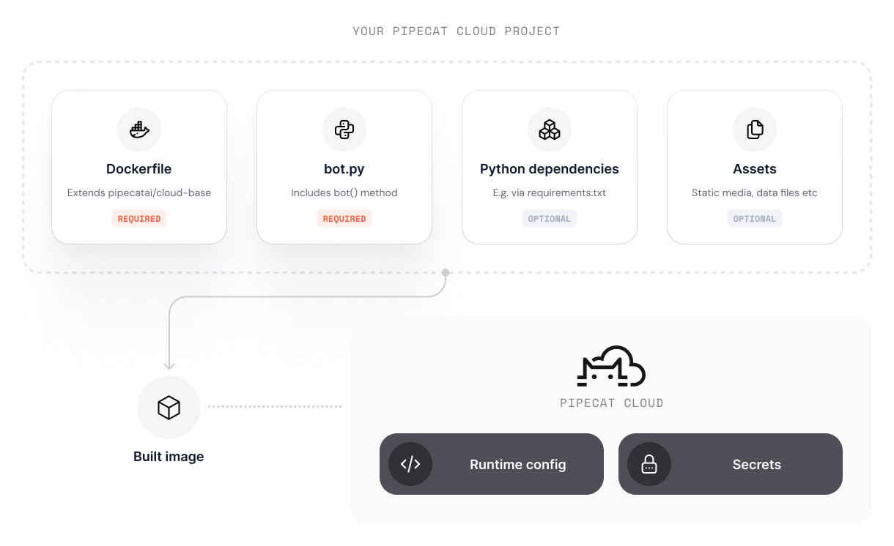

Pipecat Cloud agents are designed to be run from containerized images. This allows you to run the agent in a controlled environment, with all the dependencies and configurations needed.

Your project defines the environment that your agent will run using Docker and built using a Dockerfile in the root directory of the project.

For example, your Dockerfile might look like this:

```dockerfile
FROM dailyco/pipecat-base:latest
COPY ./requirements.txt requirements.txt
RUN pip install --no-cache-dir --upgrade -r requirements.txt
COPY ./bot.py bot.py
```

<Frame>
  
</Frame>

## Using an official base image

Pipecat Cloud provides a series of base images that we recommend for most use-cases. Base images provide:

- Simplified development and deployment
- Optimizations for performance and security
- Pre-installed system dependencies for most multi-modal agent use-cases

Using a base image reduces complexity in your project but requires you to adhere to a specific project structure.

- Your project must contain a `bot.py` file that defines the agent pipeline
- The `bot.py` must contain a `bot()` method that is the entry point for your agent pipeline
- The `bot()` method must be asynchronous, e.g. `async def bot():`

You do not need to specify a `CMD` as part of your Dockerfile - the base image is configured to run your `bot.py` module.

You can browse available base images in the [Pipecat Cloud Docker Hub <Icon icon="arrow-up-right-from-square" iconType="solid" />](https://hub.docker.com/u/dailyco).

### Available images

#### Base Image

| Name                   | Description                                               |
| ---------------------- | --------------------------------------------------------- |
| `dailyco/pipecat-base` | Multi-modal Pipecat optimized, suitable for most use-case |

The base image supports multiple Python versions. Starting with version 0.1.0, the default Python version is 3.12 (previously 3.10).

**Latest tags:**

- `dailyco/pipecat-base:latest` (Python 3.12, default)
- `dailyco/pipecat-base:latest-py3.10` (Python 3.10)
- `dailyco/pipecat-base:latest-py3.11` (Python 3.11)
- `dailyco/pipecat-base:latest-py3.12` (Python 3.12)
- `dailyco/pipecat-base:latest-py3.13` (Python 3.13)

**Versioned tags:**

- `dailyco/pipecat-base:0.1.0` (Python 3.12, default)
- `dailyco/pipecat-base:0.1.0-py3.10` (Python 3.10)
- `dailyco/pipecat-base:0.1.0-py3.11` (Python 3.11)
- `dailyco/pipecat-base:0.1.0-py3.12` (Python 3.12)
- `dailyco/pipecat-base:0.1.0-py3.13` (Python 3.13)

<Tip>For production use, we recommend pinning to specific versions.</Tip>

#### Starter Images

| Name                                              | Description                                                                                          |
| ------------------------------------------------- | ---------------------------------------------------------------------------------------------------- |
| `dailyco/pipecat-starters-voice`                  | Basic voice bot with Deepgram STT, OpenAI LLM, and Cartesia TTS services                             |
| `dailyco/pipecat-starters-twilio`                 | Basic voice bot using Twilio websockets                                                              |
| `dailyco/pipecat-starters-telnyx`                 | Basic voice bot using Telnyx websockets                                                              |
| `dailyco/pipecat-starters-plivo`                  | Basic voice bot using Plivo websockets                                                               |
| `dailyco/pipecat-starters-pstn_sip`               | Basic voice bot using Daily's PSTN/SIP for dialing in and out                                        |
| `dailyco/pipecat-starters-gemini_multimodal_live` | Voice bot using Google's Gemini Multimodal Live with integrated audio, video, and speech processing  |
| `dailyco/pipecat-starters-natural_conversation`   | Voice bot with dual-LLM architecture for natural conversation flow and utterance detection           |
| `dailyco/pipecat-starters-openai_realtime`        | Voice bot using OpenAI's Realtime Beta API with integrated audio streaming, STT, LLM, and TTS        |
| `dailyco/pipecat-starters-vision`                 | Voice and vision bot with camera analysis capabilities using Anthropic Claude and custom image tools |

Starter images are independently versioned and can be pinned to specific versions. For example, to use the voice starter image version `0.0.8`:

```dockerfile
FROM dailyco/pipecat-starters-voice:0.0.8
```

## Using a custom image

For more complex use-cases, you can use a custom image.

When doing so, we recommend following best practices to ensure your agent instance runs optimally on the platform.

Our [base image](https://github.com/daily-co/pipecat-cloud-images/tree/main/pipecat-base) is open source and serves as a useful blueprint for configuring your custom agent image.

### Agent image structure

<Warning>
Custom agent images are for advanced use cases. For most teams,
we recommend using our base images. If needed, consult the base
image code as a reference.

For unsupported use cases, contact us at help@daily.co or via
[Discord](https://discord.gg/dailyco).

</Warning>

Pipecat Cloud agent images must adhere to a specific structure to run on the platform. Our base images abstract away much of this complexity, but if you are building a custom image, you must ensure your agent adheres to the following:

- HTTP API that can handle requests from the platform to configure and run agent instances.
- The necessary system level dependencies (such as Python.)

In order to start an instance of your custom agent, you must expose a HTTP `POST /bot` route that will be called by the platform.

We recommend using FastAPI to create this route. Please refer to the base image code for an example of how to do this.

## Building the image

While in beta, Pipecat Cloud requires all images to be built to target Linux on ARM. This is the most common platform for cloud deployments.

```bash
docker build --platform linux/arm64 -t my-agent:latest .
```

Your agent image should include:

- All dependencies required for your agent to run.
- Assets (such as images or models) available in the container filesystem
- The entry point for your agent (usually a Python script)
- Additional system dependencies (if required)

### Best practices

- Keep your image as small as possible. Use multi-stage builds to reduce the size of the final image.
- Use a `.dockerignore` file to exclude unnecessary files from the image.
- Pipecat Cloud will automatically restart your agent if it crashes. Ensure your agent can handle this gracefully.
- Use [Secrets](./secrets) to securely store sensitive information in your agent image.
- To optimize for fast start-ups, avoid long running or blocking processes during initialization.
