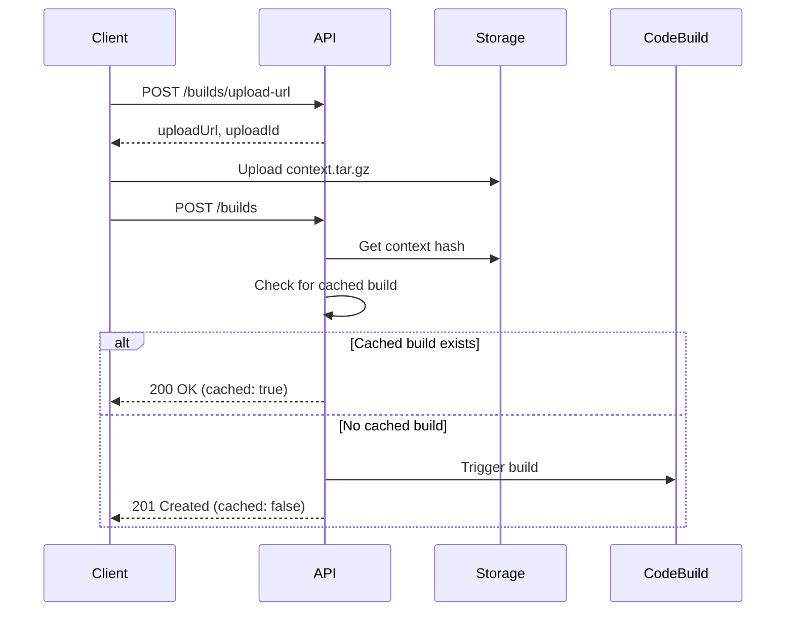

## Build Caching

Pipecat Cloud automatically caches successful builds based on three factors:

1. **Context hash** - A hash of your uploaded context archive
2. **Region** - The target deployment region
3. **Dockerfile path** - The path to your Dockerfile

If a successful build already exists with the same combination, you'll receive the cached build with `cached: true`. This makes repeated deployments much faster.

## Build Flow



## Example: Complete Build Flow

```bash
# 1. Get upload URL
UPLOAD_RESPONSE=$(curl -s -X POST "https://api.pipecat.daily.co/v1/builds/upload-url" \
  -H "Authorization: Bearer $PIPECAT_API_KEY" \
  -H "Content-Type: application/json" \
  -d '{"contentLength": 10485760, "region": "us-west"}')

UPLOAD_ID=$(echo $UPLOAD_RESPONSE | jq -r '.uploadId')

# 2. Upload context (see upload-url endpoint for details)

# 3. Create the build
BUILD_RESPONSE=$(curl -s -X POST "https://api.pipecat.daily.co/v1/builds" \
  -H "Authorization: Bearer $PIPECAT_API_KEY" \
  -H "Content-Type: application/json" \
  -d "{
    \"uploadId\": \"$UPLOAD_ID\",
    \"region\": \"us-west\",
    \"dockerfilePath\": \"Dockerfile\"
  }")

BUILD_ID=$(echo $BUILD_RESPONSE | jq -r '.build.id')
CACHED=$(echo $BUILD_RESPONSE | jq -r '.cached')

if [ "$CACHED" = "true" ]; then
  echo "Using cached build!"
  IMAGE_URI=$(echo $BUILD_RESPONSE | jq -r '.build.imageUri')
else
  echo "Build started: $BUILD_ID"
  echo "Poll GET /builds/$BUILD_ID for status"
fi
```

## Build Statuses

| Status | Description |
|--------|-------------|
| `pending` | Build created, waiting to start |
| `building` | Build is in progress |
| `success` | Build completed successfully, `imageUri` is available |
| `failed` | Build failed, check `errorMessage` for details |
| `timeout` | Build exceeded the time limit |
