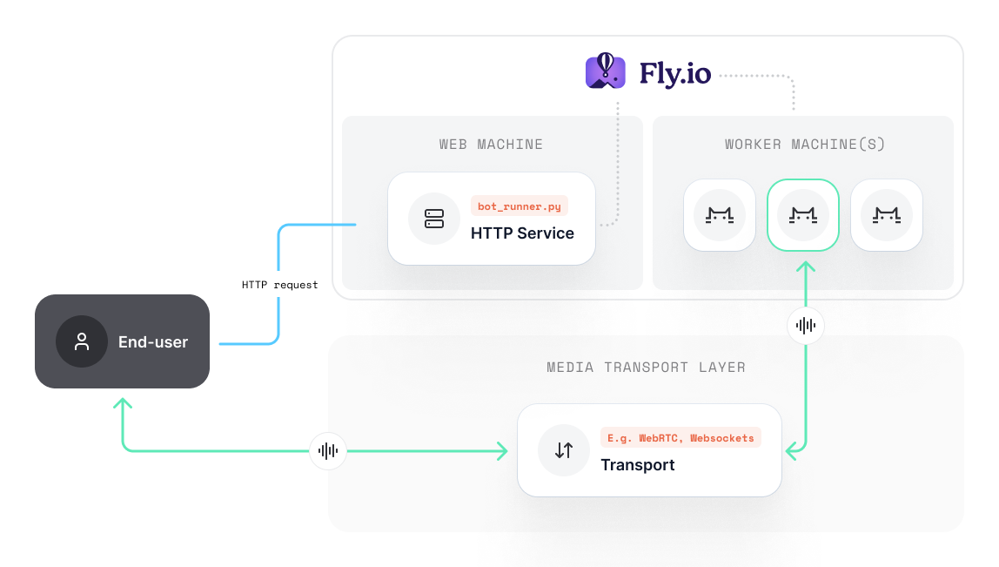

## Project setup

Let's explore how we can use [fly.io](www.fly.io) to make our app scalable for production by spawning our Pipecat bots on virtual machines with their own resources.

We mentioned [before](../pattern) that you would ideally containerize the `bot_runner.py` web service and the `bot.py` separately. To keep this example simple, we'll use the same container image for both services.

<Frame></Frame>

### Install the Fly CLI

You can find instructions for creating and setting up your fly account [here](https://fly.io/docs/getting-started/).

## Creating the Pipecat project

<Note>
  We have created a template project
  [here](https://github.com/pipecat-ai/pipecat-examples/tree/main/deployment/flyio-example)
  which you can clone. Since we're targeting production use-cases, this example
  uses Daily (WebRTC) as a transport, but you can configure your bot however you
  like.
</Note>

### Adding a fly.toml

Add a `fly.toml` to the root of your project directory. Here is a basic example:

```toml fly.toml
app = 'some-unique-app-name'
primary_region = 'sjc'

[build]

[env]
FLY_APP_NAME = 'some-unique-app-name'

[http_service]
internal_port = 7860
force_https = true
auto_stop_machines = true
auto_start_machines = true
min_machines_running = 0
processes = ['app']

[[vm]]
memory = 512
cpu_kind = 'shared'
cpus = 1
```

For apps with lots of users, consider what resources your HTTP service will require to meet load. We'll define our `bot.py` resources later, so you can set and scale these as you like (`fly scale ...`)

### Environment setup

Our bot requires some API keys and configuration, so create a `.env` in your project root:

```shell .env
DAILY_API_KEY=
OPENAI_API_KEY=
ELEVENLABS_API_KEY=
ELEVENLABS_VOICE_ID=
FLY_API_KEY=
FLY_APP_NAME=
```

Of course, the exact keys you need will depend on which services you are using within your `bot.py`.

<Warning>
  **Important:** your `FLY_APP_NAME` should match the name of your fly instance,
  such as that declared in your fly.toml.
</Warning>

The `.env` will allow us to test in local development, but is not included in the deployment. You'll need to set them as Fly app secrets, which you can do via the Fly dashboard or cli.

`fly secrets set ...`

## Containerize our app

Our Fly deployment will need a container image; let's create a simple `Dockerfile` in the root of the project:

<CodeGroup>
```shell Dockerfile
FROM python:3.11-slim-bookworm

# Open port 7860 for http service

ENV FAST_API_PORT=7860
EXPOSE 7860

# Install Python dependencies

COPY \*.py .
COPY ./requirements.txt requirements.txt
RUN pip3 install --no-cache-dir --upgrade -r requirements.txt

# Install models

RUN python3 install_deps.py

# Start the FastAPI server

CMD python3 bot_runner.py --port ${FAST_API_PORT}

````

```shell .dockerignore
**/.DS_Store
.env
.env.*
fly.toml
````

</CodeGroup>

<Note>You can use any base image as long as Python is available</Note>

Our container does the following:

- Opens port `7860` to serve our `bot_runner.py` FastAPI service.
- Downloads the necessary python dependencies.
- Download / cache the model dependencies the `bot.py` requires.
- Runs the `bot_runner.py` and listens for web requests.

### What models are we downloading?

To support voice activity detection, we're using Silero VAD. Whilst the filesize is not huge, having each new machine download the Silero model at runtime will impact bootup time. Instead, we include the model as part of the Docker image so it's cached and available.

You could, of course, also attach a network volume to each instance if you plan to include larger files as part of your deployment and don't want to bloat the size of your image.

## Launching new machines in `bot_runner.py`

When a user starts a session with our Pipecat bot, we want to launch a new machine on fly.io with it's own system resources.

Let's grab the bot_runner.py from the example repo [here](https://github.com/pipecat-ai/pipecat/blob/jpt/deployment-examples/examples/deployment/flyio-example/bot_runner.py).

This runner differs from others in the Pipecat repo; we've added a new method that sends a REST request to Fly to provision a new machine for the session.

This method is invoked as part of the `/start_bot` endpoint:

```python bot_runner.py
FLY_API_HOST = os.getenv("FLY_API_HOST", "https://api.machines.dev/v1")
FLY_APP_NAME = os.getenv("FLY_APP_NAME", "your-fly-app-name")
FLY_API_KEY = os.getenv("FLY_API_KEY", "")
FLY_HEADERS = {
    'Authorization': f"Bearer {FLY_API_KEY}",
    'Content-Type': 'application/json'
}

def spawn_fly_machine(room_url: str, token: str):
    # Use the same image as the bot runner
    res = requests.get(f"{FLY_API_HOST}/apps/{FLY_APP_NAME}/machines", headers=FLY_HEADERS)
    if res.status_code != 200:
        raise Exception(f"Unable to get machine info from Fly: {res.text}")
    image = res.json()[0]['config']['image']

    # Machine configuration
    cmd = f"python3 bot.py -u {room_url} -t {token}"
    cmd = cmd.split()
    worker_props = {
        "config": {
            "image": image,
            "auto_destroy": True,
            "init": {
                "cmd": cmd
            },
            "restart": {
                "policy": "no"
            },
            "guest": {
                "cpu_kind": "shared",
                "cpus": 1,
                "memory_mb": 1024 # Note: 512 is just enough to run VAD, but 1gb is better
            }
        },

    }

    # Spawn a new machine instance
    res = requests.post(
        f"{FLY_API_HOST}/apps/{FLY_APP_NAME}/machines",
        headers=FLY_HEADERS,
        json=worker_props)

    if res.status_code != 200:
        raise Exception(f"Problem starting a bot worker: {res.text}")

    # Wait for the machine to enter the started state
    vm_id = res.json()['id']

    res = requests.get(
        f"{FLY_API_HOST}/apps/{FLY_APP_NAME}/machines/{vm_id}/wait?state=started",
        headers=FLY_HEADERS)

    if res.status_code != 200:
        raise Exception(f"Bot was unable to enter started state: {res.text}")
```

We want to make sure the machine started ok before returning any data to the user. Fly launches machines pretty fast, but will timeout if things take longer than they should. Depending on your transport method, you may want to optimistically return a response to the user, so they can join the room and poll for the status of their bot.

## Launch the Fly project

Getting your bot on Fly is as simple as:

`fly launch` or `fly launch --org orgname` if you're part of a team.

This will step you through some configuration, and build and deploy your Docker image.

Be sure to configure your app secrets with the necessary environment variables once the deployment has complete.

Assuming all goes well, you can update with any changes with `fly deploy`.

### Test it out

Start a new bot instance by sending a `POST` request to `https://your-fly-url.fly.dev/start_bot`. All being well, this will return a room URL and token.

A nice feature of Fly is the ability to monitor your machines (with live logs) via their dashboard:

https://fly.io/apps/YOUR-APP_NAME/machines

This is really helpful for monitoring the status of your spawned machine, and debugging if things do not work as expected.

<Note>
  This example is configured to expire after 5 minutes. The bot process is also
  configured to exit after the user leaves the room. This is a good way to
  ensure we don't have any hanging VMs, although you'll likely need to configure
  this behaviour this to meet your own needs.

You'll also notice that we set `restart policy` to `no`. This prevents the machine attempting to restart after the session has concluded and the process exits.

</Note>

---

## Important considerations

This example does little in the way of load balancing or app security. Indeed, a user can spawn a new machine on your account simply by sending a `POST` request to the `bot_runner.py`. Be sure to configure a maximum number of instances, or authenticate requests to avoid costs getting out of control.

We also deployed our `bot.py` on a machine with the same image as our `bot_runner.py`. To optimize container file sizes and increase security, consider individual images that only deploy resources they require.
