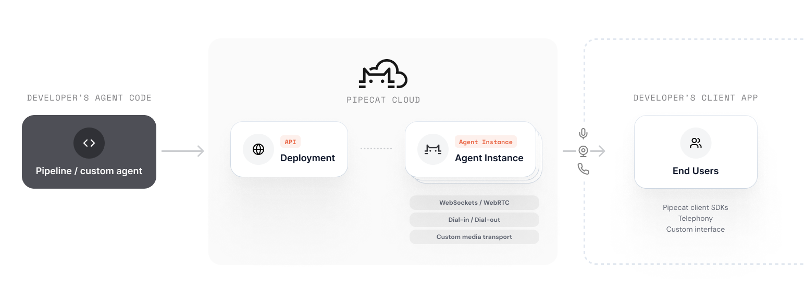

[Pipecat Cloud](https://pipecat.daily.co) is a managed platform for deploying and scaling Pipecat agents in production. It handles infrastructure, scaling, and operations so you can focus on building your agent.

<Frame>
  
</Frame>

## Key Capabilities

- **One-command deploy**: Package and deploy agents with `pipecat cloud deploy`
- **Auto-scaling**: Scale from zero to thousands of concurrent sessions
- **Built-in WebRTC**: Daily WebRTC transport included, no separate infrastructure needed
- **Secrets management**: Securely store and inject API keys and credentials
- **Session management**: Start, stop, and monitor agent sessions via REST API or SDK
- **Logging & monitoring**: Built-in logging with Datadog integration support
- **Global regions**: Deploy close to your users for lowest latency

## How It Works

<Steps>
  <Step title="Build your agent">
    Write a Pipecat pipeline as you normally would, using any supported services.
  </Step>
  <Step title="Deploy">
    Use the CLI to build and deploy your agent image to Pipecat Cloud.
    ```bash
    pipecat cloud deploy
    ```
  </Step>
  <Step title="Start sessions">
    Use the REST API or Python SDK to start agent sessions on demand.
    ```bash
    curl --request POST \
  --url https://api.pipecat.daily.co/v1/public/{agentName}/start \
  --header 'Authorization: Bearer <token>' \
  --header 'Content-Type: application/json' \
```

  </Step>
</Steps>

## Next Steps

<CardGroup cols={2}>
  <Card
    title="Get Started"
    icon="rocket"
    href="/deployment/pipecat-cloud/introduction"
  >
    Set up your account and deploy your first agent.
  </Card>
  <Card
    title="Fundamentals"
    icon="book-open"
    href="/deployment/pipecat-cloud/fundamentals/accounts-and-organizations"
  >
    Learn about accounts, agent images, secrets, and scaling.
  </Card>
</CardGroup>
