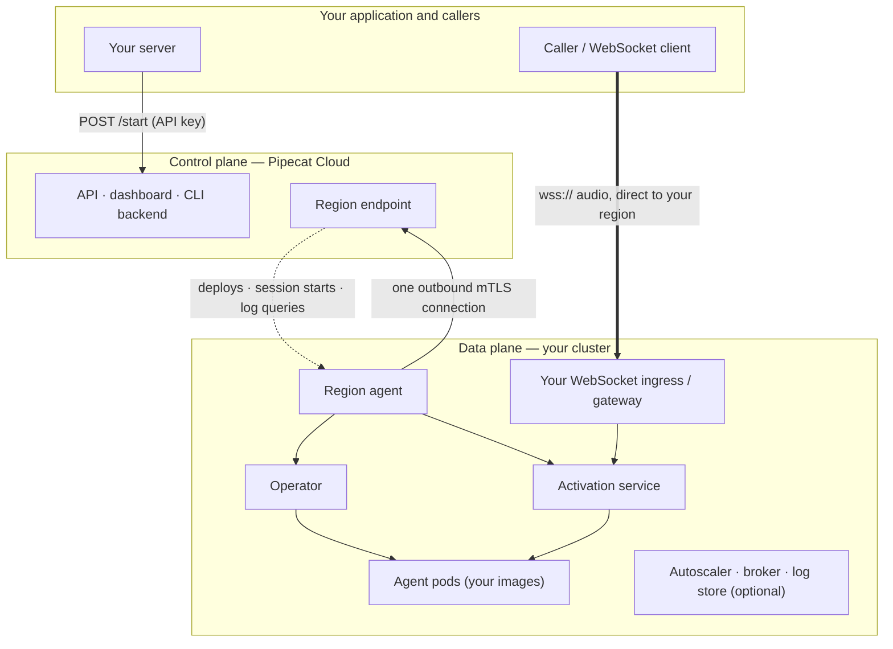

import {
  productNameSingular,
  hostedName,
} from "/snippets/self-hosted-vars.mdx";

A {productNameSingular} splits Pipecat Cloud into two planes. The **control plane** is Pipecat Cloud itself — the API, dashboard, CLI backend, and the region endpoint your cluster connects to — and it stays on Daily's infrastructure. The **data plane** is everything that runs a session, and it runs in your cluster. This page describes what each plane does, what it can see, and how traffic moves between them, because two questions come up on almost every evaluation: _do I have to expose the control plane to my users?_ (no) and _what does the control plane do beyond billing?_ (quite a lot).

## The two planes

Management traffic flows over one outbound connection from your cluster. Session traffic goes straight to your data plane and never touches the control plane.

## The control plane

The control plane is the same Pipecat Cloud your team already uses; a {productNameSingular} is one more region in it. It owns:

- **Identity and access** — your organization, its members, API keys, and personal access tokens. Your users authenticate to _your_ application; only your servers hold Pipecat Cloud API keys, exactly as with {hostedName}.
- **The agent catalog** — every agent's definition: image, secrets and image-pull secrets by name, sizing, scaling limits, architecture, WebSocket authentication mode. `pipecat cloud deploy` and the dashboard write here, and the control plane turns each deploy into instructions for your region.
- **Session starts** — `POST /start` is a control-plane call. It authenticates the API key, checks the agent and region, mints the WebSocket session token when the transport needs one, and returns a session ID plus, for WebSocket transports, the `wsUrl` under your region's public endpoint. The call takes milliseconds and no audio passes through it.
- **Session records and observability** — the sessions list, per-session outcome and CPU/memory metrics, the region's health and event history, and the log query interface (which fetches from your region on demand).
- **Region lifecycle** — registration, enrollment, certificate issuance and renewal, the platform image registry, and the record of which platform version each region runs.
- **Billing and entitlements** — including the entitlement that allows your organization to run self-hosted regions.

Nothing in the control plane is reachable from your cluster's users, and nothing in it needs to be exposed by you. Your end users interact with your application and, for WebSocket transports, with your region's public endpoint.

## The data plane

The region package installs the data plane into two namespaces of your cluster: a system namespace (`pipecat-system`) for the platform components, and a workloads namespace (`pipecat-agents`) for your agents.

| Component                | What it does                                                                                                                                                                         |
| ------------------------ | ------------------------------------------------------------------------------------------------------------------------------------------------------------------------------------ |
| **Region agent**         | Opens and maintains the outbound connection to the control plane; receives deploy and session-start instructions, answers log queries, and reports session records and region health |
| **Operator**             | Turns each deployment into agent pods in the workloads namespace, with the image, secrets, sizing, and architecture the deployment declares                                          |
| **Activation service**   | Assigns a session to an agent pod when a session starts; for WebSocket transports it also terminates the client's WebSocket and relays it to the agent                               |
| **Autoscaler**           | Scales each agent's pods with session demand, including from zero                                                                                                                    |
| **Broker**               | Coordinates session activation and autoscaling signals between the components above; a bundled one for evaluation, yours in production                                               |
| **Log store** (optional) | Holds agent logs in your region; off by default                                                                                                                                      |
| **Agent pods**           | Your images, running your Pipecat pipelines, with a small sidecar that reports session lifecycle and resource metrics                                                                |

Every session runs entirely inside the data plane: the activation service picks a pod, the pod runs your pipeline, and the pipeline talks to the AI providers you configured, directly from your network. The control plane learns that the session started, ended, and what it cost in CPU and memory — never what was said.

## How traffic flows

**Management** (deploys, session starts, log queries, diagnostics) rides one connection: the region agent dials out to the control plane's region endpoint on port 8443 with a certificate issued at enrollment, and the control plane sends its requests back down that connection. There is no inbound path into your cluster, no VPN, and no static IP to allow-list on your side.

**Sessions** never use that connection:

- **WebSocket and telephony.** The client — your browser app, or a telephony provider such as Twilio — connects to `wss://<your public endpoint>/ws/…`, which your ingress or gateway routes to the activation service in your cluster. The audio stays between the caller and your data plane. The control plane's only involvement is the `/start` call that returns the URL (and, for provider-direct dial-in, none at all — the provider's configuration names your endpoint directly). See [WebSockets and telephony](/pipecat-cloud/self-hosted/websockets).
- **Daily WebRTC.** The agent pod joins the Daily room from inside your cluster, as it does in every region; media flows between the participants and Daily's WebRTC infrastructure, not through the Pipecat Cloud control plane.

**Platform images** are pulled by your cluster from the Pipecat Cloud registry using a credential delivered at enrollment; your agent images come from whatever registry you already use.

## What each plane can see

| Data                                             | Control plane                                               | Data plane (your cluster)   |
| ------------------------------------------------ | ----------------------------------------------------------- | --------------------------- |
| Agent definitions (image refs, sizing, settings) | Yes — it is the system of record                            | Yes                         |
| Secret **names** and readiness                   | Yes                                                         | Yes                         |
| Secret **values**, environment variables         | Never                                                       | Yes                         |
| Session records, outcomes, CPU/memory metrics    | Yes                                                         | Yes                         |
| Session audio, video, messages                   | Never                                                       | Yes                         |
| Agent logs                                       | Only lines you query, only if you enable the lane           | Yes, if you enable the lane |
| Platform component health and diagnostics        | Region health always; a read-only support bundle on request | Yes                         |

The full list, including how to turn each channel off, is on [What Pipecat Cloud Can See](/pipecat-cloud/self-hosted/what-daily-can-see).

## Why keep a control plane at all

Because it is the product. The control plane is what makes a {productNameSingular} behave like every other region: the same `pipecat cloud deploy`, the same dashboard, the same session API, the same secrets-by-name model, the same session records and metrics, one place to see all of your regions, and the region's certificates, platform upgrades, and diagnostics handled for you. Running the data plane yourself changes where sessions execute and where data rests — it does not change how you operate agents.
